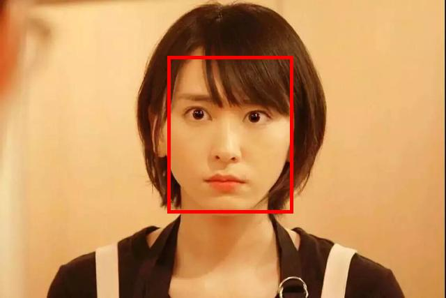
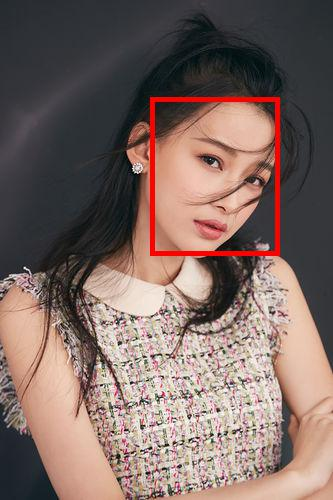

# Aliyun API

## Catalog

- [OCR](#OCR)
	- [ocr_business_card](#ocr_business_card)
	- [ocr_bank_card](#ocr_bank_card)
- [Face_Recognition](#Face_Recognition)
	- [Detect_API](#Detect_API)
	- [Attribute_API](#Attribute_API)
	- [Verify_API](#Verify_API)
	- [Illustration_of_ErrorCode](#Illustration_of_ErrorCode)

## OCR

- 导入包

	```python
	import sys,os
	import base64
	import json
	
	from urllib.parse import urlparse
	import urllib.request
	```

- 设置编码信息

	```python
	ENCODING = 'utf-8'
	```

- 获取图片 base64 编码信息

	```python
	def get_img_base64(img_file):
	    with open(img_file, 'rb') as infile:
	        s = infile.read()
	        return base64.b64encode(s).decode(ENCODING)
	```

- 请求 ocr 的识别

	```python
	def predict(url, appcode, img_base64, kv_configure):
	        param = {}
	        param['image'] = img_base64
	        if kv_configure is not None:
	            param['configure'] = json.dumps(kv_configure)
	        body = json.dumps(param)
	        data = bytes(body, ENCODING)
	
	        headers = {'Authorization': 'APPCODE %s' % appcode}
	        request = urllib.request.Request(url=url, headers=headers, data=data)
	        try:
	            response = urllib.request.urlopen(request, timeout=10)
	            return response.code, response.headers, response.read()
	        except urllib.request.HTTPError as e:
	            return e.code, e.headers, e.read()
	```

- Demo主体

	```python
	def demo():
	    appcode = 'Your APPCODE'
	    url = 'OCR Url'
	    img_file = 'img Url'
	    # 如果没有configure字段，configure设为None
		    	'''
		    	    		"configure":"{
	                     \"min_size\" : 16,    #图片中文字的最小高度
		                     \"output_prob\" : true  #是否输出文字框的概率
	                   }"
		    	''' 
	    configure = None
	
	    img_base64data = get_img_base64(img_file)
	    stat, header, content = predict(url, appcode, img_base64data, configure)
	    if stat != 200:
	        print('Http status code: ', stat)
	        print('Error msg in header: ', header['x-ca-error-message'] if 'x-ca-error-message' in header else '')
	        print('Error msg in body: ', content)
	        exit()
	    result_str = content
	
	    print(result_str.decode(ENCODING))
	```

### ocr_business_card

调用地址：https://dm-57.data.aliyun.com/rest/160601/ocr/ocr_business_card.json

请求方式：POST

返回类型：JSON

API 调用：[API 简单身份认证调用方法（APPCODE）](https://help.aliyun.com/knowledge_detail/44816.html)

**正常返回示例**

**input:**


**output:**

```python
{
  "name":"刘训志",  # 姓名
  "company":["九州证券股份有限公司","九鼎集团旗下证券公司","投资银行委员会","九州证券"],  # 公司结果数组，数组可能为空
  "department":["化工行业部"],  # 部门结果数组，数组可能为空
  "title":[]  # 职位结果数组，数组可能为空
  "tel_cell":["13162913279"],  # 手机结果数组，数组可能为空
  "tel_work":["02168813399"],  # 座机结果数组，数组可能为空
  "addr":["上海浦东新区杨高南路799号","陆家嘴世纪金融广场3号楼22层"],  # 地址结果数组，数组可能为空
  "email":["liuxunzhi@jzsec.com"],  # 邮箱结果数组，数组可能为空
  "request_id":"20191012144147_d2d0c2fde269d00b30c44e6f79222a2b",  # 请求唯一标识，用于错误追踪
  "success":true,  # 识别成功与否 true/false
}
```

### ocr_bank_card

银行卡识别服务可以自动地从图片中定位银行卡图片区域，识别出其中包含的银行卡信息

调用地址：https://yhk.market.alicloudapi.com/rest/160601/ocr/ocr_bank_card.json

求方式：POST

返回类型：JSON

**正常返回示例**

**input:**


**output:**

```python
{
  "bank_name":"中国建设银行",  # 银行名称，可能为空
  "card_num":"6217003860002354304",  # 银行卡卡号，可能为空
  "valid_date":"09/22"  # 银行卡有效期，可能为空
  "request_id":"20191016093326_e1e53c521380b0244767c11f1e56ae54",  # 请求唯一标识，用于错误追踪
  "success":true,  # 识别成功与否 true/false
}
```

## Face_Recognition

人脸识别（Face Recognition）实现了图像或视频中人脸的检测、分析和比对，包括人脸检测定位、人脸属性识别和人脸比对等独立服务模块，应用于人脸 AR、人脸识别和认证、大规模人脸检索、照片管理等各种场景

阿里云数加平台提供的人脸服务分为三个独立的模块，提供三个独立的 API，模块之间可以通过 API 参数来进行自由组合，不同的模块及组合可以实现不同的人脸技术功能

- 导入包

  ```python
  import datetime
  import hmac
  import hashlib
  import json
  from urllib.parse import urlparse
  import base64
  import http.client
  from PIL import Image, ImageDraw
  ```

- 获取时间

	```python
	def get_current_date():
	    date = datetime.datetime.strftime(datetime.datetime.utcnow(), "%a, %d %b %Y %H:%M:%S GMT")
	    return date
	```

- 计算 MD5+BASE64

	```python
	def getcode(bodyData):
	    temp = bodyData.encode("utf-8")
	    md5 = hashlib.md5()
	    md5.update(temp)
	    md5str = md5.digest()  # 16位
	    b64str = base64.b64encode(md5str)
	    return b64str
	```

- 计算 HMAC-SHA1

	```python
	def to_sha1_base64(stringToSign, secret):
	    hmacsha1 = hmac.new(secret.encode(), stringToSign.encode(), hashlib.sha1)
	    return base64.b64encode(hmacsha1.digest())
	```

- Demo 主体

	```python
	def demo():
	    # 初始参数设置
	    ak_id = 'Your AccessKey ID'
	    ak_secret = 'Your AccessKey Secret'
	    datetime1 = get_current_date()  # 获取时间
	
	    # 读取本地图片, online 模式中不需要
	    filenamePath = "local Url"  # 测试图片存放在项目目录下
	    base64_data = ''
	    with open(filenamePath, "rb") as f:
	        base64_data = base64.b64encode(f.read())
	
	    # 根据实际测试需要设置自己的图片URL
	    options = {
	        # url中 xxxxxx 有 detect, attribute, verify 3种模式
	        'url': 'https://dtplus-cn-shanghai.data.aliyuncs.com/face/xxxxxx',
	        'method': 'POST',
	        'body': json.dumps(
	                           {"type": "1", "content": base64_data.decode()}, 
	                           # online模式下, 可以设置为: 
	                           # {"type": "0", "image_url":"img Url"},
	                           separators=(',', ':')
	                          ),
	        'headers': {
	            'accept': 'application/json',
	            'content-type': 'application/json',
	            'date':  datetime1
	        }
	    }
	
	    body = ''       # 请求body参数
	    if 'body' in options:
	        body = options['body']
	
	    bodymd5 = ''    # 计算获取请求body的md5值
	    if not body == '':
	        bodymd5 = getcode(body)
	        bodymd5 = bodymd5.decode(encoding='utf-8')
	
	    urlPath = urlparse(options['url'])
	    restUrl = urlPath[1]
	    path = urlPath[2]
	
	    # 拼接请求签名字符串
	    stringToSign = options['method'] + '\n' + options['headers']['accept'] + '\n' + bodymd5 + '\n' + options['headers']['content-type'] + '\n' + options['headers']['date'] + '\n' + path
	    signature = to_sha1_base64(stringToSign, ak_secret)
	    signature = signature.decode(encoding='utf-8')
	    authHeader = 'Dataplus ' + ak_id + ':' + signature  # 组合认证Authorization
	
	    # 请求Header
	    headers = {
	        # Request headers
	        'Content-Type': options['headers']['content-type'],
	        'Authorization': authHeader,
	        'Date': datetime1,
	        'Accept': options['headers']['accept']
	    }
	
	    try:
	        # 设置http请求参数
	        conn = http.client.HTTPSConnection(restUrl)
	        conn.request(options['method'], path, body, headers)
	        response = conn.getresponse()
	        data = eval(response.read())
	        print("Result: ", data)
	        conn.close()
	    except Exception as e:
	        print("[Errno {0}] {1}".format(e.errno, e.strerror))
	```

### Detect_API

**人脸检测定位** 支持人脸检测、人脸器官轮廓点定位、人脸姿态估计；进行人脸检测后返回检测到的人脸矩形框坐标，可支持最多上千个人脸的同时检测，支持平面 360 度旋转人脸检测，支持左右最大 90 度侧面人脸检测；在人脸检测基础上，实现毫秒级的人脸 105 个器官轮廓点的精确定位，并可返回双眼瞳孔的中心点和半径信息；可返回各个人脸的三个姿态信息；可为人脸美化/美妆、人脸认证、检索、3D 人脸建模等应用程序提供精准的基础服务

#### URL说明

| 协议  | URL                                                      | 方法 | 参数       |
| :---- | :------------------------------------------------------- | :--- | :--------- |
| HTTPS | https://dtplus-cn-shanghai.data.aliyuncs.com/face/detect | POST | JSON字符串 |

#### 输入参数

> 请求参数，以json格式放置于Https Body内

| 参数      | 类型   | 必选 | 说明                                                         | 举例               |
| :-------- | :----- | :--- | :----------------------------------------------------------- | :----------------- |
| type      | int    | 是   | 0: 通过url识别，参数image_url不为空；1: 通过图片content识别，参数content不为空 | 0                  |
| image_url | string | 否   | 输入图像URL                                                  | http://a.com/a.jpg |
| content   | String | 否   | 图像内容，base64编码                                         |                    |

> 注意：如使用JS调用，请在生成图片的base64编码前缀中去掉data:image/jpeg;base64

#### 返回结果

| 参数         | 类型      | 说明                                                         | 举例                          |
| :----------- | :-------- | :----------------------------------------------------------- | :---------------------------- |
| errno        | int       | 0为成功，非0为失败，详细说明参见**错误码**                   | 0                             |
| err_msg      | string    | 处理失败时的说明                                             | invalid image url.            |
| request_id   | string    | request_id 请求id信息                                        | xx-xx                         |
| face_num     | int       | 检测出来的人脸个数                                           | 2                             |
| face_rect    | int数组   | 返回人脸矩形框，分别是[left, top, width, height], 如有多个人脸，则依次顺延，返回矩形框。如有两个人脸则返回[left1, top1, width1, height1, left2, top2, width2, height2] | [118,166,340,445]             |
| face_prob    | float数组 | 返回人脸概率, 0-1之间，如有多个人脸，则依次顺延。如有两个人脸则返回[face_prob1, face_prob2] | [0.93]                        |
| pose         | float数组 | 返回人脸姿态[yaw, pitch, roll]， yaw为左右角度，取值[-90, 90]，pitch为上下角度，取值[-90, 90]， roll为平面旋转角度，取值[-180, 180]，如有多个人脸，则依次顺延 | [10.0, 20.5, -10.0]           |
| landmark_num | int       | 特征点数目，目前固定为105点(顺序：眉毛24点，眼睛32点，鼻子6点，嘴巴34点，外轮廓9点) | 105                           |
| landmark     | float数组 | 特征点定位结果，每个人脸返回一组特征点位置，表示方式为（x0, y0, x1, y1, ……）；如有多个人脸，则依次顺延，返回定位浮点数 | [195.963501, 371.919922, …..] |
| iris         | float数组 | 左右两个瞳孔的中心点坐标和半径，每个人脸6个浮点数，顺序是[left_iris_cenpt.x, left_iris_cenpt.y, left_iris_radius, right_iris_cenpt.x, right_iris_cenpt.y, right_iris_radis] | [200.000, 150.000, …]         |

#### 正常返回示例

```python
{
  "type":"0",
  "image_url":
"http://dingyue.ws.126.net/QLwy6VtqdO4A6F=e7K5itvAIWcvEAYVulq4oSN1foJamH1503048856418.jpg"
}
Result:  
{
	  "face_num":1,
  "face_rect":[240,80,180,225],
  "face_prob":[1.0],
  "pose":[0.8295132517814636,-4.842614650726318,2.0158379077911377],
  "landmark_num":105,
  "landmark":[253.61181640625,142.6244659423828,...],
  "iris":[284.04742431640625,163.73721313476562,7.290663719177246,364.4569091796875,167.8007354736328,7.290663719177246],
  "errno":0,
  "request_id":"e78f8c70-4743-47b8-9aff-755f41a935cb"
}
```

**input: ** 	**output: **

也可以对图像中的多张面孔进行识别，比如以下例子

```python
Result:  
{'face_num': 4, 
 'face_rect': [75, 101, 90, 98, 295, 170, 63, 104, 507, 175, 83, 102, 432, 87, 68, 90], 
 'face_prob': [1.0, 1.0, 1.0, 0.8787689208984375], 
 'pose': [8.312878608703613, -10.029035568237305, -34.341957092285156, 14.727490425109863, -5.931674003601074, -6.988330841064453, -25.047643661499023, -7.542628765106201, 14.292492866516113, -8.995222091674805, -0.7264819741249084, 23.54128646850586], 
 'landmark_num': 105, 
 'landmark': [77.85490417480469, 154.32345581054688, ...], 
 'iris': [99.93559265136719, 154.64137268066406, ...], 
 'errno': 0, 
 'request_id': '63ffef2d-90c3-4b4b-9dea-90e6780c3d67'
}
```

并且在面部有遮挡的情况下，依旧有较好的识别效果，此时判断人脸的概率会略低于 1

**input: **	**output: **

### Attribute_API

**人脸属性识别** 在人脸检测定位返回结果的基础上，识别各个检测人脸的四种属性，返回性别（男/女）、年龄、表情（笑/不笑）、眼镜（戴/不戴）；并可返回人脸的 1024 维深度学习特征，基于这个特征并按照给出的特征比较规则，可实现高性能的人脸识别，该算法在业内公开测试集 lfw 上达到了99.58%的识别精度

#### URL说明

| 协议  | URL                                                         | 方法 | 参数       |
| :---- | :---------------------------------------------------------- | :--- | :--------- |
| HTTPS | https://dtplus-cn-shanghai.data.aliyuncs.com/face/attribute | POST | JSON字符串 |

#### 输入参数

> 请求参数，以json格式放置于Https Body内

| 参数      | 类型   | 必选 | 说明                                                         | 举例               |
| :-------- | :----- | :--- | :----------------------------------------------------------- | :----------------- |
| type      | int    | 是   | 0: 通过url识别，参数image_url不为空；1: 通过图片content识别，参数content不为空 | 0                  |
| image_url | string | 否   | 输入图像URL                                                  | http://a.com/a.jpg |
| content   | String | 否   | 图像内容，base64编码                                         |                    |

> 注意：如使用JS调用，请在生成图片的base64编码前缀中去掉data:image/jpeg;base64

#### 返回结果

| 参数          | 类型      | 说明                                                         | 举例                          |
| :------------ | :-------- | :----------------------------------------------------------- | :---------------------------- |
| errno         | int       | 0为成功，非0为失败，详细说明参见**错误码**                   | 0                             |
| err_msg       | string    | 处理失败时的说明                                             | invalid image url.            |
| request_id    | string    | request_id 请求id信息                                        | xx-xx                         |
| face_num      | int       | 检测出来的人脸个数                                           | 2                             |
| face_rect     | int数组   | 返回人脸矩形框，分别是[left, top, width, height], 如有多个人脸，则依次顺延，返回矩形框。如有两个人脸则返回[left1, top1, width1, height1, left2, top2, width2, height2] | [118,166,340,445]             |
| face_prob     | float数组 | 返回人脸概率, 0-1之间，如有多个人脸，则依次顺延。如有两个人脸则返回[face_prob1, face_prob2] | [0.93]                        |
| pose          | float数组 | 返回人脸姿态[yaw, pitch, roll]， yaw为左右角度，取值[-90, 90]，pitch为上下角度，取值[-90, 90]， roll为平面旋转角度，取值[-180, 180]，如有多个人脸，则依次顺延 | [10.0, 20.5, -10.0]           |
| landmark_num  | int       | 特征点数目，目前固定为105点(顺序：眉毛24点，眼睛32点，鼻子6点，嘴巴34点，外轮廓9点) | 105                           |
| landmark      | float数组 | 特征点定位结果，每个人脸返回一组特征点位置，表示方式为（x0, y0, x1, y1, ……）；如有多个人脸，则依次顺延，返回定位浮点数 | [195.963501, 371.919922, …..] |
| iris          | float数组 | 左右两个瞳孔的中心点坐标和半径，每个人脸6个浮点数，顺序是[left_iris_cenpt.x, left_iris_cenpt.y, left_iris_radius, right_iris_cenpt.x, right_iris_cenpt.y, right_iris_radis] | [200.000, 150.000, …]         |
| gender        | int数组   | 0： 女性，1： 男性，如有多个人脸，则依次返回性别             | [0]                           |
| age           | int数组   | 年龄0-100，如有多个人脸，依次返回年龄                        | [31]                          |
| expression    | int数组   | 2种表情，0：中性，1：微笑                                    | [0]                           |
| glass         | int数组   | 是否佩戴眼镜，0：无眼镜，1：有眼镜                           | [0]                           |
| dense_fea_len | int       | 人脸识别返回特征维度，目前固定为1024                         | 1024                          |
| dense_fea     | float数组 | 人脸识别返回特征；如有多个人脸，则依次顺延，返回特征         | [0.973859787, -1.28623402,……] |

#### 正常返回示例

```python
Result: 
{
		  'face_num': 4, 
  'face_rect': [172, 145, 39, 55, 472, 160, 38, 55, 363, 200, 44, 56, 267, 171, 43, 56],
  'face_prob': [1.0, 1.0, 1.0, 0.8481564521789551], 
  'pose': [-4.796856880187988, -8.329050064086914, 13.024742126464844, 3.214111328125, -4.58809757232666, 4.665469646453857, -19.613862991333008, -4.894155025482178, -5.7712483406066895, -3.5169425010681152, -11.936644554138184, -3.1791560649871826],          'landmark_num': 105, 
  'landmark': [174.5774383544922, 158.74285888671875, 186.8791961669922, ...], 
  'iris': [179.94798278808594, 163.54681396484375, 1.8118611574172974, 198.9799346923828, 168.06341552734375, 1.8118611574172974, 481.88482666015625, 181.3368377685547, 1.7063522338867188, 500.34100341796875, 181.8609161376953, 1.7063522338867188, 370.26055908203125, 222.37045288085938, 1.6744232177734375, 390.3768005371094, 221.16505432128906, 1.6744232177734375, 278.30413818359375, 192.18174743652344, 1.857758641242981, 299.0391540527344, 190.80735778808594, 1.857758641242981], 
  'gender': [0, 0, 0, 0], 
  'age': [25, 24, 24, 29], 
  'expression': [1, 0, 1, 1], 
  'glass': [0, 0, 0, 0], 
  'dense_fea_len': 1024, 
  'dense_fea': [-0.009913780726492405, 0.001418521860614419, -0.04671794921159744, ...], 
  'errno': 0, 
  'request_id': '46c2207c-ab41-4238-bbc6-3b378dd5b7a2'
}
```

ALiyun API 的优势在于可以返回一些面部的特征，比如是否微笑，是否戴眼镜，性别判断，以及对年龄的预判（脸部有遮挡时效果欠佳）等

**input: **	**output: **

### Verify_API

**人脸比对** 基于输入的两张图片，人脸比对服务可检测两张图片中的人脸，并挑选两张图片的最大人脸进行比较，判断是否是同一人；为方便调试，人脸比对服务还返回了这两个人脸的矩形框、比对的置信度，以及不同误识率的置信度阈值

#### URL说明

| 协议  | URL                                                      | 方法 | 参数       |
| :---- | :------------------------------------------------------- | :--- | :--------- |
| HTTPS | https://dtplus-cn-shanghai.data.aliyuncs.com/face/verify | POST | JSON字符串 |

#### 输入参数

> 请求参数，以json格式放置于Https Body内

| 参数        | 类型   | 必选 | 说明                                                         | 举例               |
| :---------- | :----- | :--- | :----------------------------------------------------------- | :----------------- |
| type        | int    | 是   | 0: 通过url识别，参数image_url不为空；1: 通过图片content识别，参数content不为空 | 0                  |
| image_url_1 | string | 否   | 输入图片1的URL                                               | http://a.com/a.jpg |
| content_1   | String | 否   | 输入图片1的内容，base64编码                                  |                    |
| image_url_2 | string | 否   | 输入图片2的URL                                               | http://a.com/a.jpg |
| content_2   | String | 否   | 输入图片2的内容，base64编码                                  |                    |

> 注意：如使用JS调用，请在生成图片的base64编码前缀中去掉data:image/jpeg;base64

```python
    # 根据测试需要设置两张图片的URL
    options = {
        'url': 'https://dtplus-cn-shanghai.data.aliyuncs.com/face/verify',
        'method': 'POST',
        'body': json.dumps(
                           {"type": "1", "content_1": base64_data1.decode(), "content_2": base64_data2.decode()},
                           # online模式下, 可以设置为: 
                           # {"type": "0", "image_url_1":"img Url1", "image_url_2":"img Url2"},
                           separators=(',', ':')
                          ),
        'headers': {
            'accept': 'application/json',
            'content-type': 'application/json',
            'date':  datetime1
        }
    }
```

#### 返回结果

| 参数       | 类型      | 说明                                                         | 举例                  |
| :--------- | :-------- | :----------------------------------------------------------- | :-------------------- |
| errno      | int       | 0为成功，非0为失败，详细说明参见**错误码**                   | 0                     |
| err_msg    | string    | 处理失败时的说明                                             | invalid image url.    |
| request_id | string    | request_id 请求id信息                                        | xx-xx                 |
| confidence | float     | 两张图片中最大人脸属于同一个人的置信度：0-100，如某张图片中没有人脸，返回置信度为0 | 85.0                  |
| thresholds | float数组 | 误识率在10e-3,10e-4,10e-5时对应的置信度分类阈值              | [60.03, 67.05, 75.45] |
| rectA      | int数组   | 图片1最大人脸矩形框(left, top, width, height)，如图片中没有人脸，返回矩形框数值均为0 | [100, 199, 80, 90]    |
| rectB      | int数组   | 图片2最大人脸矩形框(left, top, width, height)，如图片中没有人脸，返回矩形框数值均为0 | [110, 299, 180, 190]  |

#### 正常返回示例

**input:**

First Picture: 	Second Picture: 

**output:**

```python
Result:  
{
  'confidence': 63.10547637939453, 
  'thresholds': [61.0, 69.0, 75.0], 
  'rectA': [136, 46, 100, 127], 
  'rectB': [150, 97, 129, 158], 
  'errno': 0, 
  'request_id': '290bdf9f-5ff6-4c3c-b86b-9a92b6d73719'
}
```

First Picture: 	Second Picture: 

在人脸比对中，首先会对人脸区域进行侦测，而后进行是否是同一个人的比对

例子中，confidence 的值是 63.10547637939453 ，置信度相对较高，thresholds 给出了误识率在 10e-3, 10e-4, 10e-5 时对应的置信度分类阈值分别为 61.0, 69.0, 75.0，说明在误识率在 10e-3 时，API 会认为两张图片是来自同一人，而误识率在 10e-4 或更小时，API 会认为两张图片并不是来自于同一人，事实上，例子选取了两位外型相似的小姐姐，所以 API 返回的 confidence 的值也是相对合理的

### Illustration_of_ErrorCode

| 错误码类别 | 错误码区间 | 错误码 | 说明                          | 操作建议 |
| :--------- | :--------- | :----- | :---------------------------- | :------- |
| 成功       | 0          | 0      | 成功                          | -        |
| 服务类错误 | 1000-1999  | 1001   | 系统内部错误                  | -        |
|            |            | 1002   | 图片下载失败                  | -        |
|            |            | 1030   | 参数错误：无效的type          | -        |
|            |            | 1031   | 参数错误：无效的image url     | -        |
|            |            | 1032   | 参数错误：无效的image content | -        |
| 算法类错误 | 2000-2999  | 2000   | 图像解码失败                  | -        |
| 工程类错误 | 3000-3999  | 3000   | 系统内部错误                  | -        |
|            |            | 3001   | 远程服务不可用                | -        |
|            |            | 3002   | 参数异常错误                  | -        |