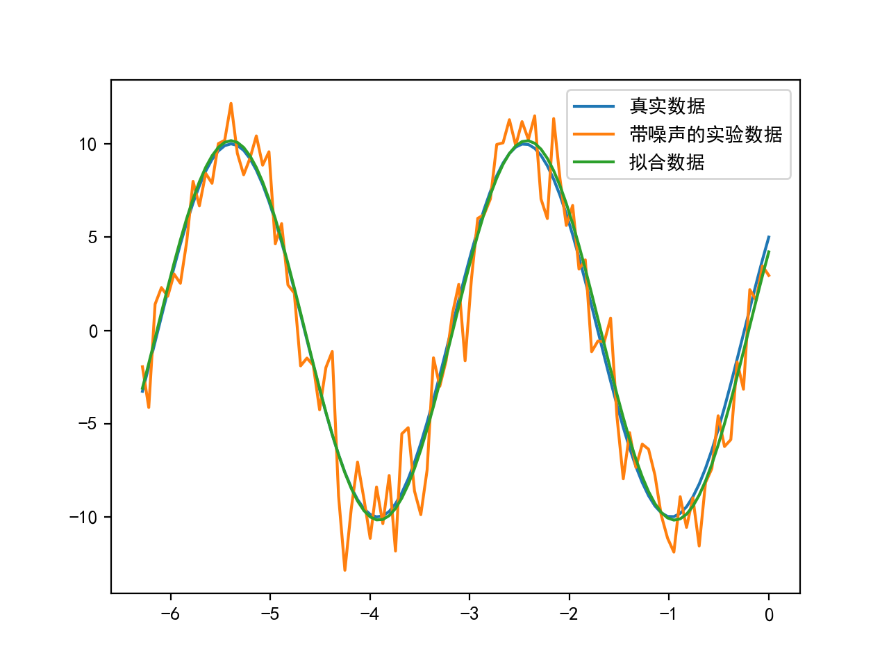
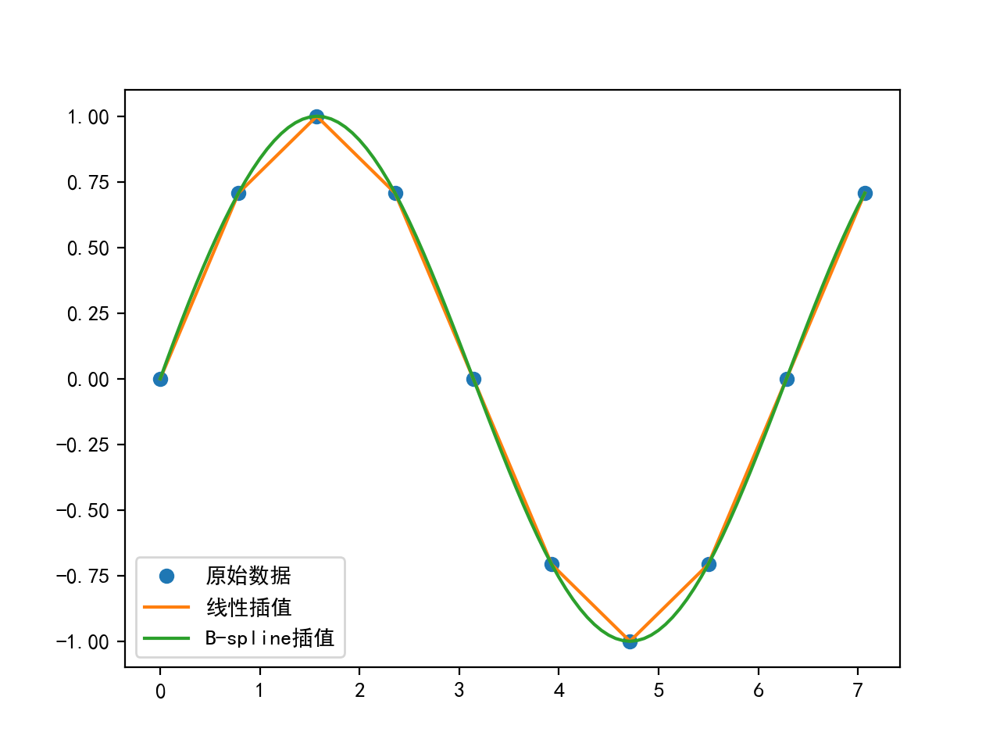
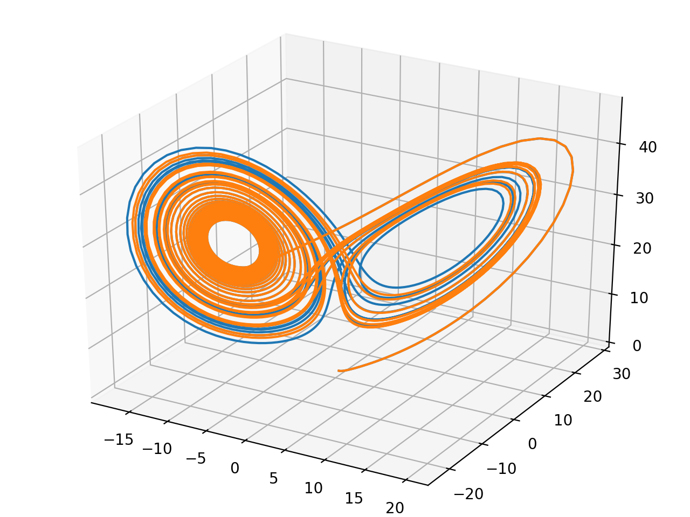
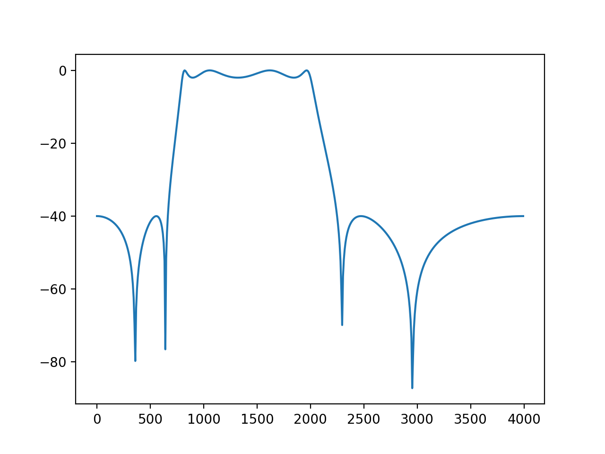
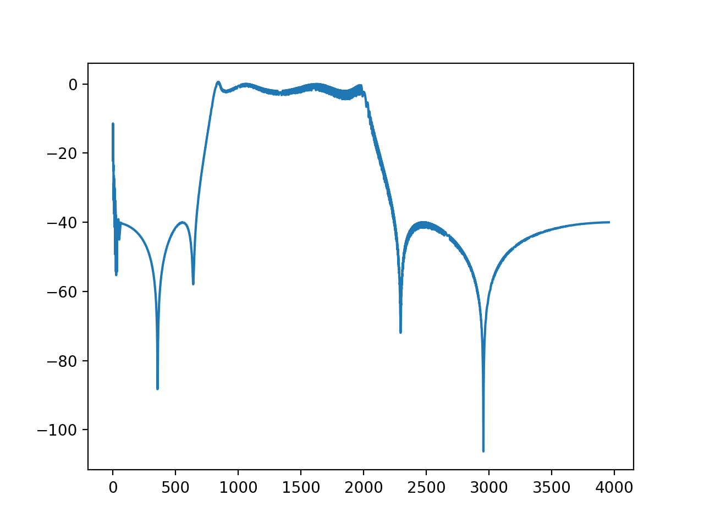

# SciPy-数值计算库

SciPy函数库在NumPy库的基础上增加了众多的数学、科学以及工程计算中常用的库函数。例如线性代数、常微分方程数值求解、信号处理、图像处理、稀疏矩阵等等。由于其涉及的领域众多、本书没有能力对其一一的进行介绍。作为入门介绍，让我们看看如何用SciPy进行插值处理、信号滤波以及用C语言加速计算。

## Catalog

- [最小二乘拟合](#最小二乘拟合)
- [非线性方程组求解](#非线性方程组求解)
- [B-Spline样条曲线](#B-Spline样条曲线)
- [数值积分](#数值积分)
- [解常微分方程组](#解常微分方程组)
- [滤波器设计](#滤波器设计)
- [符号运算](#符号运算)
- [球体体积](#球体体积)

## 最小二乘拟合

假设有一组实验数据$(x[i], y[i])$，我们知道它们之间的函数关系:$y = f(x)$，通过这些已知信息，需要确定函数中的一些参数项。例如，如果$f$是一个线型函数$f(x) = k*x+b$，那么参数k和b就是我们需要确定的值。如果将这些参数用$\bold{p}$表示的话，那么我们就是要找到一组$\bold{*p}$ 值使得如下公式中的$S$函数最小：

$S(\bold{p})=\sum\limits_{i=1}^{m}[y_i-f(x_i,\bold{p})]^2$

这种算法被称之为最小二乘拟合(Least-square fitting)。

scipy中的子函数库optimize已经提供了实现最小二乘拟合算法的函数leastsq。

下面是用leastsq进行数据拟合的一个例子：

```python
# -*- coding: utf-8 -*-
import numpy as np
from scipy.optimize import leastsq
import pylab as pl
pl.mpl.rcParams['font.sans-serif'] = ['SimHei']
pl.mpl.rcParams['axes.unicode_minus'] = False


def func(x, p):
    """
 数据拟合所用的函数: A*sin(2*pi*k*x + theta)
 """
    A, k, theta = p
    return A*np.sin(2*np.pi*k*x+theta)


def residuals(p, y, x):
    """
 实验数据x, y和拟合函数之间的差，p为拟合需要找到的系数
 """
    return y - func(x, p)


x = np.linspace(0, - 2 * np.pi, 100)
A, k, theta = 10, 0.34, np.pi/6         # 真实数据的函数参数
y0 = func(x, [A, k, theta])             # 真实数据
y1 = y0 + 2 * np.random.randn(len(x))   # 加入噪声之后的实验数据

p0 = [7, 0.2, 0]                        # 第一次猜测的函数拟合参数

# 调用leastsq进行数据拟合
# residuals为计算误差的函数
# p0为拟合参数的初始值
# args为需要拟合的实验数据
plsq = leastsq(residuals, p0, args=(y1, x))

print(u"真实参数:", [A, k, theta])
print(u"拟合参数", plsq[0])  # 实验数据拟合后的参数

pl.plot(x, y0, label=u"真实数据")
pl.plot(x, y1, label=u"带噪声的实验数据")
pl.plot(x, func(x, plsq[0]), label=u"拟合数据")
pl.legend()
pl.show()
```

输出结果：

```python
真实参数: [10, 0.34, 0.5235987755982988]
拟合参数: [10.17153618  0.33695583  0.42650544]
```



这个例子中我们要拟合的函数是一个正弦波函数，它有三个参数$\bold{A}$, $\bold{k}$, $\bold{theta}$，分别对应振幅、频率、相角。假设我们的实验数据是一组包含噪声的数据 $x$, $y_1$，其中$y_1$是在真实数据$y_0$的基础上加入噪声的到了。

通过leastsq函数对带噪声的实验数据$x$, $y_1$进行数据拟合，可以找到$x$和真实数据$y_0$之间的正弦关系的三个参数： $\bold{A}$, $\bold{k}$, $\bold{theta}$。下面是程序的输出：

```python
# -*- coding: utf-8 -*-
# 本程序用各种fmin函数求卷积的逆运算

import scipy.optimize as opt
import numpy as np


def test_fmin_convolve(fminfunc, x, h, y, yn, x0):
    """
    x (*) h = y, (*)表示卷积
    yn为在y的基础上添加一些干扰噪声的结果
    x0为求解x的初始值
    """
    def convolve_func(h):
        """
        计算 yn - x (*) h 的power
        fmin将通过计算使得此power最小
        """
        return np.sum((yn - np.convolve(x, h))**2)

    # 调用fmin函数，以x0为初始值
    h0 = fminfunc(convolve_func, x0)

    print(fminfunc.__name__)
    print("---------------------")
    # 输出 x (*) h0 和 y 之间的相对误差
    print("error of y:", np.sum((np.convolve(x, h0)-y)**2)/np.sum(y**2))
    # 输出 h0 和 h 之间的相对误差
    print("error of h:", np.sum((h0-h)**2)/np.sum(h**2))
    print('\n')


def test_n(m, n, nscale):
    """
    随机产生x, h, y, yn, x0等数列，调用各种fmin函数求解b
    m为x的长度, n为h的长度, nscale为干扰的强度
    """
    x = np.random.rand(m)
    h = np.random.rand(n)
    y = np.convolve(x, h)
    yn = y + np.random.rand(len(y)) * nscale
    x0 = np.random.rand(n)

    test_fmin_convolve(opt.fmin, x, h, y, yn, x0)
    test_fmin_convolve(opt.fmin_powell, x, h, y, yn, x0)
    test_fmin_convolve(opt.fmin_cg, x, h, y, yn, x0)
    test_fmin_convolve(opt.fmin_bfgs, x, h, y, yn, x0)


if __name__ == '__main__':
    test_n(200, 20, 0.1)
```

目前无法在PyCharm上运行，shell中可以。

下面是程序的输出：

```python
Warning: Maximum number of function evaluations has been exceeded.
fmin
---------------------
error of y: 0.0022218963984582886
error of h: 0.09973730105116382


Optimization terminated successfully.
         Current function value: 0.204911
         Iterations: 41
         Function evaluations: 7618
fmin_powell
---------------------
error of y: 0.00011240708199307319
error of h: 0.0002290649034222423


Optimization terminated successfully.
         Current function value: 0.204893
         Iterations: 14
         Function evaluations: 682
         Gradient evaluations: 31
fmin_cg
---------------------
error of y: 0.00011233608425669003
error of h: 0.00023010127954901588


Optimization terminated successfully.
         Current function value: 0.204893
         Iterations: 32
         Function evaluations: 968
         Gradient evaluations: 44
fmin_bfgs
---------------------
error of y: 0.0001123360800661849
error of h: 0.00023010120980578475
```

## 非线性方程组求解

optimize库中的fsolve函数可以用来对非线性方程组进行求解。它的基本调用形式如下：

```python
fsolve(func, x0)
```

func(x)是计算方程组误差的函数，它的参数$x$是一个矢量，表示方程组的各个未知数的一组可能解，func返回将$x$代入方程组之后得到的误差；$x_0$为未知数矢量的初始值。如果要对如下方程组进行求解的话：

$$\begin{equation}
\begin{cases}
\begin{array}{cc}
f_1(u_1,u_2,u_3)=0 \\
f_2(u_1,u_2,u_3)=0 \\
f_3(u_1,u_2,u_3)=0
\end{array}
\end{cases}
\end{equation}$$

那么func可以如下定义：

```python
def func(x):
    u1,u2,u3 = x
    return [f1(u1,u2,u3), f2(u1,u2,u3), f3(u1,u2,u3)]
```

下面是一个实际的例子，求解如下方程组的解：

$$\begin{equation}
\begin{cases}
\begin{array}\\
5\cdot x_1+3=0 \\
4\cdot {x_0}^2-2\sin(x_1\cdot x_2)=0 \\
x_1\cdot x_2-1.5 =0
\end{array}
\end{cases}
\end{equation}$$

程序如下：

```python
from scipy.optimize import fsolve
from math import sin


def f(x):
    x0 = float(x[0])
    x1 = float(x[1])
    x2 = float(x[2])
    return [
        5 * x1 + 3,
        4 * x0 * x0 - 2 * sin(x1 * x2),
        x1 * x2 - 1.5
    ]


result = fsolve(f, [1, 1, 1])

print('[x0,x1,x2] =', result)
print('[f1,f2,f3] =', f(result))
```

输出为：

```python
[x0,x1,x2] = [-0.70622057 -0.6        -2.5       ]
[f1,f2,f3] = [0.0, -9.126033262418787e-14, 5.329070518200751e-15]
```

由于fsolve函数在调用函数f时，传递的参数为数组，因此如果直接使用数组中的元素计算的话，计算速度将会有所降低，因此这里先用float函数将数组中的元素转换为Python中的标准浮点数，然后调用标准math库中的函数进行运算。

在对方程组进行求解时，fsolve会自动计算方程组的雅可比矩阵，如果方程组中的未知数很多，而与每个方程有关的未知数较少时，即雅可比矩阵比较稀疏时，传递一个计算雅可比矩阵的函数将能大幅度提高运算速度。比如在一个模拟计算的程序中需要大量求解近有50个未知数的非线性方程组的解。每个方程平均与6个未知数相关，通过传递雅可比矩阵的计算函数使计算速度提高了4倍。

**雅可比(Jacobian)矩阵**

雅可比矩阵是一阶偏导数以一定方式排列的矩阵，它给出了可微分方程与给定点的最优线性逼近，因此类似于多元函数的导数。例如前面的函数$f_1$,$f_2$,$f_3$和未知数$u_1$,$u_2$,$u_3$的雅可比矩阵如下：

$$\begin{bmatrix}
\frac{\partial f_1}{\partial u_1} & 
\frac{\partial f_1}{\partial u_2} & 
\frac{\partial f_1}{\partial u_3} \\
\frac{\partial f_2}{\partial u_1} & 
\frac{\partial f_2}{\partial u_2} & 
\frac{\partial f_2}{\partial u_3} \\
\frac{\partial f_3}{\partial u_1} & 
\frac{\partial f_3}{\partial u_2} & 
\frac{\partial f_3}{\partial u_3} \\ 
\end{bmatrix}$$

使用雅可比矩阵的fsolve实例如下，计算雅可比矩阵的函数j通过fprime参数传递给fsolve，函数j和函数f一样，有一个未知数的解矢量参数x，函数j计算非线性方程组在矢量x点上的雅可比矩阵。由于这个例子中未知数很少，因此程序计算雅可比矩阵并不能带来计算速度的提升。

```python
from scipy.optimize import fsolve
from math import sin, cos


def f(x):
    x0 = float(x[0])
    x1 = float(x[1])
    x2 = float(x[2])
    return [
        5 * x1 + 3,
        4 * x0 * x0 - 2 * sin(x1 * x2),
        x1 * x2 - 1.5
    ]


def j(x):
    x0 = float(x[0])
    x1 = float(x[1])
    x2 = float(x[2])
    return [
        [0, 5, 0],
        [8 * x0, -2 * x2 * cos(x1 * x2), - 2 * x1 * cos(x1 * x2)],
        [0, x2, x1]
    ]

  
resultj = fsolve(f, [1, 1, 1], fprime=j)

print('[x0,x1,x2] =', resultj)
print('[f1,f2,f3] =', f(resultj))
```

## B-Spline样条曲线

interpolate库提供了许多对数据进行插值运算的函数。下面是使用直线和B-Spline对正弦波上的点进行插值的例子。

```python
# -*- coding: utf-8 -*-
import numpy as np
import pylab as pl
from scipy import interpolate
pl.mpl.rcParams['font.sans-serif'] = ['SimHei']
pl.mpl.rcParams['axes.unicode_minus'] = False

x = np.linspace(0, 2*np.pi+np.pi/4, 10)
y = np.sin(x)

x_new = np.linspace(0, 2*np.pi+np.pi/4, 100)
f_linear = interpolate.interp1d(x, y)
tck = interpolate.splrep(x, y)
y_bspline = interpolate.splev(x_new, tck)

pl.plot(x, y, "o",  label=u"原始数据")
pl.plot(x_new, f_linear(x_new), label=u"线性插值")
pl.plot(x_new, y_bspline, label=u"B-spline插值")
pl.legend()
pl.show()
```



使用interpolate库对正弦波数据进行线性插值和B-Spline插值

在这段程序中，通过interp1d函数直接得到一个新的线性插值函数。而B-Spline插值运算需要先使用splrep函数计算出B-Spline曲线的参数，然后将参数传递给splev函数计算出各个取样点的插值结果。

## 数值积分

数值积分是对定积分的数值求解，例如可以利用数值积分计算某个形状的面积。下面让我们来考虑一下如何计算半径为1的半圆的面积，根据圆的面积公式，其面积应该等于PI/2。单位半圆曲线可以用下面的函数表示：

```python
def half_circle(x):
    return (1-x**2)**0.5
```

下面的程序使用经典的分小矩形计算面积总和的方式，计算出单位半圆的面积：

```python
>>> import numpy as np
>>> N = 10000
>>> x = np.linspace(-1, 1, N)
>>> dx = 2.0/N
>>> y = half_circle(x)
>>> dx * np.sum(y[:-1] + y[1:]) # 面积的两倍
3.1412751679989044
```

利用上述方式计算出的圆上一系列点的坐标，还可以用numpy.trapz进行数值积分：

```python
>>> np.trapz(y, x) * 2 # 面积的两倍
3.1415893269315975
```

此函数计算的是以x,y为顶点坐标的折线与X轴所夹的面积。同样的分割点数，trapz函数的结果更加接近精确值一些。

如果我们调用scipy.integrate库中的quad函数的话，将会得到非常精确的结果：

```python
>>> from scipy import integrate
>>> pi_half, err = integrate.quad(half_circle, -1, 1)
>>> pi_half*2
3.1415926535897967
```

多重定积分的求值可以通过多次调用quad函数实现，为了调用方便，integrate库提供了dblquad函数进行二重定积分，tplquad函数进行三重定积分。下面以计算单位半球体积为例说明dblquad函数的用法。

单位半球上的点$(x,y,z)$符合如下方程：

```python
def half_sphere(x, y):
    return (1-x**2-y**2)**0.5
```

因此可以如下定义通过$(x,y)$坐标计算球面上点的$z$值的函数：

```python
>>> integrate.dblquad(half_sphere, -1, 1,
 											lambda x:-half_circle(x),
 											lambda x:half_circle(x))
>>> (2.0943951023931984, 1.0002354500215915e-09)
>>> np.pi*4/3/2 # 通过球体体积公式计算的半球体积
2.0943951023931953
```

dblquad函数的调用方式为：

```python
dblquad(func2d, a, b, gfun, hfun)
```

对于$func2d(x,y)$函数进行二重积分，其中$a,b$为变量$x$的积分区间，而$gfun(x)$到$hfun(x)$为变量$y$的积分区间。

半球体积的积分的示意图如下：


半球体积的双重定积分示意图

$X$轴的积分区间为$[-1.0,1.0]$，对于$x=x_0$时，通过对$Y$轴的积分计算出切面的面积，因此$Y$轴的积分区间如图中红色点线所示。

## 解常微分方程组

scipy.integrate库提供了数值积分和常微分方程组求解算法odeint。下面让我们来看看如何用odeint计算洛仑兹吸引子的轨迹。洛仑兹吸引子由下面的三个微分方程定义：

$$\begin{equation}
\begin{cases}
\begin{array}\\
\frac{dx}{dt}=\sigma\cdot (y-x) \\
\frac{dy}{dt}=x\cdot(\rho-z)-y \\
\frac{dz}{dt}=x\cdot y-\beta\cdot z
\end{array}
\end{cases}
\end{equation}$$

洛仑兹吸引子的详细介绍: http://bzhang.lamost.org/website/archives/lorenz_attactor

这三个方程定义了三维空间中各个坐标点上的速度矢量。从某个坐标开始沿着速度矢量进行积分，就可以计算出无质量点在此空间中的运动轨迹。其中$\sigma,\rho,\beta$为三个常数，不同的参数可以计算出不同的运动轨迹：$x(t), y(t), z(t)$。 当参数为某些值时，轨迹出现馄饨现象：即微小的初值差别也会显著地影响运动轨迹。下面是洛仑兹吸引子的轨迹计算和绘制程序：

```python
# -*- coding: utf-8 -*-
from scipy.integrate import odeint
import numpy as np
from mpl_toolkits.mplot3d import Axes3D
import matplotlib.pyplot as plt


def lorenz(w, t, p, r, b):
    # 给出位置矢量w，和三个参数p, r, b计算出
    # dx/dt, dy/dt, dz/dt的值
    x, y, z = w
    # 直接与lorenz的计算公式对应
    return np.array([p*(y-x), x*(r-z)-y, x*y-b*z])


t = np.arange(0, 30, 0.01)  # 创建时间点
# 调用ode对lorenz进行求解, 用两个不同的初始值
track1 = odeint(lorenz, (0.0, 1.00, 0.0), t, args=(10.0, 28.0, 3.0))
track2 = odeint(lorenz, (0.0, 1.01, 0.0), t, args=(10.0, 28.0, 3.0))

# 绘图
fig = plt.figure()
ax = Axes3D(fig)
ax.plot(track1[:, 0], track1[:, 1], track1[:, 2])
ax.plot(track2[:, 0], track2[:, 1], track2[:, 2])
plt.show()
```



用odeint函数对洛仑兹吸引子微分方程进行数值求解所得到的运动轨迹

我们看到即使初始值只相差$0.01$，两条运动轨迹也是完全不同的。

在程序中先定义一个lorenz函数，它的任务是计算出某个位置的各个方向的微分值，这个计算直接根据洛仑兹吸引子的公式得出。然后调用odeint，对微分方程求解，odeint有许多参数，这里用到的四个参数分别为：

1. lorenz， 它是计算某个位移上的各个方向的速度(位移的微分)
2. (0.0, 1.0, 0.0)，位移初始值。计算常微分方程所需的各个变量的初始值
3. t， 表示时间的数组，odeint对于此数组中的每个时间点进行求解，得出所有时间点的位置
4. args， 这些参数直接传递给lorenz函数，因此它们都是常量

## 滤波器设计

scipy.signal库提供了许多信号处理方面的函数。在这一节，让我们来看看如何利用signal库设计滤波器，查看滤波器的频率响应，以及如何使用滤波器对信号进行滤波。

假设如下导入signal库:

```python
>>> import scipy.signal as signal
```

下面的程序设计一个带通IIR滤波器：

```python
>>> b, a = signal.iirdesign([0.2, 0.5], [0.1, 0.6], 2, 40)
>>> b
array([ 0.03193562, -0.05910825,  0.04142241, -0.05481403,  0.08626467,
       -0.05481403,  0.04142241, -0.05910825,  0.03193562])
>>> a
array([ 1.        , -3.30745502,  6.76994048, -9.43199719, 10.11810698,
       -8.04647662,  4.89587393, -2.00060123,  0.5162737 ])
```

这个滤波器的通带为$0.2f_0$到$0.5f_0$，阻带为小于$0.1f_0$和大于$0.6f_0$，其中$f_0$为$1/2$的信号取样频率，如果取样频率为$8k\rm Hz$的话，那么这个带通滤波器的通带为$800\rm Hz$到$2k\rm Hz$。通带的最大增益衰减为$2dB$，阻带的最小增益衰减为$40dB$，即通带的增益浮动在$2dB$之内，阻带至少有$40dB$的衰减。

iirdesgin返回的两个数组$b$和$a$， 它们分别是IIR滤波器的分子和分母部分的系数。其中$a[0]$恒等于$1$。

下面通过调用freqz计算所得到的滤波器的频率响应：

```
>>> w, h = signal.freqz(b, a)
>>> h
```

freqz返回两个数组$w$和$h$，其中$w$是圆频率数组，通过$w/\pi*f_0$可以计算出其对应的实际频率。$h$是$w$中的对应频率点的响应，它是一个复数数组，其幅值为滤波器的增益，相角为滤波器的相位特性。

下面计算$h$的增益特性，并转换为$dB$度量。由于$h$中存在幅值几乎为$0$的值，因此先用clip函数对其裁剪之后，再调用对数函数，避免计算出错。

```python
>>> power = 20*np.log10(np.clip(np.abs(h), 1e-8, 1e100))
```

通过下面的语句可以绘制出滤波器的增益特性图，这里假设取样频率为$8k\rm Hz$ :

```python
>>> pl.plot(w/np.pi*4000, power)
```

**freqz计算的滤波器频谱**



在实际运用中为了测量未知系统的频率特性，经常将频率扫描波输入到系统中，观察系统的输出，从而计算其频率特性。下面让我们来模拟这一过程。
为了调用chirp函数以产生频率扫描波形的数据，首先需要产生一个等差数组代表取样时间，下面的语句产生$2$秒钟取样频率为$8k\rm Hz$的取样时间数组：

```python
>>> t = np.arange(0, 2, 1/8000)
```

然后调用chirp得到$2$秒钟的频率扫描波形的数据：

```python
>>> sweep = signal.chirp(t, f0=0, t1 = 2, f1=4000.0)
>>> sweep
array([ 1.        ,  1.        ,  0.99999992, ..., -0.99999961,
        0.99999992, -1.        ])
```

频率扫描波的开始频率$f_0$为$0\rm Hz$，结束频率$f_1$为$4k\rm Hz$，到达$4k \rm Hz$的时间为$2$秒，使用数组$t$作为取样时间点。

下面通过调用lfilter函数计算sweep波形经过带通滤波器之后的结果：

```python
>>> out = signal.lfilter(b, a, sweep)
array([ 0.03193562,  0.078453  ,  0.0575273 , ..., -0.00999908,
        0.00999909, -0.00999909])
```

lfilter内部通过如下算式计算IIR滤波器的输出：

通过如下算式可以计算输入为$x$时的滤波器的输出，其中数组$x$代表输入信号，$y$代表输出信号：

$$y[n] = b[0] x[n] + b[1] x[n-1] + \cdots + b[P] x[n-P] \\
\qquad -a[1] y[n-1] - a[2] y[n-2] - \cdots - a[Q] y[n-Q]$$

为了和系统的增益特性图进行比较，需要获取输出波形的包络，因此下面先将输出波形数据转换为能量值：

```python
>>> out = 20*np.log10(np.abs(out))
>>> out
array([-29.91449261, -22.10780877, -24.80252051, ..., -40.00080168,
       -40.00079462, -40.00079146])
```

为了计算包络，找到所有能量大于前后两个取样点(局部最大点)的下标：

```python
>>> index = np.where(np.logical_and(out[1:-1] > out[:-2], out[1:-1] > out[2:]))[0] + 1
>>> index
 array([    1,     4,     7, ..., 15690, 15747, 15821])
```

最后将时间转换为对应的频率，绘制所有局部最大点的能量值：

```python
>>> pl.plot(t[index]/2.0*4000, out[index] )
```

下图显示freqz计算的频谱和频率扫描波得到的频率特性，我们看到其结果是一致的。

**频率扫描波测量的滤波器频谱**



带通IIR滤波器的频率响应和频率扫描波计算的结果比较

## 符号运算

欧拉恒等式：

$e^{\pi i}+1=0$

其中$e$是自然指数的底，$i$是虚数单位，$\pi$是圆周率。此公式被誉为数学最奇妙的公式，它将$5$个基本数学常数用加法、乘法和幂运算联系起来。下面用SymPy验证一下这个公式。

载入的符号中，E表示自然指数的底，I表示虚数单位，pi表示圆周率，因此上述的公式可以直接如下计算：

```python
>>> from sympy import *
>>> E**(I*pi)+1
0
```

欧拉恒等式可以下面的公式进行计算，

$e^{ix}=\cos x+i\sin x$

为了用SymPy求证上面的公式，我们需要引入变量$x$。在SymPy中，数学符号是Symbol类的对象，因此必须先创建之后才能使用：

```python
>>> x = Symbol('x')
```

expand函数可以将公式展开，我们用它来展开$e^{ix}$试试看：

```python
>>> expand( E**(I*x) )
exp(I*x)
```

没有成功，只是换了一种写法而已。这里的exp不是math.exp或者numpy.exp，而是sympy.exp，它是一个类，用来表述自然指数函数。

expand函数有关键字参数complex，当它为True时，expand将把公式分为实数和虚数两个部分：

```python
>>> expand(exp(I*x), complex=True)                                                             
I*exp(-im(x))*sin(re(x)) + exp(-im(x))*cos(re(x))
```

这次得到的结果相当复杂，其中sin, cos, re, im都是sympy定义的类，re表示取实数部分，im表示取虚数部分。显然这里的运算将符号$x$当作复数了。为了指定符号$x$必须是实数，我们需要如下重新定义符号$x$：

```python
>>> x = Symbol("x", real=True)
>>> expand(exp(I*x), complex=True)
I*sin(x) + cos(x)
```

终于得到了我们需要的公式。那么如何证明它呢。我们可以用泰勒多项式展开：

```python
>>> tmp = series(exp(I*x), x, 0, 10)                                                           

>>> pprint(tmp)                                                                                
           2      3     4     5     6      7      8        9          
          x    ⅈ⋅x     x    ⅈ⋅x     x     ⅈ⋅x      x      ⅈ⋅x      ⎛ 10⎞
1 + ⅈ⋅x - ── - ──── + ── + ──── - ─── - ──── + ───── + ────── + O⎝x  ⎠
          2     6     24   120    720   5040   40320   362880         
```

series是泰勒展开函数，pprint将公式用更好看的格式打印出来。下面分别获得tmp的实部和虚部，分别和cos(x)和sin(x)的展开公式进行比较：

series是泰勒展开函数，pprint将公式用更好看的格式打印出来。下面分别获得tmp的实部和虚部，分别和cos(x)和sin(x)的展开公式进行比较：

> ```python
> >>> pprint(re(tmp))
>       8      6    4    2                 
>     x      x    x    x      ⎛ ⎛ 10⎞⎞    
> ───── - ─── + ── - ── + re⎝O⎝x  ⎠⎠ + 1
> 40320   720   24   2   
> >>> pprint( series( cos(x), x, 0, 10) )
>         2    4     6      8          
>        x    x     x      x      ⎛ 10⎞
> 1 - ── + ── - ─── + ───── + O⎝x  ⎠
>        2    24   720   40320         
> >>> pprint(im(tmp))
>       9       7      5    3                 
>     x       x      x    x          ⎛ ⎛ 10⎞⎞
> ────── - ──── + ─── - ── + x + im⎝O⎝x  ⎠⎠
> 362880   5040   120   6                  
> >>> pprint(series(sin(x), x, 0, 10))
>         3     5     7       9           
>        x     x     x       x       ⎛ 10⎞
> x - ── + ─── - ──── + ────── + O⎝x  ⎠
>        6    120   5040   362880         
> ```

## 球体体积

在[Scipy数值积分](##数值积分)一节我们介绍了如何使用数值定积分计算球体的体积，而SymPy的符号积分函数integrate则可以帮助我们进行符号积分。integrate可以进行不定积分：

```python
>>> integrate(x*sin(x), (x, 0, 2*pi))
-2*pi
```

如果指定x的取值范围的话，integrate则进行定积分运算：

为了计算球体体积，首先让我们来看看如何计算圆形面积，假设圆形的半径为$r$，则圆上任意一点的$Y$坐标函数为：

$$y(x)=\sqrt{r^2-x^2}$$

因此我们可以直接对上述函数在$[-r,r]$区间上进行积分得到半圆面积，注意这里我们使用symbols函数一次创建多个符号：

```python
>>> x, y, r = symbols('x,y,r')
>>> 2 * integrate(sqrt(r*r-x**2), (x, -r, r))
 2*Piecewise((Integral(Piecewise((-I*r/sqrt(-1 + x**2/r**2) + 3*I*x**2/(2*r*sqrt(-1 + x**2/r**2)) + I*x**2/(2*r*(-1 + x**2/r**2)**(3/2)) - I*x**4/(2*r**3*(-1 + x**2/r**2)**(3/2)), Abs(x**2/r**2) > 1), (r*sqrt(1 - x**2/r**2)/2 + r/(2*sqrt(1 - x**2/r**2)) - x**2/(2*r*sqrt(1 - x**2/r**2)), True)), (x, -r, r)), r > -r), (-Integral(Piecewise((-I*r/sqrt(-1 + x**2/r**2) + 3*I*x**2/(2*r*sqrt(-1 + x**2/r**2)) + I*x**2/(2*r*(-1 + x**2/r**2)**(3/2)) - I*x**4/(2*r**3*(-1 + x**2/r**2)**(3/2)), Abs(x**2/r**2) > 1), (r*sqrt(1 - x**2/r**2)/2 + r/(2*sqrt(1 - x**2/r**2)) - x**2/(2*r*sqrt(1 - x**2/r**2)), True)), (x, r, -r)), True))
```

很遗憾，integrate函数没有计算出结果。这是因为SymPy不知道$r$是大于$0$的，如下重新定义$r$，就可以得到正确答案了：

```python
>>> r = symbols('r', positive=True)
>>> circle_area = 2 * integrate(sqrt(r**2-x**2), (x, -r, r))
>>> circle_area
pi*r**2
```

接下来对此面积公式进行定积分，就可以得到球体的体积，但是随着X轴坐标的变化，对应的切面的的半径会发生变化，现在假设$X$轴的坐标为$x$，球体的半径为$r$，则$x$处的切面的半径为可以使用前面的公式$y(x)$计算出。


球体体积的双重定积分示意图

因此我们需要对circle_area中的变量$r$进行替代：

```python
>>> circle_area = circle_area.subs(r, sqrt(r**2-x**2))
>>> circle_area
pi*(r**2 - x**2)
```

用subs进行算式替换

subs函数可以将算式中的符号进行替换，它有3种调用方式：

- expression.subs(x, y) : 将算式中的x替换成y
- expression.subs({x:y,u:v}) : 使用字典进行多次替换
- expression.subs([(x,y),(u,v)]) : 使用列表进行多次替换

请注意多次替换是顺序执行的，因此：

```python
expression.sub([(x,y),(y,x)])
```

并不能对两个符号x, y进行交换。

然后对circle_area中的变量$x$在区间$[-r,r]$上进行定积分，得到球体的体积公式：

```python
>>> integrate(circle_area, (x, -r, r))                                                       
4*pi*r**3/3
```

