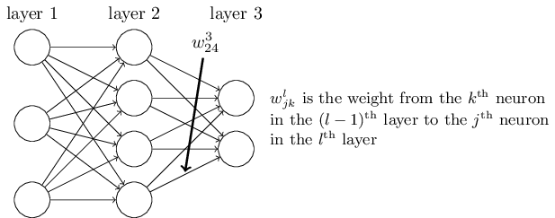
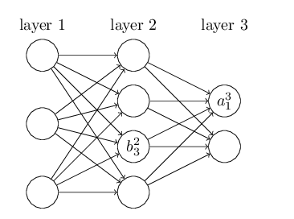
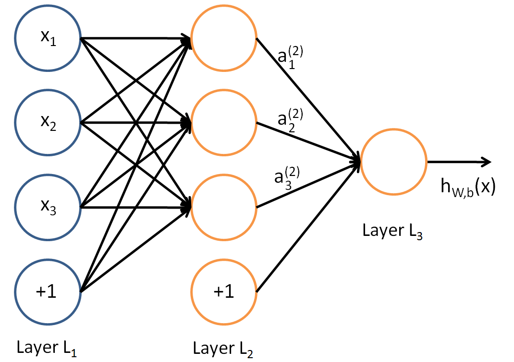

# 神经网络前向与反向传播的详细推导

## 常见符号解释

在求出前向传播和反向传播前要先确定参数和输入输出符号的表达形式

最普通的 DNN 就可以看做是一个多层感知机 MLP ，感知机的输出其实就是对输入的加权求和: $z=\sum w_ix_i+b$ ，再经过一个非线性激活函数 $\sigma(z)$

首先来定义权值矩阵 $W$，按照下图规则，$w_{24}^3$ 表示的是第 $3$ 层第 $2$ 个神经元和第 $2$ 层第 $4$ 个神经元之间连线（连线就代表权重，可以看成是 $w_{24}^{32}$ 的省略写法）

偏置项 $b$ 的定义也是类似，$b_3^2$ 表示第 $2$ 层第 $3$ 个神经元的偏置

而 $z_1^3$ 表示第 $3$ 层第 $1$ 个神经元的输入，而 $a_1^3$ 表示第 $3$ 层第 $1$ 个神经元的输出

更一般的，

- $w_{jk}^l$ 是第 $l-1$ 层的第 $k$ 个神经元连接第 $l$ 层的第 $j$ 个神经元的权重
- $b_j^l$ 是第 $l$ 层的第 $j$ 个神经元的偏置
- $z_j^l$ 是第 $l$ 层的第 $j$ 个神经元的输入
- $a_j^l$ 是第 $l$ 层的第 $j$ 个神经元的输出
- $n_l$ 是第 $l$ 层的神经元个数

并假设，我们的激活函数为 $\sigma(z)$ ，其具体形式可以是 Sigmoid，ReLU 等等，这里不再赘述

## 前向过程

对于第 $2$ 层第 $1$ 个节点的输出 $a_1^2$ 有
$$
a_1^2=\sigma(z_1^2)=\sigma(w_{11}^2x_1 + w_{12}^2x_2 + w_{13}^2x_3 + b_1^{2})
$$
对于第 $3$ 层第 $1$ 个节点的输出 $a_1^3$ 有
$$
a_1^3=\sigma(z_1^3)=\sigma(w_{11}^3a_1 + w_{12}^3a_2 + w_{13}^3a_3 + b_1^{3})
$$
更一般的，假设第 $l-1$ 层有 $n_{l-1}$ 个神经元，对于 $a_j^l$ 有
$$
a_j^l=\sigma(z_j^l)=\sigma(\sum_{k=1}^{n_{l-1}} w_{jk}^la_k^{l-1}+b_j^l)
$$
也就是第 $l$ 层第 $j$ 个神经元的输入为与它相连的上一层 **每个神经元** 的 **输出加权求和** 后加上 **该神经元对应的偏置** ，该神经元所做的工作只是把这个结果做一个 **非线性激活**

为了方便化，我们可以将形式向量化，假设第 $l$ 层有 $n_l$ 个神经元，记
$$
z^l=\left[
\begin{matrix}
z_1^l \\ z_2^l \\ \vdots \\ z_{n_l}^l
\end{matrix}\right]_{n_l \times 1}, \quad 
w^l=\left[
\begin{matrix}
w_{11}^l & w_{12}^l & \cdots & w_{1n_{l-1}}^l \\
w_{21}^l & w_{22}^l & \cdots & w_{2n_{l-1}}^l \\
\vdots & \vdots & \ddots & \vdots \\
w_{n_l1}^l & w_{n_l2}^l & \cdots & w_{n_ln_{l-1}}^l \\
\end{matrix}\right]_{n_l \times n_{l-1}}, \quad 
a^{l-1}=\left[
\begin{matrix}
a_1^{l-1} \\ a_2^{l-1} \\ \vdots \\ a_{n_{l-1}}^{l-1}
\end{matrix}\right]_{n_{l-1} \times 1}, \quad 
b^l=\left[
\begin{matrix}
b_1^l \\ b_2^l \\ \vdots \\ b_n^l
\end{matrix}\right]_{n_l \times 1}, \quad
$$
则有向量化的前向公式
$$
\begin{split}
z^l &= w^la^{l-1}+b^l \\
a^l &= \sigma(z^l)
\end{split}
$$

## 反向传播过程

当通过前向传播得到由任意一组随机参数 $W$ 和 $b$ 计算出的网络预测结果后，我们可以利用损失函数相对于每个参数的梯度来对他们进行修正，事实上神经网络的训练就是这样一个不停的前向-反向传播的过程，直到网络的预测能力达到我们的预期

假设选择最简单的均方误差和作为损失函数
$$
J(W,b,x,y)=\frac12 \left\Vert a^L-y \right\Vert_2^2
$$
下面就根据这个损失函数更新每一层的 $w,b$

根据前向传播的公式，输出层 $L$ 的输出
$$
a^L=\sigma(z^L)=\sigma(w^La^{L-1}+b^L)
$$
带入到损失函数中，有
$$
J(W,b,x,y)=\frac {1}{2}||\sigma (w^La^{L-1}+b^L)-y||_2^2
$$
记运算 $\odot$ 为
$$
P_{n\times m} \odot Q_{n\times1} = 
\left[\begin{matrix}
p_{11} & p_{12} & \cdots & p_{1m} \\
p_{21} & p_{22} & \cdots & p_{2m} \\
\vdots & \vdots & \ddots & \vdots \\
p_{n1} & p_{n2} & \cdots & p_{nm}
\end{matrix}\right] \odot
\left[\begin{matrix}
q_1 \\ q_2 \\ \vdots \\ q_n
\end{matrix}\right] = 
\left[\begin{matrix}
p_{11}q_1 & p_{12}q_1 & \cdots & p_{1m}q_1 \\
p_{21}q_2 & p_{22}q_2 & \cdots & p_{2m}q_2 \\
\vdots & \vdots & \ddots & \vdots \\
p_{n1}q_n & p_{n2}q_n & \cdots & p_{nm}q_n
\end{matrix}\right]
$$
根据复合函数链式求导法则，$L$ 层参数 $W^L,b^L$ 的梯度容易求得
$$
\begin{align}
& \delta w^L=\frac{\partial J(W,b,x,y)}{\partial W^L}=\frac {\partial J(W,b,x,y)}{\partial z^L}\cdot \frac{\partial z^L}{\partial W^L}=(a^L-y)\odot \sigma^{(1)}(z^L)(a^{L-1})^T \\ 
& \delta b^L=\frac{\partial J(W,b,x,y)}{\partial b^L} = \frac{\partial J(W,b,x,y)}{\partial z^L}\frac{\partial z^L}{\partial b^L} =(a^L-y)\odot \sigma^{(1)}(z^L)
\end{align}
$$
显然，两式有一部分是重叠的，将这部分记做 $\delta^L$，$shape(\delta^L)=(n_L,1)$
$$
\delta^L=\frac{\partial J(W,b,x,y)}{\partial b^L} =(a^L-y)\odot \sigma^{(1)}(z^L)
$$
这一规律同样适用在非输出层的隐藏层 $L-1,L-2,\cdots,l,\cdots,1$ ，我们只需要求出损失函数相对 $l$ 层非激活输出 $z^l$ 的导数，再根据前向传播公式 $z^l=w^la^{l-1}+b^l$ 便可以轻易的求得 $W^L,b^l$ 

同样，根据链式求导法则，
$$
\begin{align}
& \delta^l =\frac{\partial J(W,b,x,y)}{\partial b^l} 
= \frac{\partial J(W,b,x,y)}{\partial z^l}\frac{\partial z^l}{\partial b^l}
= \frac{\partial J(W,b,x,y)}{\partial z^L}\frac{\partial z^L}{\partial z^{L-1}}\frac{\partial z^{L-1}}{\partial z^{L-2}}...\frac{\partial z^{l+1}}{\partial z^{l}} \\
& \frac{\partial J(W,b,x,y)}{\partial W^l} = \frac{\partial J(W,b,x,y)}{\partial z^l} \frac{\partial z^l}{\partial W^l} = \delta^{l}(a^{l-1})^T
\end{align}
$$
至此，问题的关键转化成如何求解 $\delta^l$，既然是反向传播，在求第 $l$ 层参数时，$\delta^L,...,\delta^{l+1}$ 都是已知的，还是根据链式求导法则
$$
\delta^{l} = \frac{\partial J(W,b,x,y)}{\partial z^l} = \frac{\partial J(W,b,x,y)}{\partial z^{l+1}}\frac{\partial z^{l+1}}{\partial z^{l}} = \delta^{l+1}\frac{\partial z^{l+1}}{\partial z^{l}}
$$
显然，问题的关键在于求解 $\frac{\partial z^{l+1}}{\partial z^{l}}$ ，再根据前向传播公式，
$$
\frac{\partial z^{l+1}}{\partial z^{l}}=
\frac{\partial z^{l+1}}{\partial a^{l}} \odot \frac{\partial a^l}{\partial z^{l}}=
(W^{l+1})^T \odot \sigma^{(1)}(z^l), \quad shape=(n_l,n_{l+1})
$$
所以
$$
\delta^{l} = \delta^{l+1}((W^{l+1})^T \odot \sigma^{(1)}(z^l))
$$
但是发现如上式那么组合的话，维度上是不相容的，所以应该调整成如下式
$$
\delta^{l} = ((W^{l+1})^T \odot \sigma^{(1)}(z^l))\delta^{l+1}
=(W^{l+1})^T \delta^{l+1} \odot \sigma^{(1)}(z^l)
$$
所以反向传播算法，关键公式为
$$
\begin{align}
\delta^L &= J^{(1)}(a^L) \odot \sigma^{(1)}(z^L) \\
\delta^{l} &=(W^{l+1})^T \delta^{l+1} \odot \sigma^{(1)}(z^l) \\
\frac{\partial J}{\partial W^l} &= \delta^l(a^{l-1})^T \\
\frac{\partial J}{\partial b^l} &= \delta^l
\end{align}
$$

