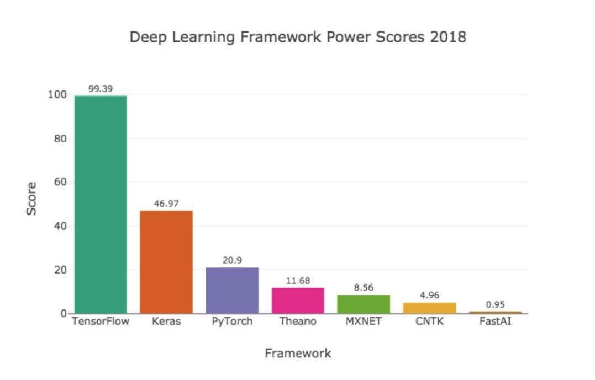

# 1. Tensorflow 2.0 简明文档

## 1.1. catalog

- [关于 TensorFlow](#关于-tensorflow)
    - [简介](#简介)
    - [各种主流框架](#各种主流框架)
    - [TensorFlow 的特征](#tensorflow-的特征)
- [TensorFlow 安装与环境配置](#tensorflow-安装与环境配置)
    - [一般安装步骤](#一般安装步骤)
        - [Conda 安装技巧](#conda-安装技巧)
            - [Pypi 镜像使用帮助](#pypi-镜像使用帮助)
            - [Anaconda 镜像使用帮助](#anaconda-镜像使用帮助)
        - [Conda 虚拟环境](#conda-虚拟环境)
    - [使用 Docker 部署 TensorFlow 环境](#使用-docker-部署-tensorflow-环境)
    - [安装测试](#安装测试)
- [Tensorflow 基础](#tensorflow-基础)
    - [前置知识](#前置知识)
    - [基础元素](#基础元素)
- [自动求导机制](#自动求导机制)
- [基础示例：线性回归](#基础示例线性回归)
        - [基础知识和原理参考](#基础知识和原理参考)
    - [NumPy 下的线性回归](#numpy-下的线性回归)
    - [TensorFlow 下的线性回归](#tensorflow-下的线性回归)

## 1.2. 关于 TensorFlow

### 1.2.1. 简介

- TensorFlow™ 是一个采用数据流图（data flow graphs），用于数值计算的开源软件库

- 节点（Nodes）在图中表示数学操作，图中的线（edges）则表示在节点间相互联系的多维数据数组，即张量（tensor）

- 它灵活的架构让你可以在多种平台上展开计算，例如台式计算机中的一个或多个CPU（或GPU），服务器，移动设备等等

- TensorFlow 最初由Google大脑小组（隶属于Google机器智能研究机构）的研究员和工程师们开发出来，用于机器学习和深度神经网络方面的研究，但这个系统的通用性使其也可广泛用于其他计算领域

### 1.2.2. 各种主流框架

| 名称       | 简介                                                         |
| :--------- | ------------------------------------------------------------ |
| caffe      | 深度学习最古老的框架，代码没做优化，适合源码阅读，理解机器学 习，文档少。大多框架基于此，早期的论文使用caffe较多 |
| Pytorch    | Facebook人工智能学院创立的框架，具有良好的易用性，设计简洁   |
| Mxnet      | 框架文档少、资料少、但是优化好，灵活性强，内存显存复用优化、 运行速度比较快 |
| Tensorflow | google支持，文档齐全，开源资源多，使用人员较多               |

 			 		



### 1.2.3. TensorFlow 的特征

- **高度的灵活性** TensorFlow 不是一个严格的 “神经网络” 库，只要你可以将你的计算表示为一个数据流图，你就 可以使用Tensorflow
- **真正的可移植性** TensorFlow 不仅支持在 CPU 和 GPU 上运行，还支持在台式机、服务器、手机移动设备上运行，以及多CPU上规模化运算等
- **将科研和产品联系在一起** 使用 Tensorflow 可以让应用型研究者将想法迅速运用到产品中， 也可以让学术性研究者更直接地彼此分享代码，从而提高科研产出率
- **自动求微分** 基于梯度的机器学习算法会受益于 Tensorflow 自动求微分的能力，只需要定义预测模型的结构，将这个结构和目标函数(objective function)结合在一 起，并添加数据，Tensorflow 将自动为你计算相关的微分导数
- **多语言支持** 可以直接写 python/c++ 程序，也可以用交互式的 ipython 界面来用 Tensorflow 尝试些想法，它可以帮你将笔记、代码、 可视化等有条理地归置好，还鼓励创造最喜欢的语言界面，比如Go，Java， Lua，Javascript，或者是R
- **性能最优化** Tensorflow 给予了线程、队列、异步操作等以最佳的支持，Tensorflow 可以将硬件的计算潜能全部发挥出来，也可以自由地将 Tensorflow 图中的计算元素分配到不同设备

## 1.3. TensorFlow 安装与环境配置

TensorFlow 支持 Python、Java、Go、C 等多种编程语言以及 Windows、OSX、Linux 等多种操作系统，此处及后文均以 Python 3.7 为准 			 		

### 1.3.1. 一般安装步骤

1. 安装 Python 环境，此处建议安装 [Anaconda](https://www.anaconda.com/) 的 Python 3.7 版本（后文均以此为准），这是一个开源的 Python 发行版本，提供了一个完整的科学计算环境，包括 NumPy、SciPy 等常用科学计算库，当然，你有权选择自己喜欢的 Python 环境，Anaconda 的安装包可在 [这里](https://mirrors.tuna.tsinghua.edu.cn/anaconda/archive/) 获得

2. 使用 Anaconda 自带的 conda 包管理器建立一个 Conda 虚拟环境，并进入该虚拟环境，在命令行下输入

	```sh
	conda create --name tf2.0 python=3.7   # “tf2.0”是你建立的 Conda 虚拟环境的名字
	conda activate tf2.0                   # 进入名为“tf2.0”的虚拟环境
	```

3. 使用 Python 包管理器 pip 安装 TensorFlow，在命令行下输入

	```sh
	pip install tensorflow==2.0.0           # TensorFlow CPU 版本
	```

	或

	```sh
	pip install tensorflow-gpu==2.0.0       # TensorFlow GPU 版本，需要具有NVIDIA显卡及正确安装驱动程序，因为目前没有 GPU，不做进一步探究
	```

#### 1.3.1.1. Conda 安装技巧

可以使用 `conda install tensorflow` 或者 `conda install tensorflow-gpu` 来安装 TensorFlow，不过 conda 源的版本往往更新较慢，难以第一时间获得最新的 TensorFlow 版本，在 Windows 下，需要打开开始菜单中的 “Anaconda Prompt” 进入 Anaconda 的命令行环境

如果对磁盘空间要求严格（比如服务器环境），可以安装 [Miniconda](https://docs.conda.io/en/latest/miniconda.html) ，仅包含 Python 和 Conda，但是可以通过 pip 和 conda 来安装所需要的包，Miniconda 的安装包可在 [这里](https://mirrors.tuna.tsinghua.edu.cn/anaconda/miniconda/) 获得

在国内环境下，推荐使用国内的 pypi 镜像和 Anaconda 镜像，将显著提升 pip 和 conda 的下载速度

##### 1.3.1.1.1. Pypi 镜像使用帮助

pypi 镜像每 5 分钟同步一次

**临时使用**

```sh
pip install -i https://pypi.tuna.tsinghua.edu.cn/simple some-package
```

注意，`simple` 不能少, 是 `https` 而不是 `http`

**设为默认**

升级 pip 到最新的版本 (>=10.0.0) 后进行配置

```sh
pip install pip -U
pip config set global.index-url https://pypi.tuna.tsinghua.edu.cn/simple
```

如果您到 pip 默认源的网络连接较差，临时使用本镜像站来升级 pip

```sh
pip install -i https://pypi.tuna.tsinghua.edu.cn/simple pip -U
```

##### 1.3.1.1.2. Anaconda 镜像使用帮助

TUNA 还提供了 Anaconda 仓库与第三方源（conda-forge、msys2、pytorch等，[查看完整列表](https://mirrors.tuna.tsinghua.edu.cn/anaconda/cloud/)）的镜像，各系统都可以通过修改用户目录下的 `.condarc` 文件

```markdown
channels:
  - defaults
show_channel_urls: true
default_channels:
  - https://mirrors.tuna.tsinghua.edu.cn/anaconda/pkgs/main
  - https://mirrors.tuna.tsinghua.edu.cn/anaconda/pkgs/free
  - https://mirrors.tuna.tsinghua.edu.cn/anaconda/pkgs/r
custom_channels:
  conda-forge: https://mirrors.tuna.tsinghua.edu.cn/anaconda/cloud
  msys2: https://mirrors.tuna.tsinghua.edu.cn/anaconda/cloud
  bioconda: https://mirrors.tuna.tsinghua.edu.cn/anaconda/cloud
  menpo: https://mirrors.tuna.tsinghua.edu.cn/anaconda/cloud
  pytorch: https://mirrors.tuna.tsinghua.edu.cn/anaconda/cloud
  simpleitk: https://mirrors.tuna.tsinghua.edu.cn/anaconda/cloud
```

即可添加 Anaconda Python 免费仓库，Windows 用户无法直接创建名为 `.condarc` 的文件，可先执行 `conda config --set show_channel_urls yes` 生成该文件之后再修改

#### 1.3.1.2. Conda 虚拟环境

在 Python 开发中，很多时候我们希望每个应用有一个独立的 Python 环境（比如应用 1 需要用到 TensorFlow 1.X，而应用 2 使用 TensorFlow 2.0），这时，Conda 虚拟环境即可为一个应用创建一套 “隔离” 的 Python 运行环境，使用 Python 的包管理器 conda 即可轻松地创建 Conda 虚拟环境，常用命令如下

```sh
conda create --name [env-name]      # 建立名为[env-name]的Conda虚拟环境
conda activate [env-name]           # 进入名为[env-name]的Conda虚拟环境
conda deactivate                    # 退出当前的Conda虚拟环境
conda env remove --name [env-name]  # 删除名为[env-name]的Conda虚拟环境
conda env list                      # 列出所有Conda虚拟环境
```

### 1.3.2. 使用 Docker 部署 TensorFlow 环境

Docker 是轻量级的容器（Container）环境，通过将程序放在虚拟的 “容器” 或者说 “保护层” 中运行，既避免了配置各种库、依赖和环境变量的麻烦，又克服了虚拟机资源占用多、启动慢的缺点，使用 Docker 部署 TensorFlow 的步骤如下

1. 安装 [Docker](https://www.docker.com/) ，Windows 下，下载官方网站的安装包进行安装即可，Linux 下建议使用 [官方的快速脚本](https://docs.docker.com/install/linux/docker-ce/ubuntu/#install-using-the-convenience-script) 进行安装，即命令行下输入

```sh
wget -qO- https://get.docker.com/ | sh
```

如果当前的用户非 root 用户，可以执行 `sudo usermod -aG docker your-user` 命令将当前用户加入 `docker` 用户组，重新登录后即可直接运行 Docker

Linux 下通过以下命令启动 Docker 服务：

```sh
sudo service docker start
```

2. 拉取 TensorFlow 映像。Docker 将应用程序及其依赖打包在映像文件中，通过映像文件生成容器。使用 `docker image pull` 命令拉取适合自己需求的 TensorFlow 映像，例如

```sh
docker image pull tensorflow/tensorflow:latest-py3        # 最新稳定版本TensorFlow（Python 3.5，CPU版）
docker image pull tensorflow/tensorflow:latest-gpu-py3    # 最新稳定版本TensorFlow（Python 3.5，GPU版）
```

3. 基于拉取的映像文件，创建并启动 TensorFlow 容器。使用 `docker container run` 命令创建一个新的 TensorFlow 容器并启动

**CPU 版本的 TensorFlow**

```sh
docker container run -it tensorflow/tensorflow:latest-py3 bash
```

`docker container run` 命令的部分选项如下

- `-it` 让 docker 运行的容器能够在终端进行交互，具体而言

	- `-i` （ `--interactive` ）：允许与容器内的标准输入 (STDIN) 进行交互

	- `-t` （ `--tty` ）：在新容器中指定一个伪终端

- `--rm` ：当容器中的进程运行完毕后自动删除容器

- `tensorflow/tensorflow:latest-py3` ：新容器基于的映像。如果本地不存在指定的映像，会自动从公有仓库下载

- `bash` 在容器中运行的命令（进程），Bash 是大多数 Linux 系统的默认 Shell

### 1.3.3. 安装测试

安装完毕后，我们来编写一个简单的程序来验证安装

在命令行下输入 `conda activate tf2.0` 进入之前建立的安装有 TensorFlow 的 Conda 虚拟环境，再输入 `python` 进入 Python 环境，逐行输入以下代码

```
import tensorflow as tf

A = tf.constant([[1, 2], [3, 4]])
B = tf.constant([[5, 6], [7, 8]])
C = tf.matmul(A, B)

print(C)
```

如果能够最终输出

```
tf.Tensor(
[[19 22]
[43 50]], shape=(2, 2), dtype=int32)
```

说明 TensorFlow 已安装成功，运行途中可能会输出一些 TensorFlow 的提示信息，属于正常现象

## 1.4. Tensorflow 基础

### 1.4.1. 前置知识

- [Python 基本操作](http://www.runoob.com/python3/python3-tutorial.html) （赋值、分支及循环语句、使用 import 导入库）
- [Python 的 With 语句](https://www.ibm.com/developerworks/cn/opensource/os-cn-pythonwith/index.html) 
- [NumPy](https://docs.scipy.org/doc/numpy/user/quickstart.html) ，Python 下常用的科学计算库，TensorFlow 与之结合紧密
- [向量](https://zh.wikipedia.org/wiki/向量) 和 [矩阵](https://zh.wikipedia.org/wiki/矩阵) 运算（矩阵的加减法、矩阵与向量相乘、矩阵与矩阵相乘、矩阵的转置等
- [函数的导数](http://old.pep.com.cn/gzsx/jszx_1/czsxtbjxzy/qrzptgjzxjc/dzkb/dscl/) ，[多元函数求导](https://zh.wikipedia.org/wiki/偏导数) 
- [线性回归](http://old.pep.com.cn/gzsx/jszx_1/czsxtbjxzy/qrzptgjzxjc/dzkb/dscl/) 
- [梯度下降方法](https://zh.wikipedia.org/wiki/梯度下降法) 求函数的局部最小值

### 1.4.2. 基础元素

我们可以先简单地将 TensorFlow 视为一个科学计算库（类似于 Python 下的 NumPy）

首先，我们导入 TensorFlow

```python
import tensorflow as tf
```

TensorFlow 使用 **张量** （Tensor）作为数据的基本单位。TensorFlow 的张量在概念上等同于多维数组，我们可以使用它来描述数学中的标量（0 维数组）、向量（1 维数组）、矩阵（2 维数组）等各种量，示例如下

```python
# 定义一个随机数（标量）
random_float = tf.random.uniform(shape=())

# 定义一个有2个元素的零向量
zero_vector = tf.zeros(shape=(2))

# 定义两个2×2的常量矩阵
A = tf.constant([[1., 2.], [3., 4.]])
B = tf.constant([[5., 6.], [7., 8.]])
```

张量的重要属性是其形状、类型和值。可以通过张量的 `shape` 、 `dtype` 属性和 `numpy()` 方法获得，例如

```python
# 查看矩阵A的形状、类型和值
print(A.shape)      # 输出(2, 2)，即矩阵的长和宽均为2
print(A.dtype)      # 输出<dtype: 'float32'>
print(A.numpy())    # 输出[[1. 2.]
                    #      [3. 4.]]
```

TensorFlow 的大多数 API 函数会根据输入的值自动推断张量中元素的类型（一般默认为 `tf.float32` ），不过你也可以通过加入 `dtype` 参数来自行指定类型，例如 `zero_vector = tf.zeros(shape=(2), dtype=tf.int32)` 将使得张量中的元素类型均为整数，张量的 `numpy()` 方法是将张量的值转换为一个 NumPy 数组

TensorFlow 里有大量的 **操作** （Operation），使得我们可以将已有的张量进行运算后得到新的张量，示例如下

```python
C = tf.add(A, B)    # 计算矩阵A和B的和
D = tf.matmul(A, B) # 计算矩阵A和B的乘积
```

操作完成后， `C` 和 `D` 的值分别为

```python
tf.Tensor(
[[ 6.  8.]
 [10. 12.]], shape=(2, 2), dtype=float32)
tf.Tensor(
[[19. 22.]
 [43. 50.]], shape=(2, 2), dtype=float32)
```

可见，我们成功使用 `tf.add()` 操作计算出 $\begin{bmatrix} 1 & 2 \\ 3 & 4 \end{bmatrix} + \begin{bmatrix} 5 & 6 \\ 7 & 8 \end{bmatrix} = \begin{bmatrix} 6 & 8 \\ 10 & 12 \end{bmatrix}$，使用 `tf.matmul()` 操作计算出 $\begin{bmatrix} 1 & 2 \\ 3 & 4 \end{bmatrix} \times \begin{bmatrix} 5 & 6 \\ 7 & 8 \end{bmatrix} = \begin{bmatrix} 19 & 22 \\43 & 50 \end{bmatrix}$

## 1.5. 自动求导机制

在机器学习中，我们经常需要计算函数的导数。TensorFlow 提供了强大的 **自动求导机制** 来计算导数。以下代码展示了如何使用 `tf.GradientTape()` 计算函数 $y(x) = x^2$ 在 $x=3$ 时的导数

```python
import tensorflow as tf

x = tf.Variable(initial_value=3.)
with tf.GradientTape() as tape:     # 在 tf.GradientTape() 的上下文内，所有计算步骤都会被记录以用于求导
    y = tf.square(x)
y_grad = tape.gradient(y, x)        # 计算y关于x的导数
print([y, y_grad])
```

输出

```python
[<tf.Tensor: id=17, shape=(), dtype=float32, numpy=9.0>, <tf.Tensor: id=21, shape=(), dtype=float32, numpy=6.0>]
```

这里 `x` 是一个初始化为 3 的 **变量** （Variable），使用 `tf.Variable()` 声明，与普通张量一样，变量同样具有形状、类型和值三种属性，使用变量需要有一个初始化过程，可以通过在 `tf.Variable()` 中指定 `initial_value` 参数来指定初始值，这里将变量 `x` 初始化为 `3.` ，变量与普通张量的一个重要区别是其默认能够被 TensorFlow 的自动求导机制所求导，因此往往被用于定义机器学习模型的参数

`tf.GradientTape()` 是一个自动求导的记录器，在其中的变量和计算步骤都会被自动记录，在上面的示例中，变量 `x` 和计算步骤 `y = tf.square(x)` 被自动记录，因此可以通过 `y_grad = tape.gradient(y, x)` 求张量 `y` 对变量 `x` 的导数

在机器学习中，更加常见的是对多元函数求偏导数，以及对向量或矩阵的求导，这些对于 TensorFlow 也不在话下，以下代码展示了如何使用 `tf.GradientTape()` 计算函数 $L(w, b) = \|Xw + b - y\|^2$ 在 $w = (1, 2)^T, b = 1$ 时分别对 $w, b$ 的偏导数，其中 $X = \begin{bmatrix} 1 & 2 \\ 3 & 4 \end{bmatrix},  y = \begin{bmatrix} 1 \\ 2\end{bmatrix}$

```python
X = tf.constant([[1., 2.], [3., 4.]])
y = tf.constant([[1.], [2.]])
w = tf.Variable(initial_value=[[1.], [2.]])
b = tf.Variable(initial_value=1.)
with tf.GradientTape() as tape:
    L = 0.5 * tf.reduce_sum(tf.square(tf.matmul(X, w) + b - y))
w_grad, b_grad = tape.gradient(L, [w, b])        # 计算L(w, b)关于w, b的偏导数
print([L.numpy(), w_grad.numpy(), b_grad.numpy()])
```

输出

```python
[62.5, array([[35.],
       [50.]], dtype=float32), 15.0]
```

这里， `tf.square()` 操作代表对输入张量的每一个元素求平方，不改变张量形状。 `tf.reduce_sum()` 操作代表对输入张量的所有元素求和，输出一个形状为空的纯量张量（可以通过 `axis` 参数来指定求和的维度，不指定则默认对所有元素求和），TensorFlow 中有大量的张量操作 API，包括数学运算、张量形状操作（如 `tf.reshape()`）、切片和连接（如 `tf.concat()`）等多种类型，可以通过查阅 TensorFlow 的官方 API 文档[^1]

来进一步了解。从输出可见，TensorFlow 帮助我们计算出了
$$
\begin{align}
L((1, 2)^T, 1) &= 62.5 \\
\frac{\partial L(w, b)}{\partial w} |_{w = (1, 2)^T, b = 1} &= \begin{bmatrix} 35 \\ 50\end{bmatrix} \\
\frac{\partial L(w, b)}{\partial b} |_{w = (1, 2)^T, b = 1} &= 15
\end{align}
$$

## 1.6. 基础示例：线性回归 

#### 1.6.1. 基础知识和原理参考

- UFLDL 教程 [Linear Regression](http://ufldl.stanford.edu/tutorial/supervised/LinearRegression/) 一节

- lab-algorithm 机器学习文档 [LinearRegression](https://github.com/99cloud/lab-algorithm/tree/master/MachineLearning/Supervised/LinearRegression) 一节

考虑一个实际问题，某城市在 2013 年 - 2017 年的房价如下表所示：

| 年份 | 2013  | 2014  | 2015  | 2016  | 2017  |
| ---- | ----- | ----- | ----- | ----- | ----- |
| 房价 | 12000 | 14000 | 15000 | 16500 | 17500 |

现在，我们希望通过对该数据进行线性回归，即使用线性模型 $y = ax + b$ 来拟合上述数据，此处 `a` 和 `b` 是待求的参数

首先，我们定义数据，进行基本的归一化操作

```python
import numpy as np

X_raw = np.array([2013, 2014, 2015, 2016, 2017], dtype=np.float32)
y_raw = np.array([12000, 14000, 15000, 16500, 17500], dtype=np.float32)

X = (X_raw - X_raw.min()) / (X_raw.max() - X_raw.min())
y = (y_raw - y_raw.min()) / (y_raw.max() - y_raw.min())
```

接下来，我们使用梯度下降方法来求线性模型中两个参数 `a` 和 `b` 的值[^2]

回顾机器学习的基础知识，对于多元函数 $f(x)$ 求局部极小值，[梯度下降](https://zh.wikipedia.org/wiki/梯度下降法) 的过程如下：

- 初始化自变量为 $x_0$， $k=0$
- 迭代进行下列步骤直到满足收敛条件
    - 求函数 $f(x)$ 关于自变量的梯度 $\nabla f(x_k)$ 
    - 更新自变量：$x_{k+1} = x_{k} - \gamma \nabla f(x_k)$ ，这里 $\gamma$ 是学习率（也就是梯度下降一次迈出的 “步子” 大小）
    - $k \leftarrow k+1$

接下来，我们考虑如何使用程序来实现梯度下降方法，求得线性回归的解 $\min_\limits{a, b} L(a, b) = \sum_\limits{i=1}^n(ax_i + b - y_i)^2$

### 1.4.3. NumPy 下的线性回归 

机器学习模型的实现并不是 TensorFlow 的专利，事实上，对于简单的模型，即使使用常规的科学计算库或者工具也可以求解，在这里，我们使用 NumPy 这一通用的科学计算库来实现梯度下降方法，NumPy 提供了多维数组支持，可以表示向量、矩阵以及更高维的张量，同时，也提供了大量支持在多维数组上进行操作的函数（比如下面的 `np.dot()` 是求内积， `np.sum()` 是求和），在这方面，NumPy 和 MATLAB 比较类似，在以下代码中，我们手工求损失函数关于参数 `a` 和 `b` 的偏导数 [^3] ，并使用梯度下降法反复迭代，最终获得 `a` 和 `b` 的值

```python
a, b = 0, 0
num_epoch = 10000
learning_rate = 1e-3
for e in range(num_epoch):
    # 手动计算损失函数关于自变量（模型参数）的梯度
    y_pred = a * X + b
    grad_a, grad_b = (y_pred - y).dot(X), (y_pred - y).sum()

    # 更新参数
    a, b = a - learning_rate * grad_a, b - learning_rate * grad_b

print(a, b)
```

输出

```python
0.9763702027872221 0.057564988311377796
```

然而，你或许已经可以注意到，使用常规的科学计算库实现机器学习模型有两个痛点：

- 经常需要手工求函数关于参数的偏导数。如果是简单的函数或许还好，但一旦函数的形式变得复杂（尤其是深度学习模型），手工求导的过程将变得非常痛苦，甚至不可行
- 经常需要手工根据求导的结果更新参数，这里使用了最基础的梯度下降方法，因此参数的更新还较为容易，但如果使用更加复杂的参数更新方法（例如 Adam 或者 Adagrad），这个更新过程的编写同样会非常繁杂

而 TensorFlow 等深度学习框架的出现很大程度上解决了这些痛点，为机器学习模型的实现带来了很大的便利

### 1.4.4. TensorFlow 下的线性回归

TensorFlow 的 **Eager Execution（动态图）模式** [^4] 与上述 NumPy 的运行方式十分类似，然而提供了更快速的运算（GPU 支持）、自动求导、优化器等一系列对深度学习非常重要的功能，以下展示了如何使用 TensorFlow 计算线性回归。可以注意到，程序的结构和前述 NumPy 的实现非常类似

这里，TensorFlow 帮助我们做了两件重要的工作

- 使用 `tape.gradient(ys, xs)` 自动计算梯度
- 使用 `optimizer.apply_gradients(grads_and_vars)` 自动更新模型参数

```python
X = tf.constant(X)
y = tf.constant(y)

a = tf.Variable(initial_value=0.)
b = tf.Variable(initial_value=0.)
variables = [a, b]

num_epoch = 10000
optimizer = tf.keras.optimizers.SGD(learning_rate=1e-3)
for e in range(num_epoch):
    # 使用tf.GradientTape()记录损失函数的梯度信息
    with tf.GradientTape() as tape:
        y_pred = a * X + b
        loss = 0.5 * tf.reduce_sum(tf.square(y_pred - y))
    # TensorFlow自动计算损失函数关于自变量（模型参数）的梯度
    grads = tape.gradient(loss, variables)
    # TensorFlow自动根据梯度更新参数
    optimizer.apply_gradients(grads_and_vars=zip(grads, variables))

print(a, b)
```

输出

```python
<tf.Variable 'UnreadVariable' shape=() dtype=int64, numpy=1>
...
<tf.Variable 'UnreadVariable' shape=() dtype=int64, numpy=10000>

<tf.Variable 'Variable:0' shape=() dtype=float32, numpy=0.97637> <tf.Variable 'Variable:0' shape=() dtype=float32, numpy=0.057565063>
```


在这里，我们使用了前文的方式计算了损失函数关于参数的偏导数，同时，使用 `tf.keras.optimizers.SGD(learning_rate=1e-3)` 声明了一个梯度下降 **优化器** （Optimizer），其学习率为 1e-3，优化器可以帮助我们根据计算出的求导结果更新模型参数，从而最小化某个特定的损失函数，具体使用方式是调用其 `apply_gradients()` 方法

注意到这里，更新模型参数的方法 `optimizer.apply_gradients()` 需要提供参数 `grads_and_vars`，即待更新的变量（如上述代码中的 `variables` ）及损失函数关于这些变量的偏导数（如上述代码中的 `grads` ）

具体而言，这里需要传入一个 Python 列表（List），列表中的每个元素是一个 `（变量的偏导数，变量）` 对，比如这里是 `[(grad_a, a), (grad_b, b)]` ，我们通过 `grads = tape.gradient(loss, variables)` 求出 tape 中记录的 `loss` 关于 `variables = [a, b]` 中每个变量的偏导数，也就是 `grads = [grad_a, grad_b]`，再使用 Python 的 `zip()` 函数将 `grads = [grad_a, grad_b]` 和 `variables = [a, b]` 拼装在一起，就可以组合出所需的参数了

在实际应用中，我们编写的模型往往比这里一行就能写完的线性模型 `y_pred = a * X + b` （模型参数为 `variables = [a, b]` ）要复杂得多。所以，我们往往会编写并实例化一个模型类 `model = Model()` ，然后使用 `y_pred = model(X)` 调用模型，使用 `model.variables` 获取模型参数


[^1]: 主要可以参考 [Tensor Transformations](https://www.tensorflow.org/versions/r1.9/api_guides/python/array_ops) 和 [Math](https://www.tensorflow.org/versions/r1.9/api_guides/python/math_ops) 两个页面。可以注意到，TensorFlow 的张量操作 API 在形式上和 Python 下流行的科学计算库 NumPy 非常类似，如果对后者有所了解的话可以快速上手
[^2]: 事实上线性回归是有解析解的，这里使用梯度下降方法只是为了展示 TensorFlow 的运作方式
[^3]: 此处的损失函数为均方 $L(x) = \frac{1}{2} \sum_\limits{i=1}^5 (ax_i + b - y_i)^2$ 其关于参数 `a` 和 `b` 的偏导数为 $\frac{\partial L}{\partial a} = \sum_\limits{i=1}^5 (ax_i + b - y) x_i$，$\frac{\partial L}{\partial b} = \sum_\limits{i=1}^5 (ax_i + b - y)$
[^4]: 与 Eager Execution 相对的是 Graph Execution（静态图）模式，即 TensorFlow 在 2018 年 3 月的 1.8 版本发布之前所主要使用的模式