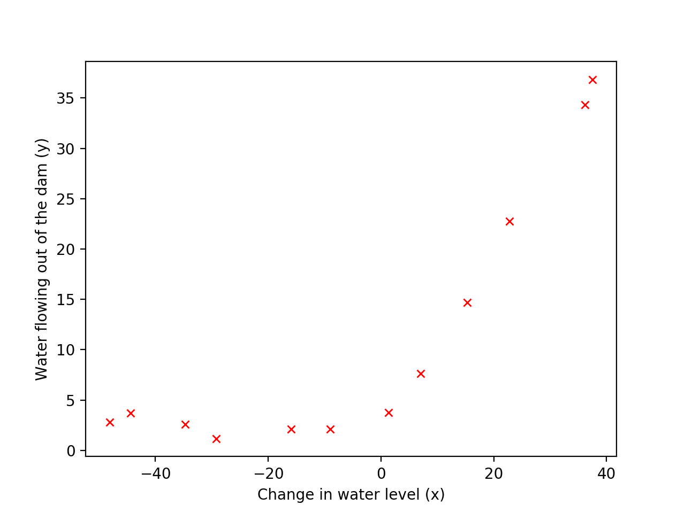

# 方差与偏差

【[返回主仓](https://github.com/99cloud/lab-algorithm)】

## Catalog

- [说明](#说明)
- [模型优化与改进](#模型优化与改进)
	- [改进策略](#改进策略)
	- [改进策略](#改进策略)
	- [数据集划分](#数据集划分)
	- [学习曲线](#学习曲线)
- [示例](#示例)
- [小结](#小结)

# 说明

 ## 文档

此为监督学习中，方差与偏差的说明文档

**主要使用的包**

```python
import numpy as np
import matplotlib.pyplot as plt
import scipy.io as sio
from scipy.optimize import minimize
```

## 文件

| 文件                     | 说明                                                         |
| ------------------------ | ------------------------------------------------------------ |
| data.mat                 | 数据集： X, y: [12, 1]; Xval, yval, Xtest, ytest: [21, 1]    |
| Bias_Variance.py         | 偏差与方差示例主函数                                         |
| linearRegCostFunction.py | 计算多变量正则化后线性回归的Cost                             |
| learningCurve.py         | 生成训练和交叉验证集的误差来绘制学习曲线                     |
| validationCurve.py       | 生成训练和交叉验证集的误差来绘制验证曲线，可用于判断对正则化项的选择 |
| featureNormalize.py      | 标准化 X 的特征                                              |
| plotFit.py               | 对于已有的图绘制其多项式回归的拟合                           |
| polyFeatures.py          | 对于 1D 向量，将其扩充至 p 次方的矩阵                        |
| trainLinearReg.py        | 根据数据集 (X, y) 和正则化参数 训练线性回归模型              |

# 模型优化与改进

之前已经整理的 **监督学习：**  **[线性回归](https://github.com/99cloud/lab-algorithm/tree/master/MachineLearning/Supervised/LinearRegression)**、**[逻辑回归](https://github.com/99cloud/lab-algorithm/tree/master/MachineLearning/Supervised/Logistic)**、**[神经网络](https://github.com/99cloud/lab-algorithm/tree/master/MachineLearning/Supervised/NeuralNetwork/)**

所有的样本数据都被用来训练模型，验证模型时，也只是将模型的数据结果与正确结果作对比来看正确率

这样的训练方法是否正确？正确率是否能作为评价模型的标准？

接着来讨论如何评价我们的模型，以及如何采取正确有效的改进策略

## 改进策略

对于 **预测函数**，我们通常会使用以下几种手段来改进：

> 1. 采集更多的样本数据
> 2. 减少特征数量，去除非主要的特征
> 3. 引入更多的相关特征
> 4. 采用多项式特征
> 5. 减小正则化参数 $\lambda$ 
> 6. 增加正则化参数 $\lambda$

盲目地使用改进策略，会耗费大量的时间和精力，却没什么效果

所以我们需要一些依据来帮助我们选择合适的策略

## 数据集划分

为了评价模型，我们通常将数据集分为三个部分，$60\%$ 的 **训练集**、$20\%$ 的 **交叉验证集** 和 $20\%$ 的 **测试集**，并使用 **误差** 作为模型使用在这些集合上的评价，**误差** 的形式与之前的 **损失函数** 相同（ 线性回归误差函数如下 ）
$$
J_s(\theta)=\frac1{2m_s}\sum\limits_{i=1}^{m_s}(h_\theta(x_s^{(i)})-y_s^{(i)})^2
\qquad s=train,\;cv,\;test
$$
在被划分的集合中，我们使用 **训练集** 来训练参数 $\theta$ ，使用 **交叉验证集** 来选择模型（ 比如该使用多少次的多项式特征 ），使用 **测试集** 来评估模型的预测能力

## 方差与偏差

当我们的模型表现不佳时，通常是出现两种问题，一种是 高偏差 问题，另一种是 高方差 问题

识别它们有助于选择正确的优化方式，所以我们先来看下 **偏差** 与 **方差** 的意义

- **偏差:** 描述模型输出结果的期望与样本真实结果的差距
- **方差:** 描述模型对于给定值的输出稳定性


就像打靶一样，偏差描述了我们的射击总体是否偏离了我们的目标，而方差描述了射击准不准

通过各种情况下 **训练集** 和 **交叉验证集** 的 **误差** 曲线来直观地理解 高偏差 与 高方差 的意义

对于 **多项式回归**

- 当次数选取较低时，我们的 训练集误差 和 交叉验证集误差 都会很大；

- 当次数选择刚好时，训练集误差 和 交叉验证集误差 都很小；

- 当次数过大时会产生过拟合，虽然 训练集误差 很小，但 交叉验证集误差 会很大（ 关系图如下 ）


所以我们可以计算 $J_{train}(\theta)$ 和 $J_{cv}(\theta)$ 

- 如果 $J_{train}(\theta)$ 和 $J_{cv}(\theta)$ 同时很大的话，就是遇到了高偏差问题

- 而 $J_{cv}(\theta)$ 比 $J_{train}(\theta)$ 大很多的话，则是遇到了高方差问题

对于 **正则化** 参数，使用同样的分析方法

- 当参数比较小时容易产生过拟合现象，也就是高方差问题
- 而参数比较大时容易产生欠拟合现象，也就是高偏差问题


## 学习曲线

无论你是要检查你的学习算法是否正常工作或是要改进算法的表现，**学习曲线** 都是一个十分直观有效的工具

**学习曲线** 的横轴是样本数，纵轴为 **训练集** 和 **交叉验证集** 的 **误差**

在一开始，由于样本数很少，$J_{train}(\theta)$ 几乎没有，而 $J_{cv}(\theta)$ 则非常大；随着样本数的增加，$J_{train}(\theta)$ 不断增大，而 $J_{cv}(\theta)$ 因为训练数据增加而拟合得更好因此下降，所以 **学习曲线** 看上去如下图：


在高偏差的情形下， $J_{train}(\theta)$ 和 $J_{cv}(\theta)$ 已经十分接近，但是 **误差** 很大

这时候一味地增加样本数并不能给算法的性能带来提升


在高方差的情形下，$J_{train}(\theta)$ 的 **误差** 较小，$J_{cv}(\theta)$ 比较大，这时搜集更多的样本很可能带来帮助


# 示例

原始图像



```python
Loading and Visualizing Data ...

Cost at theta = [1 ; 1]: 303.993192 
(this value should be about 303.993192)
```

线性回归拟合


```python
[-15.30301567 598.25074417]
Gradient at theta = [1 ; 1]:  [-15.303016; 598.250744]
(this value should be about [-15.303016; 598.250744])
```

线性回归拟合的学习曲线


```python
      fun: 22.373906495108912
 hess_inv: array([[1.03142187, 0.00617881],
       [0.00617881, 0.001215  ]])
      jac: array([ 8.88178420e-16, -4.26325641e-14])
  message: 'Optimization terminated successfully.'
     nfev: 5
      nit: 3
     njev: 5
   status: 0
  success: True
        x: array([13.08790351,  0.36777923])
```

多项式回归拟合的学习曲线


```python
lambda		Train Error	Validation Error

 0.000000		0.240785	18.733669
 0.001000		0.240788	18.422206
 0.003000		0.241346	17.834911
 0.010000		0.247605	16.088401
 0.030000		0.281763	12.813067
 0.100000		0.438639	7.897192
 0.300000		0.868040	4.761813
 1.000000		1.958668	4.267932
 3.000000		4.525773	3.831872
 10.000000	14.826685	8.891720
```

不同正则化参数下的误差情况


# 小结

有了以上的分析手段，就能够得出在何种场景下使用我们的改进策略：

> 1. [高方差] 采集更多的样本数据
> 2. [高方差] 减少特征数量，去除非主要的特征
> 3. [高偏差] 引入更多的相关特征
> 4. [高偏差] 采用多项式特征
> 5. [高偏差] 减小正则化参数 $\lambda$ 
> 6. [高方差] 增加正则化参数 $\lambda$ 


【[返回顶部](#方差与偏差)】

【[返回主仓](https://github.com/99cloud/lab-algorithm)】