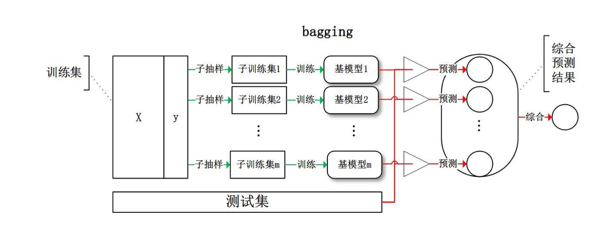
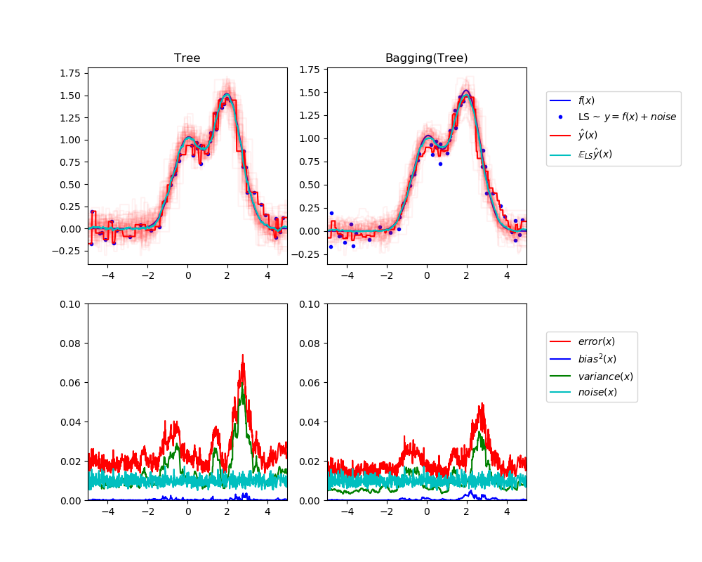
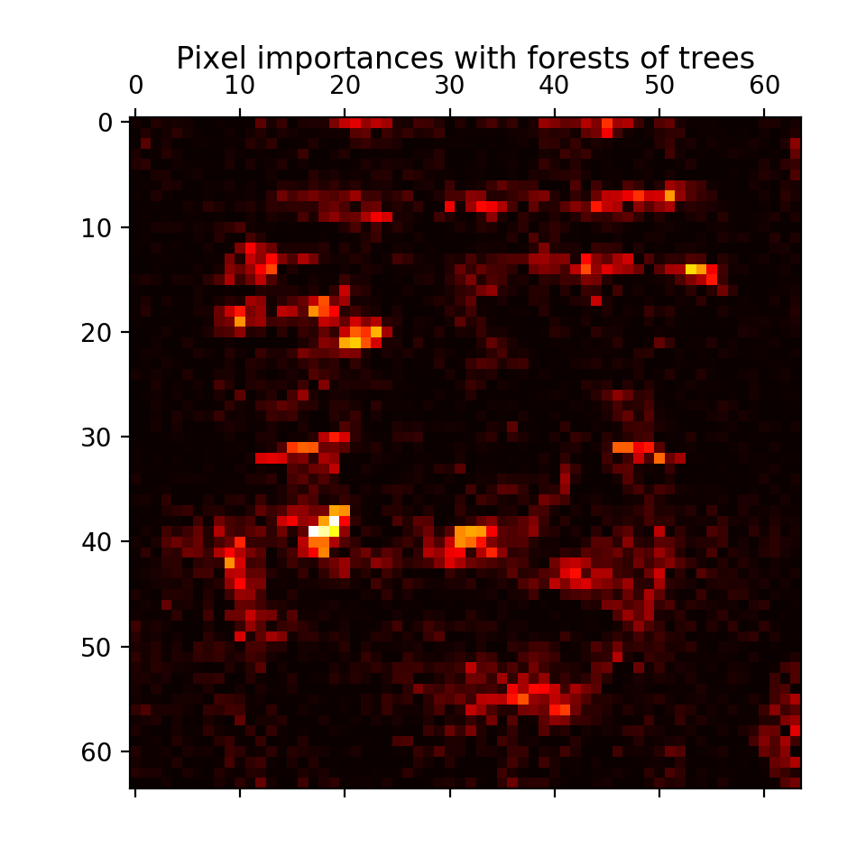
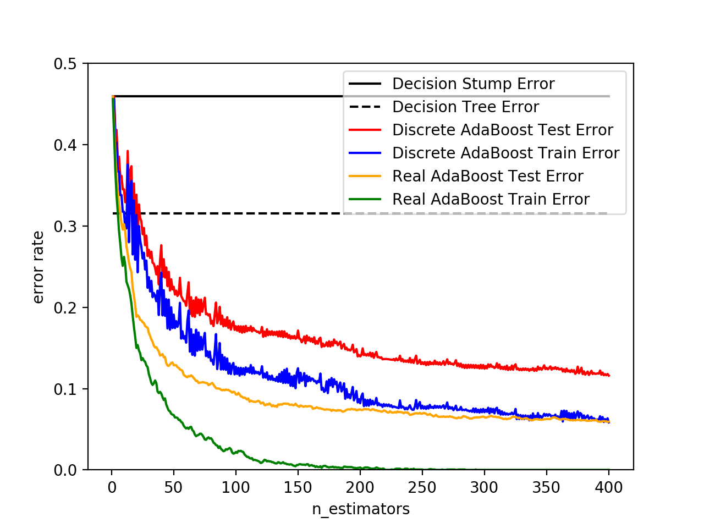
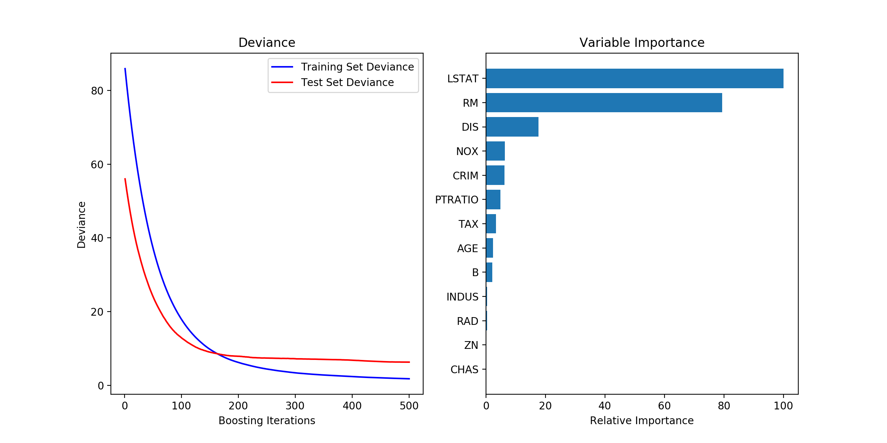

# 集成学习

【[返回主仓](https://github.com/99cloud/lab-algorithm)】

## Catalog

- [说明](#说明)
- [集成学习介绍](#集成学习介绍)
  - [Bagging元估计器](#Bagging元估计器)
  	- [Bagging算法流程](#Bagging算法流程)
  	- [Bagging在sklearn中的示例](#Bagging在sklearn中的示例)
  - [由随机树组成的森林](#由随机树组成的森林)
  	- [随机森林](#随机森林)
  		- [随机森林原理](#随机森林原理)
  		- [随机森林算法](#随机森林算法)
  		- [随机森林使用](#随机森林使用)
  		- [随机森林优缺点](#随机森林优缺点)
  	- [极限随机树](#极限随机树)
  	- [参数](#参数)
  	- [并行化](#并行化)
  	- [特征重要性评估](#特征重要性评估)
  	- [完全随机树嵌入](#完全随机树嵌入)
  - [AdaBoost](#AdaBoost)
  	- [Boosting原理](#Boosting原理)
  	- [Adaboost算法](#Adaboost算法)
  	- [Adaboost算法](#Adaboost算法)
  	- [Adaboost分类损失函数](#Adaboost分类损失函数)
  	- [Adaboost算法的正则化](#Adaboost算法的正则化)
  	- [Adaboost在sklearn中的示例](#Adaboost在sklearn中的示例)
  	- [使用方法](#使用方法)
  	- [Adaboost优缺点](#Adaboost优缺点)
  - [GBDT](#GBDT)
  	- [提升树](#提升树)
  	- [梯度提升树](#梯度提升树)
  	- [GBDT分类](#GBDT分类)
  	- [GBDT回归](#GBDT回归)
- [小结](#小结)

# 说明

 ## 文档

此为监督学习中，集成学习 算法的说明文档

**主要使用的包**

```python
import numpy as np
import matplotlib.pyplot as plt
import pandas as pd

from sklearn.datasets import load_iris
from sklearn.datasets import make_blobs
from sklearn.datasets import make_hastie_10_2
from sklearn.datasets import make_friedman1

from sklearn.model_selection import  train_test_split
from sklearn.model_selection import cross_val_score
from sklearn.tree import DecisionTreeClassifier
from sklearn.metrics import mean_squared_error

from sklearn.ensemble import RandomForestClassifier
from sklearn.ensemble import AdaBoostClassifier
from sklearn.ensemble import ExtraTreesClassifier
from sklearn.ensemble import GradientBoostingClassifier
from sklearn.ensemble import GradientBoostingRegressor
```

## 文件

| 文件                                 | 说明                                                         |
| ------------------------------------ | ------------------------------------------------------------ |
| Adaboost.ipynb                       | jupyter文档，展示 Iris 数据集的 Adaboost 算法                |
| AdaBoost.py                          | Adaboost 算法实现分类                                        |
| data_generater.py                    | 决策树 对 多值输出（正余弦）的回归示例                       |
| plot_bias_variance.py                | 单估计器和 bagging 方法在 误差、偏差、噪声 上的比较 官方示例代码 |
| plot_forest_importances_faces.py     | 随机森林 方法在 人脸图像 像素点分类效果的 官方示例代码       |
| plot_adaboost_hastie_10_2.py         | 离散 Adaboost 算法和真正的 Adaboost 算法差异的 官方示例代码  |
| plot_gradient_boosting_regression.py | 波士顿住房数据集上的梯度提升官方示例， 最小平方为损失函数的 500 个深度为 4 的回归树 Gradient Boosting 模型 |

# 集成学习介绍

## 前言

**集成方法** 的目标是把多个使用给定学习算法构建的基估计器的预测结果结合起来，从而获得比单个估计器更好的泛化能力/鲁棒性

集成方法通常分为两种

- **平均方法**，该方法的原理是构建多个独立的估计器，然后取它们的预测结果的平均，一般来说组合之后的估计器是会比单个估计器要好的，因为它的方差减小了

	**示例:** [Bagging 方法](#bagging元估计器) ， [随机森林](#随机森林) ，…

- 相比之下，在 **boosting 方法** 中，基估计器是依次构建的，并且每一个基估计器都尝试去减少组合估计器的偏差，这种方法主要目的是为了结合多个弱模型，使集成的模型更加强大

	**示例:** [AdaBoost](#adaboost) ， [梯度提升树](https://sklearn.apachecn.org/docs/0.21.3/12.html#1114-gradient-tree-boosting（梯度树提升）) ， …

## Bagging元估计器

在集成算法中，bagging 方法会在原始训练集的随机子集上构建一类黑盒估计器的多个实例，然后把这些估计器的预测结果结合起来形成最终的预测结果，该方法通过在构建模型的过程中引入随机性，来减少基估计器的方差(例如，决策树)，在多数情况下，bagging 方法提供了一种非常简单的方式来对单一模型进行改进，而无需修改背后的算法，因为 bagging 方法可以减小过拟合，所以通常在强分类器和复杂模型上使用时表现的很好（例如，完全生长的决策树，fully developed decision trees），相比之下 boosting 方法则在弱模型上表现更好（例如，浅层决策树，shallow decision trees）

bagging 方法有很多种，其主要区别在于随机抽取训练子集的方法不同

- 如果抽取的数据集的随机子集是样例的随机子集，我们叫做粘贴（Pasting） 
- 如果样例抽取是有放回的，我们称为 Bagging 
- 如果抽取的数据集的随机子集是特征的随机子集，我们叫做随机子空间（Random Subspaces）
- 最后，如果基估计器构建在对于样本和特征抽取的子集之上时，我们叫做随机补丁（Random Patches）

### Bagging算法流程

相对于 Boosting 系列的 Adaboost 和 GBDT ，Bagging 算法要简单的多

输入为样本集 $D=(x_1,y_1),(x_2,y_2),\cdots,(x_m,y_m)$，弱学习器算法，弱分类器迭代次数 $T$

输出为最终的强分类器 $f(x)$

1. 对于 $t=1,2,\cdots,T$ 
	1. 对训练集进行第 $t$ 次随机采样，共采集 $m$ 次，得到包含 $m$ 个样本的采样集 $D_t$
	2. 用采样集 $D_t$训练第 $t$ 个弱学习器 $G_t(x)$
2. 如果是分类算法预测，则 $T$ 个弱学习器投出最多票数的类别或者类别之一为最终类别，如果是回归算法，$T$ 个弱学习器得到的回归结果进行算术平均得到的值为最终的模型输出



###Bagging在sklearn中的示例

在 scikit-learn 中，bagging 方法使用统一的 [`BaggingClassifier`](https://scikit-learn.org/stable/modules/generated/sklearn.ensemble.BaggingClassifier.html#sklearn.ensemble.BaggingClassifier) 元估计器（或者 [`BaggingRegressor`](https://scikit-learn.org/stable/modules/generated/sklearn.ensemble.BaggingRegressor.html#sklearn.ensemble.BaggingRegressor) ），基估计器和随机子集抽取策略由用户指定，`max_samples` 和 `max_features` 控制着子集的大小（对于样例和特征）， `bootstrap` 和 `bootstrap_features` 控制着样例和特征的抽取是有放回还是无放回的，当使用样本子集时，通过设置 `oob_score=True` ，可以使用袋外（out-of-bag）样本来评估泛化精度，下面的代码片段说明了如何构造一个 `KNeighborsClassifier` 估计器的 bagging 集成实例，每一个基估计器都建立在 50% 的样本随机子集和 50% 的特征随机子集上

```python
>>> from sklearn.ensemble import BaggingClassifier
>>> from sklearn.neighbors import KNeighborsClassifier
>>> bagging = BaggingClassifier(KNeighborsClassifier(),
...                             max_samples=0.5, max_features=0.5)
```

bagging 方法的误差、偏差、噪声等情况都会偏小



## 由随机树组成的森林

这两种算法都是专门为树而设计的扰动和组合技术（perturb-and-combine techniques），这种技术通过在分类器构造过程中引入随机性来创建一组不同的分类器，集成分类器的预测结果就是单个分类器预测结果的平均值

与其他分类器一样，森林分类器必须拟合（fit）两个数组： 保存训练样本的数组（或稀疏或稠密的）X，大小为 `[n_samples, n_features]`，和 保存训练样本目标值（类标签）的数组 Y，大小为 `[n_samples]`

```python
>>> from sklearn.ensemble import RandomForestClassifier
>>> X = [[0, 0], [1, 1]]
>>> Y = [0, 1]
>>> clf = RandomForestClassifier(n_estimators=10)
>>> clf = clf.fit(X, Y)
```

得到结果

```python
RandomForestClassifier(bootstrap=True, class_weight=None, criterion='gini',
                       max_depth=None, max_features='auto', max_leaf_nodes=None,
                       min_impurity_decrease=0.0, min_impurity_split=None,
                       min_samples_leaf=1, min_samples_split=2,
                       min_weight_fraction_leaf=0.0, n_estimators=10,
                       n_jobs=None, oob_score=False, random_state=None,
                       verbose=0, warm_start=False)
```

同 **决策树** 一样，随机森林算法（forests of trees）也能用来解决 **多输出问题**（ Y 的大小是 `[n_samples, n_outputs])` ）

### 随机森林

####随机森林原理

随机森林是 Bagging 算法的进化版，也就是说，它的基本思想仍然和 Bagging，但是进行了独有的改进

1. RF 使用了 CART 决策树作为弱学习器，这让我们想到了梯度提示树 GBDT
2. 在使用决策树的基础上，RF 对决策树的建立做了改进，对于普通的决策树，我们会在节点上所有的 $n$ 个样本特征中选择一个最优的特征来做决策树的左右子树划分，**但是RF通过随机选择节点上的一部分样本特征**，这个数字小于 $n$，假设为 $n_{sub}$，然后在这些随机选择的 $n_{sub}$ 个样本特征中，选择一个最优的特征来做决策树的左右子树划分，这样进一步增强了模型的泛化能力

如果 $n_{sub}=n$ ，则此时 RF 的 CART 决策树和普通的 CART 决策树没有区别，$n_{sub}$ 越小，则模型约健壮，当然此时对于训练集的拟合程度会变差，也就是说 $n_{sub}$ 越小，模型的方差会减小，但是偏倚会增大，在实际案例中，一般会通过交叉验证调参获取一个合适的 $n_{sub}$ 的值

####随机森林算法

输入：为样本集 $D=(x_1,y_1),(x_2,y_2),\cdots,(x_m,y_m)$，弱分类器迭代次数 $T$
输出：为最终的强分类器 $f(x)$

1. 对于 $t=1,2,\cdots,T$ 
	1. 对训练集进行第 $t$ 次随机采样，共采集 $m$ 次，得到包含 $m$ 个样本的采样集 $D_t$
	2. 用采样集 $D_t$ 训练第 $t$ 个决策树模型 $G_t(x)$，在训练决策树模型的节点的时候， 在节点上所有的样本特征中选择一部分样本特征， 在这些随机选择的部分样本特征中选择一个最优的特征来做决策树的左右子树划分
2. 如果是分类算法预测，则 $T$ 个弱学习器投出最多票数的类别或者类别之一为最终类别，如果是回归算法，$T$ 个弱学习器得到的回归结果进行算术平均得到的值为最终的模型输出

#### 随机森林使用

在随机森林中（参见 [`RandomForestClassifier`](https://scikit-learn.org/stable/modules/generated/sklearn.ensemble.RandomForestClassifier.html#sklearn.ensemble.RandomForestClassifier) 和 [`RandomForestRegressor`](https://scikit-learn.org/stable/modules/generated/sklearn.ensemble.RandomForestRegressor.html#sklearn.ensemble.RandomForestRegressor) 类）， 集成模型中的每棵树构建时的样本都是由训练集经过有放回抽样得来的（例如，自助采样法-bootstrap sample）

另外，在构建树的过程中进行结点分割时，选择的分割点是所有特征的最佳分割点，或特征的大小为 `max_features` 的随机子集的最佳分割点

这两种随机性的目的是降低估计器的方差，的确，单棵决策树通常具有高方差，容易过拟合，随机森林构建过程的随机性能够产生具有不同预测错误的决策树，通过取这些决策树的平均，能够消除部分错误，随机森林虽然能够通过组合不同的树降低方差，但是有时会略微增加偏差，在实际问题中，方差的降低通常更加显著，所以随机森林能够取得更好地效果

不同的是，scikit-learn 的实现是取每个分类器预测概率的平均，而不是让每个分类器对类别进行投票

#### 随机森林优缺点

- RF 的主要优点有
	- 训练可以高度并行化，对于大数据时代的大样本训练速度有优势
	- 由于可以随机选择决策树节点划分特征，这样在样本特征维度很高的时候，仍然能高效的训练模型
	- 在训练后，可以给出各个特征对于输出的重要性
	- 由于采用了随机采样，训练出的模型的方差小，泛化能力强
	- 相对于 Boosting 系列的 Adaboost 和 GBDT ， RF 实现比较简单
	- 对部分特征缺失不敏感
- RF 的主要缺点有
	- 在某些噪音比较大的样本集上，RF 模型容易陷入过拟合
	- 取值划分比较多的特征容易对 RF 的决策产生更大的影响，从而影响拟合的模型的效果

### 极限随机树

Extra Trees是 RF 的一个变种，原理几乎和 RF 一模一样，仅有区别有

1. 对于每个决策树的训练集，RF 采用的是随机采样 bootstrap 来选择采样集作为每个决策树的训练集，而 Extra Trees 一般不采用随机采样，即每个决策树采用原始训练集
2. 在选定了划分特征后，RF 的决策树会基于基尼系数，均方差之类的原则，选择一个最优的特征值划分点，这和传统的决策树相同，但是 Extra Trees 比较的激进，他会随机的选择一个特征值来划分决策树

从第 2 点可以看出，由于随机选择了特征值的划分点位，而不是最优点位，这样会导致生成的决策树的规模一般会大于 RF 所生成的决策树，也就是说，模型的方差相对于 RF 进一步减少，但是偏倚相对于 RF 进一步增大，在某些时候，Extra Trees 的泛化能力比 RF 更好

sklearn 的极限随机树中（参见 [`ExtraTreesClassifier`](https://scikit-learn.org/stable/modules/generated/sklearn.ensemble.ExtraTreesClassifier.html#sklearn.ensemble.ExtraTreesClassifier) 和 [`ExtraTreesRegressor`](https://scikit-learn.org/stable/modules/generated/sklearn.ensemble.ExtraTreesRegressor.html#sklearn.ensemble.ExtraTreesRegressor) 类)， 计算分割点方法中的随机性进一步增强，与随机森林相同，使用的特征是候选特征的随机子集；但是不同于随机森林寻找最具有区分度的阈值，这里的阈值是针对每个候选特征随机生成的，并且选择这些随机生成的阈值中的最佳者作为分割规则，这种做法通常能够减少一点模型的方差，代价则是略微地增大偏差

```python
>>> from sklearn.model_selection import cross_val_score
>>> from sklearn.datasets import make_blobs
>>> from sklearn.ensemble import RandomForestClassifier
>>> from sklearn.ensemble import ExtraTreesClassifier
>>> from sklearn.tree import DecisionTreeClassifier

>>> X, y = make_blobs(n_samples=10000, n_features=10, centers=100,
...     random_state=0)

>>> clf = DecisionTreeClassifier(max_depth=None, min_samples_split=2,
...     random_state=0)
>>> scores = cross_val_score(clf, X, y, cv=5)
>>> scores.mean()                               
0.9823

>>> clf = RandomForestClassifier(n_estimators=10, max_depth=None,
...     min_samples_split=2, random_state=0)
>>> scores = cross_val_score(clf, X, y, cv=5)
>>> scores.mean()                               
0.9997

>>> clf = ExtraTreesClassifier(n_estimators=10, max_depth=None,
...     min_samples_split=2, random_state=0)
>>> scores = cross_val_score(clf, X, y, cv=5)
>>> scores.mean() > 0.999
True
```

### 参数

使用这些方法时要调整的参数主要是 `n_estimators` 和 `max_features`，前者（n_estimators）是森林里树的数量，通常数量越大，效果越好，但是计算时间也会随之增加，当树的数量超过一个临界值之后，算法的效果并不会很显著地变好，后者（max_features）是分割节点时考虑的特征的随机子集的大小，这个值越低，方差减小得越多，但是偏差的增大也越多，根据经验，回归问题中使用 `max_features = None` （总是考虑所有的特征）， 分类问题使用 `max_features = "sqrt"` （随机考虑 `sqrt(n_features)` 特征，其中 `n_features` 是特征的个数）是比较好的默认值， `max_depth = None` 和 `min_samples_split = 2` 结合通常会有不错的效果（即生成完全的树），请记住，这些（默认）值通常不是最佳的，同时还可能消耗大量的内存，最佳参数值应由交叉验证获得，另外，在随机森林中，默认使用自助采样法（`bootstrap = True`）， 然而 extra-trees 的默认策略是使用整个数据集（`bootstrap = False`），当使用自助采样法方法抽样时，泛化精度是可以通过剩余的或者袋外的样本来估算的，设置 `oob_score = True` 即可实现

> 注意:
>
> 默认参数下模型复杂度是：`O(M*N*log(N))` ， 其中 `M` 是树的数目， `N` 是样本数，可以通过设置以下参数来降低模型复杂度： `min_samples_split` , `max_leaf_nodes` , `max_depth` 和 `min_samples_leaf`

### 并行化

这个模块还支持树的并行构建和预测结果的并行计算，这可以通过 `n_jobs` 参数实现，如果设置 `n_jobs = k` ，则计算被划分为 `k` 个作业，并运行在机器的 `k` 个核上，如果设置 `n_jobs = -1` ，则使用机器的所有核，注意由于进程间通信具有一定的开销，这里的提速并不是线性的（即，使用 `k` 个作业不会快 `k` 倍），当然，在建立大量的树，或者构建单个树需要相当长的时间（例如，在大数据集上）时，（通过并行化）仍然可以实现显著的加速

### 特征重要性评估

特征对目标变量预测的相对重要性可以通过（树中的决策节点的）特征使用的相对顺序（即深度）来进行评估，决策树顶部使用的特征对更大一部分输入样本的最终预测决策做出贡献；因此，可以使用接受每个特征对最终预测的贡献的样本比例来评估该 **特征的相对重要性** ，scikit-learn 通过将特征贡献的样本比例与纯度减少相结合得到特征的重要性

通过对多个随机树中的 **预期贡献率** （expected activity rates） **取平均**，可以减少这种估计的 **方差** ，并将其用于特征选择，这被称作平均纯度减少，或MDI

下面的例子展示了一个面部识别任务中每个像素的相对重要性，其中重要性由颜色（的深浅）来表示，使用的模型是 [`ExtraTreesClassifier`](https://scikit-learn.org/stable/modules/generated/sklearn.ensemble.ExtraTreesClassifier.html#sklearn.ensemble.ExtraTreesClassifier) 



实际上，对于训练完成的模型这些估计值存储在 `feature_importances_` 属性中，这是一个大小为 `(n_features,)` 的数组，其每个元素值为正，并且总和为 1.0，一个元素的值越高，其对应的特征对预测函数的贡献越大

### 完全随机树嵌入

Totally Random Trees Embedding （以下简称 TRTE）是一种非监督学习的数据转化方法，它将低维的数据集映射到高维，从而让映射到高维的数据更好的运用于分类回归模型，我们知道，在支持向量机中运用了核方法来将低维的数据集映射到高维，此处 TRTE 提供了另外一种方法

TRTE 在数据转化的过程也使用了类似于 RF 的方法，建立 $T$ 个决策树来拟合数据，当决策树建立完毕以后，数据集里的每个数据在 $T$ 个决策树中叶子节点的位置也定下来了，比如我们有 $3$ 颗决策树，每个决策树有 $5$ 个叶子节点，某个数据特征 $x$ 划分到第一个决策树的第 $2$ 个叶子节点，第 $2$ 个决策树的第 $3$ 个叶子节点，第 $3$ 个决策树的第 $5$ 个叶子节点，则 $x$ 映射后的特征编码为 $(0,1,0,0,0,\quad0,0,1,0,0,\quad0,0,0,0,1)$， 有 $15$ 维的高维特征，这里特征维度之间加上空格是为了强调三颗决策树各自的子编码

映射到高维特征后，可以继续使用监督学习的各种分类回归算法了

sklearn 中 [`RandomTreesEmbedding`](https://scikit-learn.org/stable/modules/generated/sklearn.ensemble.RandomTreesEmbedding.html#sklearn.ensemble.RandomTreesEmbedding)  实现了一个无监督的数据转换，通过由完全随机树构成的森林， [`RandomTreesEmbedding`](https://scikit-learn.org/stable/modules/generated/sklearn.ensemble.RandomTreesEmbedding.html#sklearn.ensemble.RandomTreesEmbedding) 使用数据最终归属的叶子节点的索引值（编号）对数据进行编码，该索引以 one-of-K 方式编码，最终形成一个高维的稀疏二进制编码，这种编码可以被非常高效地计算出来，并且可以作为其他学习任务的基础，编码的大小和稀疏度可以通过选择树的数量和每棵树的最大深度来确定，对于集成中的每棵树的，每个样本对应其中的一个叶节点，编码的大小（维度）最多为 `n_estimators * 2 ** max_depth` ，即森林中的叶子节点的最大数

由于相邻数据点更可能位于树的同一叶子中，该变换可以作为一种隐式地非参数密度估计

## AdaBoost

### Boosting原理

Boosting算法的工作机制

1. 首先从训练集用初始权重训练出一个弱学习器1
2. 根据学习器1的学习误差率来更新训练样本的权重，使得之前弱学习器 1 学习 **误差率高的训练样本点的权重变高**，使得这些误差率高的点在后面的弱学习器 2 中得到更多的重视
3. 然后基于调整权重后的训练集来训练弱学习器 2
4. 如此重复进行，直到弱学习器数达到事先指定的数目 $T$
5. 最终将这 $T$ 个弱学习器通过集合策略进行整合，得到最终的强学习器


这里涉及如下概念

1. 学习误差率 $e$
2. 学习器权重 $\alpha$
3. 更新下一次训练样本的权重 $D$
4. 最后如何结合所有的弱学习器

### Adaboost算法

我们的训练样本是
$$
T=\{(x_1,y_1),(x_2,y_2),\cdots,(x_m,y_m)\}
$$
训练集的第 $k$ 个弱学习器的输出权重为
$$
D(k)=(\omega_{k_1},\omega_{k_2},\cdots,\omega_{k_m}); 
\qquad \omega_{k_i}=\frac1m; \qquad i=1,2,\cdots,m
$$

- 首先我们看下第 $k$ 个弱学习器的错误率 $e_k$，因为我们是二分类问题，所以我们的的错误率是所有误分类的样本的权重和如下，其中求和的是误分类的样本的集合
	$$
	e_k=\sum\limits_{i=1}^m\omega_{k_i}
	$$

- 得到了 $e_k$，我们就能去计算弱学习器在最后结合的时候的权重系数 $\alpha_k$，根据下面的公式，我们发现，当 $e_k$ 越大，则 $\alpha_k$ 越小，这也符合大家的直观感受
	$$
	\alpha_k=\frac12\log\frac{1-e_k}{e_k}
	$$

- 更新下一个弱学习器的权重𝐷(𝑘+1)=(𝑤(𝑘+1)1,𝑤(𝑘+1)2,...𝑤(𝑘+1)𝑚)D(k+1)=(w(k+1)1,w(k+1)2,...w(k+1)m)。

- 更新下一个弱学习器的权重𝐷(𝑘+1)=(𝑤(𝑘+1)1,𝑤(𝑘+1)2,...𝑤(𝑘+1)𝑚)D(k+1)=(w(k+1)1,w(k+1)2,...w(k+1)m)。

- 更新下一个弱学习器的权重𝐷(𝑘+1)=(𝑤(𝑘+1)1,𝑤(𝑘+1)2,...𝑤(𝑘+1)𝑚)D(k+1)=(w(k+1)1,w(k+1)2,...w(k+1)m)。

- 更新下一个弱学习器的权重𝐷(𝑘+1)=(𝑤(𝑘+1)1,𝑤(𝑘+1)2,...𝑤(𝑘+1)𝑚)D(k+1)=(w(k+1)1,w(k+1)2,...w(k+1)m)。

- 更新下一个弱学习器的权重
	$$
	\begin{align}
	D(k+1) &=(\omega_{(k+1)_1},\omega_{(k+1)_2},\cdots,\omega_{(k+1)_m}) \\
	\omega_{(k+1)_i} &= \frac{\omega_{k_i}}{Z_k}\exp(-\alpha_ky_iG_k(x_i)) \\
	Z_k &= \sum\limits_{i=1}^m \omega_{k_i}\exp(-\alpha_ky_iG_k(x_i))
	\end{align}
	$$
	上面公式中 $G_k()$ 是第 $k$ 个弱学习器，从 $w_{(k+1)_i}$ 计算公式可以看出，如果第 $i$ 个样本分类错误，则 $y_iG_k(x_i)<0$ ，导致样本的权重在第 $k+1$ 个弱分类器中增大，如果分类正确，则权重在第 $k+1$ 个弱分类器中减少

- 还剩下一个如何组合所有弱学习器的问题
	$$
	f(x)=sign(\sum_{k=1}^K \alpha_kG_k(x))
	$$

### Adaboost分类损失函数

首先我们定义一个 Adaboost 的损失函数为
$$
\arg \min \sum_{i=1}^m \exp(-y_if_k(x))
$$
其中
$$
\begin{align}
f_{k-1}(x) &= \sum_{i=1}^{k-1}\alpha_iG_i(x) \\
f_k(x) &= f_{k-1}(x)+\alpha_kG_k(x)
\end{align}
$$
把 $f_k(x)$ 带入损失函数得到
$$
\arg\min\sum_{i=1}^m \exp[(-y_i)(f_{k-1}(x)+\alpha_kG_k(x))]
$$
我们令 $\omega_{k_i}=\exp(-y_if_{k-1}(x))$ ，它的值不依赖于 $\alpha,G$ 因此与最小化无关，仅仅依赖于 $f_{k−1}(x)$，随着每一轮迭代而改变

将这个式子带入损失函数，损失函数转化为
$$
\arg\min\sum_{i=1}^m \omega_{k_i} \exp[-y_i\alpha_kG_k(x)]
$$
又因为我们可以计算
$$
G_k(x)=\arg\min\sum_{i=1}^m \omega_{k_i}
$$
将 $G_k(x)$ 带入损失函数，并对 $\alpha$ 求导，使其等于 $0$，则就得到了
$$
\alpha_k=\frac12\log\frac{1-e_k}{e_k}
$$
最后看样本权重的更新，利用 $f_k(x)=f_{k−1}(x)+\alpha_kG_k(x)$ 和 $\omega_{k_i}=\exp(−y_if_{k−1}(x))$，即可得
$$
\omega_{(k+1)_i}=w_{k_i}\exp[−y_i\alpha_kG_k(x)]
$$

### Adaboost算法的正则化

为了防止 Adaboost 过拟合，我们通常也会加入正则化项，这个正则化项我们通常称为步长（learning rate），定义为 $\nu$ ，对于前面的弱学习器的迭代
$$
f_k(x)=f_{k−1}(x)+\alpha_kG_k(x)
$$
如果我们加上了正则化项，则有
$$
f_k(x)=f_{k−1}(x)+\nu\alpha_kG_k(x)
$$
$\nu$ 的取值范围为 $0<\nu\leq1$ ，对于同样的训练集学习效果，较小的 $\nu$ 意味着我们需要更多的弱学习器的迭代次数，通常我们用步长和迭代最大次数一起来决定算法的拟合效果

### Adaboost在sklearn中的示例

模型 [`sklearn.ensemble`](https://sklearn.apachecn.org/docs/0.21.3/classes.html#module-sklearn.ensemble) 包含了流行的提升算法 AdaBoost，这个算法是由 Freund and Schapire 在 1995 年提出来的

AdaBoost 的核心思想是用反复修改的数据（主要是修正数据的权重）来训练一系列的弱学习器（一个弱学习器模型仅仅比随机猜测好一点, 比如一个简单的决策树），由这些弱学习器的预测结果通过加权投票（或加权求和）的方式组合，得到我们最终的预测结果，在每一次所谓的提升（boosting）迭代中，数据的修改由应用于每一个训练样本的（新） 的权重 $\omega_1,\omega_2,\cdots,\omega_N$ 组成（即修改每一个训练样本应用于新一轮学习器的权重），始化时，将所有弱学习器的权重都设置为 $w_i = 1/N$ ，因此第一次迭代仅仅是通过原始数据训练出一个弱学习器，在接下来的连续迭代中，样本的权重逐个地被修改,学习算法也因此要重新应用这些已经修改的权重，在给定的一个迭代中，那些在上一轮迭代中被预测为错误结果的样本的权重将会被增加，而那些被预测为正确结果的样本的权重将会被降低，随着迭代次数的增加，那些难以预测的样例的影响将会越来越大，每一个随后的弱学习器都将会被强迫更加关注那些在之前被错误预测的样例



AdaBoost 既可以用在分类问题也可以用在回归问题中

- 对于 multi-class 分类， [`AdaBoostClassifier`](https://scikit-learn.org/stable/modules/generated/sklearn.ensemble.AdaBoostClassifier.html#sklearn.ensemble.AdaBoostClassifier) 实现了 AdaBoost-SAMME 和 AdaBoost-SAMME.R
- 对于回归， [`AdaBoostRegressor`](https://scikit-learn.org/stable/modules/generated/sklearn.ensemble.AdaBoostRegressor.html#sklearn.ensemble.AdaBoostRegressor) 实现了 AdaBoost.R2

### 使用方法

下面的例子展示了如何训练一个包含 100 个弱学习器的 AdaBoost 分类器

```python
>>> from sklearn.model_selection import cross_val_score
>>> from sklearn.datasets import load_iris
>>> from sklearn.ensemble import AdaBoostClassifier

>>> iris = load_iris()
>>> clf = AdaBoostClassifier(n_estimators=100)
>>> scores = cross_val_score(clf, iris.data, iris.target)
>>> scores.mean()                             
0.9599...
```

弱学习器的数量由参数 `n_estimators` 来控制， `learning_rate` 参数用来控制每个弱学习器对最终的结果的贡献程度（就是控制每个弱学习器的权重修改速率），弱学习器默认使用决策树，不同的弱学习器可以通过参数 `base_estimator` 来指定，获取一个好的预测结果主要需要调整的参数是 `n_estimators` 和 `base_estimator` 的复杂度 (例如:对于弱学习器为决策树的情况，树的深度 `max_depth` 或叶子节点的最小样本数 `min_samples_leaf` 等都是控制树的复杂度的参数)

### Adaboost优缺点

理论上任何学习器都可以用于 Adaboost，但一般来说，使用最广泛的 Adaboost 弱学习器是决策树和神经网络，对于决策树，Adaboost 分类用了 CART 分类树，而 Adaboost 回归用了 CART 回归树

- Adaboost 的主要优点
	- Adaboost 作为分类器时，分类精度很高
	- 在 Adaboost 的框架下，可以使用各种回归分类模型来构建弱学习器，非常灵活
	- 作为简单的二元分类器时，构造简单，结果可理解
	- 不容易发生过拟合

- Adaboost 的主要缺点
	- 对异常样本敏感，异常样本在迭代中可能会获得较高的权重，影响最终的强学习器的预测准确性

## GBDT

GBDT 的中文名叫梯度提升树，GBDT 也是集成学习 Boosting 家族的成员，但是却和传统的 Adaboost 有很大的不同，在 Adaboost 中，我们是利用前一轮迭代弱学习器的误差率来更新训练集的权重，这样一轮轮的迭代下去， GBDT 也是迭代，使用了前向分布算法，但是弱学习器限定了只能使用 CART 回归树模型，同时迭代思路和Adaboost 也有所不同

在 GBDT 的迭代中，假设我们前一轮迭代得到的强学习器是 $f_{t−1}(x)$， 损失函数是 $L(y,f_{t−1}(x))$ ，我们本轮迭代的目标是找到一个 CART 回归树模型的弱学习器 $h_t(x)$，让本轮的损失函数 $L(y,f_t(x)=L(y,f_{t−1}(x)+h_t(x))$ 最小，也就是说，本轮迭代找到决策树，要让样本的损失尽量变得更小， **即梯度提升树是用 CART 树去拟合前一个弱模型的损失函数的残差，使得本轮的损失更小**

### 提升树

回归问题提升树的前向分步算法

假设第 $m$ 个模型是 $f_m(x)$，则有以下公式
$$
\begin{align}
& f_0(x)=0 \\
& f_m(X)=f_{m-1}(x)+T(x,\theta_m)\\
& f_M(x)= \sum\limits_{m=1}^M T(x,\theta_m)
\end{align}
$$
有了模型函数后，我们就得到了损失函数
$$
L(y,f_m(x))=L(y,f_{m−1}(x)+T(x,\theta_m))=L(r_{m−1},T(x,\theta_m))
$$
其中 $T(x,\theta)$ 需要用 CART 树去拟合，而 $r_m$ 是上一个学习器的损失的残差
$$
r_{m−1}=L(y,f_{m−1}(x))
$$
我们举个例子，假设损失函数是平方损失函数
$$
L(y,f(x))=(y−f(x))^2
$$
则第 $m$ 个模型的损失函数
$$
L(y,f_m(x))=L(y,f_{m-1}(𝑥)+T(x,\theta_m))=L(r_{m-1},T(x,\theta_m))=(r_{m-1}-T(x,\theta_m))^2
$$


### 梯度提升树

前面的提升树利用加法模型和前向算法进行，当损失函数是平方损失或者指数损失的时候，很好推算，但是对于一般的损失函数，就比较难处理，这时候我们可以利用最速下降法来近似，**关键是利用了损失函数的负梯度在当前模型的值**
$$
r_{t_i} \approx −\left[\frac{\partial L(y_i,f(x_i))}{\partial f(x_i)}
\right]_{f(x)=f_{t−1}(x)}
$$
**输入**	训练集样本 $T=(x_1,y_1),(x_2,y_2),\cdots,(x_N,y_N)$， 最大迭代次数 $M$， 损失函数 $L$

**输出**	强学习器 $f_M(x)$

1. 初始化弱学习器
	$$
	f_0(x)=\arg\min\limits_c \sum\limits_{i=1}^N L(y_i,c)
	$$

2. 对迭代轮数 $m=1,2,\cdots,M$ ，有
	1. 对样本 $i=1,2,\cdots,N$，计算负梯度 $r_{m_i}\approx−\left[\frac{\partial L(y_i,f(x_i))}{\partial f(x_i)}\right]_{f(x)=f_{t−1}(x)}$
	2. 利用 $(x_i,r_{m_i})(i=1,2,\cdots,N)$，拟合一颗 CART 回归树，得到第 $t$ 颗回归树，其对应的叶子节点区域为$R_{m_j},(j=1,2,\cdots,J)$ ，其中 $J$ 为回归树 $t$ 的叶子节点的个数
	3. 对叶子区域 $j=1,2,\cdots,J$ 计算最佳拟合值 $c_{m_j}=\arg\min\limits_c \sum\limits_{x_i \in R_{m_j}}L(y_i,f_{m−1}(x_i)+c)$
	4. 更新强学习器 $f_m(x)=f_{m−1}(x)+\sum\limits_{j=1}^J c_{m_j}I(x\in R_{m_j})$

3. 得到强学习器 $f(x)$ 的表达式 $f(x)=f_M(x)=f_0(x)+\sum\limits_{m=1}^M\sum\limits_{j=1}^Jc_{m_j}I(x\in R_{t_j})$

### GBDT分类

[`GradientBoostingClassifier`](https://scikit-learn.org/stable/modules/generated/sklearn.ensemble.GradientBoostingClassifier.html#sklearn.ensemble.GradientBoostingClassifier) 既支持二分类又支持多分类问题，下面的例子展示了如何训练一个包含 100 个决策树弱学习器的梯度提升分类器

```python
>>> from sklearn.datasets import make_hastie_10_2
>>> from sklearn.ensemble import GradientBoostingClassifier

>>> X, y = make_hastie_10_2(random_state=0)
>>> X_train, X_test = X[:2000], X[2000:]
>>> y_train, y_test = y[:2000], y[2000:]

>>> clf = GradientBoostingClassifier(n_estimators=100, learning_rate=1.0,
...     max_depth=1, random_state=0).fit(X_train, y_train)
>>> clf.score(X_test, y_test)                 
0.913...
```

弱学习器（例如：回归树）的数量由参数 `n_estimators` 来控制；每个树的大小可以通过由参数 `max_depth` 设置树的深度，或者由参数 `max_leaf_nodes` 设置叶子节点数目来控制， `learning_rate` 是一个在 (0,1] 之间的超参数，这个参数通过 shrinkage（缩减步长）来控制过拟合

> **注意**：超过两类的分类问题需要在每一次迭代时推导 `n_classes` 个回归树，则所有的需要推导的树数量等于 `n_classes * n_estimators` ，对于拥有大量类别的数据集我们强烈推荐使用 [`RandomForestClassifier`](https://scikit-learn.org/stable/modules/generated/sklearn.ensemble.RandomForestClassifier.html#sklearn.ensemble.RandomForestClassifier) 来代替 [`GradientBoostingClassifier`](https://scikit-learn.org/stable/modules/generated/sklearn.ensemble.GradientBoostingClassifier.html#sklearn.ensemble.GradientBoostingClassifier) 

### GBDT回归

对于回归问题 [`GradientBoostingRegressor`](https://scikit-learn.org/stable/modules/generated/sklearn.ensemble.GradientBoostingRegressor.html#sklearn.ensemble.GradientBoostingRegressor) 支持一系列 [different loss functions](https://sklearn.apachecn.org/docs/0.21.3/12.html#gradient-boosting-loss) ，这些损失函数可以通过参数 `loss` 来指定；对于回归问题默认的损失函数是最小二乘损失函数（ `'ls'` ）。

```python
>>> import numpy as np
>>> from sklearn.metrics import mean_squared_error
>>> from sklearn.datasets import make_friedman1
>>> from sklearn.ensemble import GradientBoostingRegressor

>>> X, y = make_friedman1(n_samples=1200, random_state=0, noise=1.0)
>>> X_train, X_test = X[:200], X[200:]
>>> y_train, y_test = y[:200], y[200:]
>>> est = GradientBoostingRegressor(n_estimators=100, learning_rate=0.1,
...     max_depth=1, random_state=0, loss='ls').fit(X_train, y_train)
>>> mean_squared_error(y_test, est.predict(X_test))    
5.00...
```

下图展示了应用损失函数为最小二乘损失，基学习器个数为 500 的 [`GradientBoostingRegressor`](https://scikit-learn.org/stable/modules/generated/sklearn.ensemble.GradientBoostingRegressor.html#sklearn.ensemble.GradientBoostingRegressor) 来处理 [`sklearn.datasets.load_boston`](https://scikit-learn.org/stable/modules/generated/sklearn.datasets.load_boston.html#sklearn.datasets.load_boston) 数据集的结果，左图表示每一次迭代的训练误差和测试误差，每一次迭代的训练误差保存在提升树模型的 `train_score_` 属性中，每一次迭代的测试误差能够通过 [`staged_predict`](https://scikit-learn.org/stable/modules/generated/sklearn.ensemble.GradientBoostingRegressor.html#sklearn.ensemble.GradientBoostingRegressor.staged_predict) 方法获取，该方法返回一个生成器，用来产生每一 个迭代的预测结果，类似下面这样的图表，可以用于决定最优的树的数量，从而进行提前停止，右图表示每个特征的重要性，它可以通过 `feature_importances_` 属性来获取



```python
MSE: 6.2851
```

# 小结

集成学习顾名思义是结合了好多的算法一起来进行预测，我们之所以要把多个学习器组合在一起，是因为单个学习器往往可能效果不那么好，而多个学习器可以互相帮助，各取所长，就有可能一起决策，把一个学习任务完成得比较漂亮，单个学习器我们称为弱学习器，相对的集成学习则是强学习器

【[返回顶部](#集成学习)】

【[返回主仓](https://github.com/99cloud/lab-algorithm)】