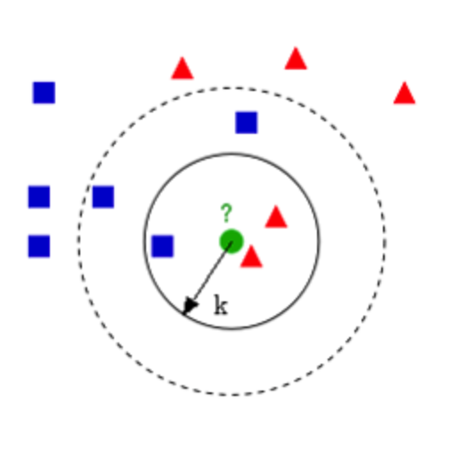
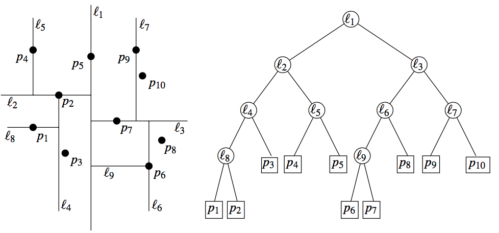

# K 近邻算法（KNN）

【[返回主仓](https://github.com/99cloud/lab-algorithm)】

## Catalog

- [说明](#说明)
- [KNN 介绍](#KNN 介绍)
	- [KNN 原理](#KNN 原理)
	- [KNN 算法描述](#KNN 算法描述)
	- [KNN的基本要素](#KNN的基本要素)
		- [距离度量](#距离度量)
		- [k 值的选择](#k 值的选择)
		- [分类决策规则](#分类决策规则)
	- [kd 树](#kd 树)
		- [构造 kd 树](#构造 kd 树)
		- [kd 树搜索最近邻](#kd 树搜索最近邻)
		- [kd 树预测](#kd 树预测)
- [KNN 实现](#KNN 实现)
	- [KNN 在 sklearn 中的使用](#KNN 在 sklearn 中的使用)
	- [KNN 基础版实现](#KNN 基础版实现)
	- [KdTree 版本实现](#KdTree 版本实现)
		- [构建 KdTree](#构建 KdTree)
		- [KdTree 搜索最近邻和预测](#KdTree 搜索最近邻和预测)
- [小结](#小结)

# 说明

 ## 文档

此为监督学习中，KNN 算法的说明文档

**主要使用的包**

```python
import numpy as np
from sklearn.cluster import KMeans
from sklearn.manifold import TSNE
from sklearn import datasets
```

## 文件

| 文件              | 说明                                                         |
| ----------------- | ------------------------------------------------------------ |
| KNN.ipynb         | jupyter文档，展示 knn_base 和 knn_kdtree 两种方法实现的效率差异 |
| knn_base.py       | knn 基础算法实现                                             |
| knn.kdtree.py     | knn kdtree 版本的算法实现                                    |
| data_generater.py | 随机生成点                                                   |
| plot.py           | 画图呈现                                                     |

# KNN 介绍

## 前言

K 近邻法（K-nearest neighbors, KNN）是一种很基本的机器学习方法，在我们平常的生活中也会不自主的应用，就是 **物以类聚，人以群分** 

比如，我们判断一个人的人品，只需要观察他来往最密切的几个人的人品好坏就可以得出了，这里就运用了 KNN 的思想，KNN 方法既可以做分类，也可以做回归，这点和决策树算法相同

KNN做回归和分类的主要区别在于最后做预测时候的决策方式不同， **KNN 做分类预测时，一般是选择多数表决法** ，即训练集里和预测的样本特征最近的 $k$ 个样本，预测为里面有最多类别数的类别， 而 **KNN 做回归时，一般是选择平均法** ，即最近的 $k$ 个样本的样本输出的平均值作为回归预测值，由于两者区别不大，所以 KNN 的分类方法思想对 KNN 的回归方法也适用，但主要介绍的是 KNN 的分类问题

## KNN 原理

给定一个训练集，对新输入的实例，在训练集中找到与该实例最邻近的k个实例，这 $k$ 个实例的多数属于某个类，我们就把该输入实例分为这个类



## KNN 算法描述

输入：训练数据集 $T=\{(x_1,y_1),(x_2,y_2),\cdots,(x_N,y_N)\}$，其中 $x_i\in\mathcal{X}$ 为实例的特征向量，$y_i\in \{c_1,c_2,\cdots,c_m\}$ 为实例的类别；实例特征向量 $x$ 

输出：实例 $x$ 所属的类别 $y$ 

1. 根据给定的距离度量方式，在训练集 $T$ 中找到与 $x$ 最邻近的 $k$ 个点，涵盖着 $k$ 个点的 $x$ 的邻域记为 $N_k(x)$

2. 在 $N_k(x)$ 中根据分类决策规则决定 $x$ 的类别 $y$ 
   $$
   y=\arg\max\limits_{c_j} \sum\limits_{x_i \in N_k(x)} I(y_i=c_j)
   $$
   其中 $I(y_i=c_j)$ 为指示函数，当 $y_i=c_j$ 的时候 $I=1$ ，否则 $I=0$ 

## KNN的基本要素

对于一个确定的训练集，只要确定了 **距离度量、k值和分类决策规则**，就能对任何一个新的实例，确定它的分类

### 距离度量

距离度量是描述特征空间中两个实例的距离，也是这两个实例的相似程度，在 $n$ 维实数向量空间中，我们主要使用的距离度量方式是 **欧式距离** ，但也可以使用更加一般化 $L_p$ 距离（闵可夫斯基距离）

在特征空间中，取出两个特征 $x_i,x_j$，它们分别是 $n$ 维的特征向量

- 欧式距离
  $$
  L_2(x_i,y_i)= \left( \sum\limits_{l=1}^n(x_i^l-y_i^l)^2 \right)^\frac12
  $$

- 曼哈顿距离
  $$
  L_2(x_i,y_i)= \sum\limits_{l=1}^n \left\vert x_i^l-y_i^l \right\vert
  $$

- 闵可夫斯基距离
  $$
  L_2(x_i,y_i)= \left( \sum\limits_{l=1}^n(x_i^l-y_i^l)^p \right)^\frac1p
  $$

从上式可以看出，欧氏距离和曼哈顿距离分别是闵可夫斯基距离的 $(p=2,p=1)$ 特殊情况

### k 值的选择

对于 $k$ 值的选择，没有一个固定的经验，一般根据样本的分布，选择一个较小的值， **然后通过交叉验证选择一个合适的 $\bold{k}$ 值**

- 选择较小的 $k$ 值，就相当于用较小的领域中的训练实例进行预测，训练误差会减小，只有与输入实例较近或相似的训练实例才会对预测结果起作用，与此同时带来的问题是泛化误差会增大， **换句话说，$\bold k$ 值的减小就意味着整体模型变得复杂，容易发生过拟合**
- 选择较大的 $k$ 值，就相当于用较大领域中的训练实例进行预测，其优点是可以减少泛化误差，但缺点是训练误差会增大，这时候，与输入实例较远（不相似的）训练实例也会对预测器作用，使预测发生错误， **换句话说，$\bold k$ 值的增大就意味着整体的模型变得简单，容易发生欠拟合** 

一个极端是 $k$ 等于样本数 $m$ ，则完全没有分类，此时无论输入实例是什么，都只是简单的预测它属于在训练实例中最多的类，模型过于简单

### 分类决策规则

对于分类决策规则，一般都是使用前面提到的多数表决法

## kd 树

KNN 算法最简单的实现方式，就是计算输入实例和所有训练实例的距离，然后进行排序，取前 $k$ 个，进行分类，但是训练集特别大的时候，这种方式非常耗时，不可行，下面介绍 kd 树的方式，kd 树是通过减少输入实例和训练实例的计算次数来达到优化的目的

kd 树算法包括三步，第一步是建树，第二部是搜索最近邻，最后一步是预测

### 构造 kd 树

kd 树是一种对 $n$ 维空间的实例点进行存储，以便对其进行快速检索的树形结构，kd 树是二叉树，构造 kd 树相当于不断的用垂直于坐标轴的超平面将 $n$ 维空间进行划分，构成一系列的 $n$ 维超矩阵区域

我们首先来看建树的方法， kd 树建树采用的是从 $m$ 个样本的 $n$ 维特征中，分别计算 $n$ 个特征的取值的方差，用方差最大的第 $k$ 维特征 $n_k$ 来作为根节点。对于这个特征，我们选择特征 $n_k$ 取值的中位数 $n_{kv}$ 对应的样本作为划分点，对于所有第 $k$ 维特征的取值小于 $n_{kv}$ 的样本，我们划入左子树，对于第 $k$ 维特征的取值大于等于 $n_{kv}$ 的样本，我们划入右子树，对于左子树和右子树，我们采用和刚才同样的办法来找方差最大的特征来做更节点，递归的生成 kd 树

构建好的 kd 树，大概如下



### kd 树搜索最近邻

当我们生成 kd 树以后，就可以去预测测试集里面的样本目标点了，预测的过程如下：

1. 对于一个目标点，**我们首先在 kd 树里面找到包含目标点的叶子节点** ，以目标点为圆心，**以目标点到叶子节点样本实例的距离为半径，得到一个超球体**，最近邻的点一定在这个超球体内部
2. **然后返回叶子节点的父节点，检查另一个子节点包含的超矩形体是否和超球体相交，如果相交就到这个子节点寻找是否有更加近的近邻，有的话就更新最近邻，并且更新超球体** ，如果不相交那就简单了，我们直接返回父节点的父节点，在另一个子树继续搜索最近邻
3. 当回溯到根节点时，算法结束，此时保存的最近邻节点就是最终的最近邻

从上面的描述可以看出，kd 树划分后可以大大减少无效的最近邻搜索，很多样本点由于所在的超矩形体和超球体不相交，根本不需要计算距离，大大节省了计算时间

搜索过程，大致如下：


### kd 树预测

有了 kd 树搜索最近邻的办法，kd 树的预测就很简单了，在 kd 树搜索最近邻的基础上，**我们选择到了第一个最近邻样本，就把它置为已选， 在第二轮中，我们忽略置为已选的样本，重新选择最近邻，这样跑 k 次，就得到了目标的 k 个最近邻** ，然后根据多数表决法，如果是 KNN 分类，预测为 k 个最近邻里面有最多类别数的类别，如果是 KNN 回归，用 k 个最近邻样本输出的平均值作为回归预测值

# KNN 实现

## KNN 在 sklearn 中的使用

kNN 在 sklearn 中是放在 sklearn.neighbors 的包中的，分类器 KNeighborsClassifier 的主要参数是

| 参数        | 意义                                                         |
| ----------- | ------------------------------------------------------------ |
| n_neighbors | K 值的选择与样本分布有关，一般选择一个较小的K值，可以通过交叉验证来选择一个比较优的K值，默认值是 5 |
| weights     | 'uniform' 是每个点权重一样，'distance'则权重和距离成反比例，即距离预测目标更近的近邻具有更高的权重 |
| algorithm   | 'brute' 对应第一种蛮力实现，'kd_tree' 对应第二种 KD 树实现，'ball_tree' 对应第三种的球树实现， 'auto' 则会在上面三种算法中做权衡，选择一个拟合最好的最优算法 |
| leaf_size   | 这个值控制了使用 KD 树或者球树时， 停止建子树的叶子节点数量的阈值 |
| metric      | K 近邻法和限定半径最近邻法类可以使用的距离度量较多，一般来说默认的欧式距离（即 p=2 的闵可夫斯基距离）就可以满足我们的需求 |
| p           | p 是使用距离度量参数 metric 附属参数，只用于闵可夫斯基距离和带权重闵可夫斯基距离中 p 值的选择，p=1 为曼哈顿距离， p=2 为欧式距离，默认为 2 |

比较重要的应该属 n_neighbors，weights

## KNN 基础版实现

```python
def fit(self, X_train, y_train):
    self.X_train = X_train
    self.y_train = y_train

def predict(self, X):
    # 取出n个点
    knn_list = []
    for i in range(self.n):
        dist = np.linalg.norm(X - self.X_train[i], ord=self.p)
        knn_list.append((dist, self.y_train[i]))

    for i in range(self.n, len(self.X_train)):
        max_index = knn_list.index(max(knn_list, key=lambda x: x[0]))
        dist = np.linalg.norm(X - self.X_train[i], ord=self.p)
        if knn_list[max_index][0] > dist:
            knn_list[max_index] = (dist, self.y_train[i])

    # 统计
    knn = [k[-1] for k in knn_list]
    return Counter(knn).most_common()[0][0]
```

接口设计都是按照 sklearn 的样子设计的，fit 方法其实主要用来接收参数了，没有进行任何的处理，所有的操作都在 predict 中，这就会导致，我们对每个点预测的时候，时间消耗比较大

## KdTree 版本实现

### 构建 KdTree

```python
# 建立kdtree
def create(self, dataSet, label, depth=0):
    if len(dataSet) > 0:
        m, n = np.shape(dataSet)
        self.n = n
        axis = depth % self.n
        mid = int(m / 2)
        dataSetcopy = sorted(dataSet, key=lambda x: x[axis])
        node = Node(dataSetcopy[mid], label[mid], depth)
        if depth == 0:
            self.KdTree = node
        node.lchild = self.create(dataSetcopy[:mid], label, depth+1)
        node.rchild = self.create(dataSetcopy[mid+1:], label, depth+1)
        return node
    return None
```

### KdTree 搜索最近邻和预测

```python
# 搜索kdtree的前count个近的点
def search(self, x, count = 1):
    nearest = []
    for i in range(count):
        nearest.append([-1, None])
    # 初始化n个点，nearest是按照距离递减的方式
    self.nearest = np.array(nearest)

    def recurve(node):
        if node is not None:
            # 计算当前点的维度axis
            axis = node.depth % self.n
            # 计算测试点和当前点在axis维度上的差
            daxis = x[axis] - node.data[axis]
            # 如果小于进左子树，大于进右子树
            if daxis < 0:
                recurve(node.lchild)
            else:
                recurve(node.rchild)
            # 计算预测点x到当前点的距离dist
            dist = np.sqrt(np.sum(np.square(x - node.data)))
            for i, d in enumerate(self.nearest):
                # 如果有比现在最近的n个点更近的点，更新最近的点
                if d[0] < 0 or dist < d[0]:
                    # 插入第i个位置的点
                    self.nearest = np.insert(self.nearest, i, [dist, node], axis=0)
                    # 删除最后一个多出来的点
                    self.nearest = self.nearest[:-1]
                    break

            # 统计距离为-1的个数n
            n = list(self.nearest[:, 0]).count(-1)
            '''
            self.nearest[-n-1, 0]是当前nearest中已经有的最近点中，距离最大的点。
            self.nearest[-n-1, 0] > abs(daxis)代表以x为圆心，self.nearest[-n-1, 0]为
            半径的圆与axis相交，说明在左右子树里面有比self.nearest[-n-1, 0]更近的点
            '''
            if self.nearest[-n-1, 0] > abs(daxis):
                if daxis < 0:
                    recurve(node.rchild)
                else:
                    recurve(node.lchild)

    recurve(self.KdTree)

    # nodeList是最近n个点的
    nodeList = self.nearest[:, 1]

    # knn是n个点的标签
    knn = [node.label for node in nodeList]
    return self.nearest[:, 1], Counter(knn).most_common()[0][0]
```

# 小结

- 优点
	- 解决分类问题
	- 天然可以解决多分类问题
	- 思想简单，效果强大
- 不足
	- 最大缺点：效率低下，如果训练集有 m 个样本，n 个特征，则预测每一个新的数据，需要 O(m*n)
	- 维度灾难，随着维度的增加，"看似相近" 的两个点之间的距离会越来越大
	- 数据高度相关
	- 预测结果不具有可解释性


【[返回顶部](#K 近邻算法（KNN）)】

【[返回主仓](https://github.com/99cloud/lab-algorithm)】