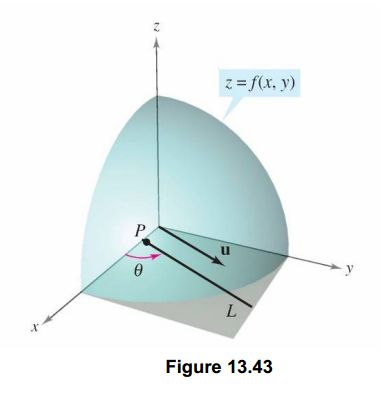

# 线性回归

【[返回主仓](https://github.com/99cloud/lab-algorithm)】

## Catalog

- [说明](#说明)
- [回归问题](#回归问题)
	- [监督学习的工作方式](#监督学习的工作方式)
	- [损失函数](#损失函数)
	- [梯度下降](#梯度下降)
		- [算法](#算法)
		- [数学解释](#数学解释)
	- [正规方程](#正规方程)
		- [正规方程的推导](#正规方程的推导)
		- [梯度下降与正规方程的比较](#梯度下降与正规方程的比较)
	- [特征标准化](#特征标准化)
	- [多项式回归](#多项式回归)
- [示例](#示例)
	- [sklearn.linear_model方法](#sklearn.linear_model方法)
	- [梯度下降方法](#梯度下降方法)
	- [正规方程方法](#正规方程方法)
- [小结](#小结)

# 说明

 ## 文档

此为监督学习中，线性回归的说明文档

**主要使用的包**

```python
import numpy as np
import matplotlib.pyplot as plt
from sklearn.linear_model import LinearRegression
```

## 文件

| 文件                 | 说明                                       |
| -------------------- | ------------------------------------------ |
| Linear_Regression.py | 基于 sklearn.linear_model 的线性回归代码   |
| GD.py                | 基于随机梯度下降和批梯度下降的线性回归代码 |
| Normal_Equation.py   | 基于正规方程的线性回归代码                 |

# 回归问题

## 介绍

回归问题是非常常见的一类问题，目的是为了找寻变量之间的关系

比如要从数据中找寻房屋面积与价格的关系，年龄与身高的关系，气体压力和体积的关系等等

而机器学习要做的正是要让机器自己来学习这些关系，并为对未知的情况做出预测

## 监督学习的工作方式

首先要有一个训练数据集（Training Set），其中包含数据对应问题的正确结果

通过我们的学习算法 （Learning Algorithm） 学习训练数据集，最终获得一个函数 （Hypothesis），这个函数就是我们需要的 **预测函数**，能够对 训练集的数据 与 其它数据输入 做出比较准确的预测


对于 **线性回归** ，我们的 **Hypothesis** 就是
$$
h_\theta(x)=\theta_0+\theta_1x_1+\theta_2x_2+⋯+\theta_nx_n=\theta^\mathrm{T}x
$$
其中的 $\theta_i$ 就是学习算法需要学习的参数，而 $x_i$ 是我们对于问题所选取的特征

特征就是一些与问题相关可以度量的值，比如长度、重量、温度等等

$h_\theta(x)$ 是我们预测的结果

## 损失函数

那么如何学习 **预测函数** 中的 $\theta_i$ 呢？

我们需要引入 **损失函数** 的概念，它的作用是评估真实与预测值之间的差异，一旦有了这个函数，学习算法的目标就是找到 $\theta_i$ 得这个函数的值尽可能的小

对于 **线性回归**，我们使用的 **损失函数** 是
$$
J(\theta)=\frac1{2m}\sum\limits_{i=1}^m(h_\theta(x{(i)}−y{(i)})^2
$$
其中 $m$ 是样本数， $y$ 是训练数据集已知答案，上标 $i$ 表示第几组训练数据，**损失函数** $J(\theta)$ 是关于 $\theta$ 的函数，当然为了是表达更简洁、编写的程序更加清晰，我们通常会使用它的矩阵表达
$$
J(\theta)=\frac1{2m}(X\theta−y)^\mathrm{T}(X\theta−y)
$$
式中 $X$ 为所有训练特征数据组成的矩阵， $i$ 为训练数据集已知答案的列向量
$$
X=\left[
\begin{matrix}
1 & x_1^{(1)} & x_2^{(1)} & \cdots & x_n^{(1)} \\
1 & x_1^{(2)} & x_2^{(2)} & \cdots & x_n^{(2)} \\
\vdots & \vdots & \vdots & \ddots & \vdots \\
1 & x_1^{(m)} & x_2^{(m)} & \cdots & x_n^{(m)}
\end{matrix}
\right]
\qquad\qquad 
y=\left[
\begin{matrix}
y^{(1)} \\ y^{(2)} \\ \vdots \\ y^{(m)}
\end{matrix}
\right]
$$
损失函数的Python实现

```python
import numpy as np
def computeCost(X, y, theta):
  	inner = np.power(((X * theta.T) - y), 2)
    return np.sum(inner) / (2 * len(X))
```

最后为了承上启下，我们来看看当特征只有一个的时候，**损失函数** $J(\theta)$ 的样子


## 梯度下降

### 算法

接着刚刚看的单个特征所对应的 **损失函数** 图像加上之前所说的 “学习算法的目标就是找到 $\theta_i$ 使得 **损失函数** 尽可能的小” 

一个很直观的想法就是，在坡上任意取一点，然后沿着下坡方向走最后到达最低点，这也正是梯度下降算法的思路，我们沿着梯度的反向更新 $\theta_i$ 的值（沿着最陡的方向下坡），直到 **损失函数** 收敛到最小值

梯度下降算法更新 $\theta_i$ 的方式为
$$
\theta_i:=\theta_i−\alpha\frac{\partial}{\partial\theta_i}J(\theta)
$$
其中 $\alpha$ 为学习率， $:=$ 表示使用右式的值替换$\theta_i$原有的值

对于 **线性回归**，我们更新 $\theta_i$ 的方式为
$$
\theta:=\theta-\alpha\frac1mX^\mathrm{T}(X\theta-y)
$$
到这里我们就能够完成整个 **线性回归** 的机器学习算法了

设定 $\theta_i$ 的初始值，使用梯度下降算法迭代更新 $\theta_i$ 的值，直到 $J(\theta)$ 收敛

### 数学解释

- **导数**

导数的几何意义比较熟悉，当函数定义域和取值都在实数域中的时候，导数可以表示函数曲线上的切线斜率，除了切线的斜率，导数还表示函数在该点的**变化率**
$$
f'(x_0)=\lim\limits_{\Delta x\to0}\frac{\Delta y}{\Delta x}
=\lim\limits_{\Delta x\to0}\frac{f(x_0+\Delta x)-f(x_0)}{\Delta x}
$$
将上面的公式转化为下面图像为


*（来自维基百科）*

*直白的来说，导数代表了在自变量变化趋于无穷小的时候，函数值的变化与自变量变化的比值代表了导数，**几何意义**有该点的切线。**物理意义**有该时刻的（瞬时）变化率...*

注意在一元函数中，只有一个自变量变动，也就是说只存在一个方向的变化率，这也就是为什么一元函数没有偏导数的原因

- **偏导数**

既然谈到偏导数，那就至少涉及到两个自变量，以两个自变量为例， $z=f(x,y)$  ，从导数到偏导数，也就是从曲线来到了曲面，曲线上的一点，其切线只有一条，但是曲面的一点，切线有无数条

而我们所说的偏导数就是指的是多元函数沿坐标轴的变化率

1. $f_x(x,y)$ 指的是函数在$y$方向不变，函数值沿着 $x$ 轴方向的变化率
2. $f_y(x,y)$ 指的是函数在$x$方向不变，函数值沿着 $y$ 轴方向的变化率

对应的图像形象表达如下


那么偏导数对应的几何意义

1. 偏导数 $f_x(x_0,y_0)$ 就是曲面被平面 $y=y_0$ 所截得的曲面在点 $M_0$ 处的切线 $M_0T_x$ 对 $x$ 轴的斜率
2. 偏导数 $f_y(x_0,y_0)$ 就是曲面被平面 $x=x_0$ 所截得的曲面在点 $M_0$ 处的切线 $M_0T_y$ 对 $y$ 轴的斜率

**但偏导数存在局限性，原来我们学到的偏导数指的是多元函数沿坐标轴的变化率，但是我们往往很多时候要考虑多元函数沿任意方向的变化率，那么就引出了方向导数**

- **方向导数**

假设你站在山坡上，想知道山坡的坡度（倾斜度），山坡图如下


假设山坡表示为 $z=f(x,y)$ ，主要俩个方向的斜率容易得到

1. $y$ 方向的斜率可以通过 $\partial y$ 得到
2. $x$ 方向的斜率可以通过 $\partial x$ 得到

类似于一个平面的所有向量可以用俩个基向量来表示，我们可以使用这俩个偏微分来求出任何方向的斜率

对于 $u$ 方向的斜率，假设 $z=f(x,y)$ 为一个曲面， $p(x_0,y_0)$ 为 $f$ 定义域中一个点，单位向量 $u=\cos\theta\cdot i+\sin\theta\cdot j$ 的斜率，其中 $\theta$ 是此向量与 $x$ 轴正向夹角，单位向量 $u$ 可以表示对任何方向导数的方向，如下图



那么我们来考虑如何求出 $u$ 方向的斜率，可以类比于前面导数定义，得出如下：

设 $f(x,y)$ 为一个二元函数， $u=\cos\theta\cdot i+\sin\theta\cdot j$ 为一个单位向量，如果下列的极限值存在
$$
D_uf=\lim\limits_{t\to0}\frac{f(x_0+t\cos\theta,y_0+t\sin\theta)-f(x_0,y_0)}{t}
$$
则称这个极限值是 $f$ 沿着 $u$ 方向的方向导数，那么随着 $\theta$ 的不同，我们可以求出任意方向的方向导数

这也表明了方向导数的用处，是为了给我们考虑函数对任意方向的变化率

**在求方向导数的时候，除了用上面的定义法求之外，我们还可以用偏微分来简化我们的计算**
$$
D_uf(x,y)=f_x(x,y)\cos\theta+f_y(x,y)\sin\theta
$$
***那么一个平面上无数个方向，函数沿哪个方向变化率最大呢？***

设
$$
A=(f_x(x,y),f_y(x,y)),\quad I=(\cos\theta,\sin\theta)
$$
那么我们可以得到
$$
D_uf=A\cdot I=|A|*|I|\cos\alpha
$$
其中， $\alpha$ 为 $\vec A$ 和 $\vec I$ 之间的夹角

那么此时如果 $D_uf(x,y)$ 要取得**最大值**，就是当 $\mathbf{\alpha}$ 为 $\mathbf{0^\circ}$ 的时候，也就是 $\vec I$ （这个方向是一直在变，在寻找一个函数变化最快的方向）与 $\vec A$ （这个方向当点固定下来的时候，它就是固定的）平行的时候，方向导数最大

**方向导数最大，也就是单位步伐，函数值朝这个反向变化最快**

把 $\vec A$ 命名为梯度（当一个点确定后，梯度方向是确定的），也就是说明了为什么梯度方向是函数变化率最大的方向了！（因为本来就是把这个函数变化最大的方向命名为梯度）

## 正规方程

对于 **线性回归**，我们完全可以使用数学方法来得到 $J(\theta)$ 取最小值时 $\theta_i$ 的值

这涉及一些导数和线性代数的知识，这里给出求解 $\theta$ 的公式
$$
\theta=(X^\mathrm{T}X)^{-1}\cdot X^\mathrm{T}y
$$
在使用时 **正规方程** 有一定的限制，比 $X^\mathrm{T}X$ 矩阵需要是可逆的

那么有了直接求解问题的方法，为什么我们还需要梯度下降的概念呢？因为梯度下降方法更具有广泛性，可以用于很多问题的求解，比如非线性的 **损失函数**

### 正规方程的推导

推导过程，基于损失函数
$$
J(\theta)=\frac1{2m}\sum\limits_{i=1}^m(h_\theta(x{(i)}−y{(i)})^2
$$
其中
$$
h_\theta=\theta^{\mathrm{T}}X
=\theta_0x_0+\theta_1x_1+\theta_2x_2+\cdots+\theta_nx_n
$$
将向量表达形式转为矩阵表达形式，则有
$$
J(\theta)=\frac1{2m}(X\theta−y)^\mathrm{T}(X\theta−y)
$$
其中 $X$ 为 $m\times n$ 的矩阵（ $m$ 为样本个数， $n$ 为特征个数）， $\theta$ 为 $n\times 1$ 的矩阵， $y$ 为 $m\times 1$ 的矩阵

对 $J(\theta)$ 进行如下变换
$$
\begin{align*}
J(\theta) &= \frac1{2m}(X\theta−y)^\mathrm{T}(X\theta−y) \\
&= \frac1{2m}(X^\mathrm{T}\theta^\mathrm{T}−y^\mathrm{T})(X\theta−y) \\
&= \frac1{2m}(X^\mathrm{T}\theta^\mathrm{T}X\theta
							-X^\mathrm{T}\theta^\mathrm{T}y
							-y^\mathrm{T}X\theta-y^\mathrm{T}y)
\end{align*}
$$
接下来对 $J(\theta)$ 求偏导，需要用到以下几个矩阵求导的法则
$$
\frac{dAX}{dX^\mathrm{T}}=A,\qquad \frac{dX^\mathrm{T}AX}{dX}=2AX
$$
所以有
$$
\begin{align*}
\frac{\partial J(\theta)}{\partial\theta} 
&= \frac1{2m}(X^\mathrm{T}\frac{\partial\theta^\mathrm{T}X\theta}{\partial\theta}
							-X^\mathrm{T}\frac{\partial\theta^\mathrm{T}y}{\partial\theta}
							-\frac{\partial y^\mathrm{T}X\theta}{\partial\theta}
							-\frac{\partial y^\mathrm{T}y}{\partial\theta}) \\
&= \frac1{2m}(X^\mathrm{T}2X\theta-X^\mathrm{T}y-(y^\mathrm{T}X)^\mathrm{T}-0) \\
&= \frac1m(X^\mathrm{T}X\theta-X^\mathrm{T}y)
\end{align*}
$$
令 $\frac{\partial J(\theta)}{\partial\theta} =0$ ，则有
$$
\theta=(X^\mathrm{T}X)^{-1}\cdot X^\mathrm{T}y
$$

### 梯度下降与正规方程的比较

| 梯度下降                        | 正规方程                                                     |
| ------------------------------- | ------------------------------------------------------------ |
| 需要选择学习率 $\alpha$         | 不需要                                                       |
| 需要多次迭代                    | 一次运算得出                                                 |
| 当特征数量 $n$ 大时也能较好适用 | 需要计算 $(X^\mathrm{T}X)^{-1}$ 如果特征数量 $n$ 较大则运算代价大，因为矩阵逆的计算时间复杂度为 $O(n^3)$ ，通常来说当 $n<10000$ 时还是可以接受的 |
| 适用于各种类型的模型            | 只适用于线性模型，不适合逻辑回归模型等其他模型               |

总结一下，只要特征变量的数目并不大，标准方程是一个很好的计算参数 $\theta$ 的替代方法，具体地说，只要特征变量数量小于一万，我通常使用标准方程法，而不使用梯度下降法

随着我们要讲的学习算法越来越复杂，例如，当我们讲到分类算法，像逻辑回归算法，我们会看到，实际上对于那些算法，并不能使用标准方程法

对于那些更复杂的学习算法，我们将不得不仍然使用梯度下降法，因此，梯度下降法是一个非常有用的算法，可以用在有大量特征变量的线性回归问题，但对于这个特定的线性回归模型，标准方程法是一个比梯度下降法更快的替代算法，所以，根据具体的问题，以及特征变量的数量，这两种算法都是值得学习的

正规方程的python实现

```python
import numpy as np
def normalEqn(X, y):
  	theta = np.linalg.inv(X.T@X)@X.T@y		# X.T@X 失效时可用X.T.dot(X)
    return theta
```

## 特征标准化

在实际的运用中我们选取的特征，比如长度，重量，面积等等，通常单位和范围都不同，这会导致梯度下降算法变慢。所以我们要将特征缩放到相对统一的范围内，通常的方法有 **Standardization** 和 **Normalization**

**Standardization** 是把数据变成符合标准正态分布，即使原来是些奇奇怪怪的分布，由 **中心极限定理** 可知，数据量够大，一样变成正态，更新公式为
$$
x_i=\frac{x_i-\mu}{\delta}
$$
**Normalization** 对于梯度下降算法友好，可能可以让算法最终收敛并且提高训练速度和精度，更新公式为
$$
x_i:=\frac{x_i-\min(x_i)}{\max(x_i)-\min(x_i)}
$$

## 多项式回归

有时候线性的 **Hypothesis** 不一定合适我们需要拟合的数据，我们会选择多项式拟合例如
$$
h_\theta=\theta_0+\theta_1x_1+\theta_2x_1x_2+\theta_4x_1^2+\theta_5x_2^2
$$
这时候我们可以将它转化为 **线性回归** 问题，只要令新的特征 $x_3=x_1x_2,\quad x_4=x_1^2,\quad x_5=x_2^2$ 就可以了

# 示例

笔者选取一个$100$个点的测试集，构造点的方法为
$$
y=0.5\cdot x+1+\epsilon,\qquad 
x=\frac1{10}\times\{0,1,2,\cdots,99\},\quad 
\epsilon\in N(0,1)
$$

```python
def load_dataset(n):
    noise = np.random.rand(n)
    x = [[0.1 * x] for x in range(n)]
    y = [(0.5 * x[i][0] + 1.0 + noise[i]) for i in range(n)]
    return np.array(x), np.array(y)
```

由于各种方法图像大同小异，不累赘展示，只展示 sklearn 方法的那张，主要显示不同方法的 $\theta$ 和 $J(\theta)$ 

比较发现，还是官方的包比较厉害 \^_\^

## sklearn.linear_model方法

```python
Data Shape (100, 1) (100,)
Sklearn_Theta [1.50443066 0.49577963]
Sklearn_Linreg_Loss 0.06843549998987704
```


## 梯度下降方法

```python
SGD_Theta [1.49585133 0.5197172 ]
SGD_Loss 0.10203149081311785
BGD_Theta [1.51903492 0.49953469]
BGD_Loss 0.08474175743613946
```

## 正规方程方法

```python
Normal_Equation_Theta [1.50538654 0.49582665]
Normal_Equation_y_pred
 [1.50538654 1.5549692  1.60455187 1.65413453 1.7037172  1.75329986
  1.80288253 1.85246519 1.90204786 1.95163052 2.00121319 2.05079585
  2.10037852 2.14996118 2.19954385 2.24912651 2.29870918 2.34829184
  2.3978745  2.44745717 2.49703983 2.5466225  2.59620516 2.64578783
  2.69537049 2.74495316 2.79453582 2.84411849 2.89370115 2.94328382
  2.99286648 3.04244915 3.09203181 3.14161448 3.19119714 3.24077981
  3.29036247 3.33994514 3.3895278  3.43911047 3.48869313 3.5382758
  3.58785846 3.63744113 3.68702379 3.73660645 3.78618912 3.83577178
  3.88535445 3.93493711 3.98451978 4.03410244 4.08368511 4.13326777
  4.18285044 4.2324331  4.28201577 4.33159843 4.3811811  4.43076376
  4.48034643 4.52992909 4.57951176 4.62909442 4.67867709 4.72825975
  4.77784242 4.82742508 4.87700775 4.92659041 4.97617307 5.02575574
  5.0753384  5.12492107 5.17450373 5.2240864  5.27366906 5.32325173
  5.37283439 5.42241706 5.47199972 5.52158239 5.57116505 5.62074772
  5.67033038 5.71991305 5.76949571 5.81907838 5.86866104 5.91824371
  5.96782637 6.01740904 6.0669917  6.11657437 6.16615703 6.2157397
  6.26532236 6.31490502 6.36448769 6.41407035]
Normal_Equation_Loss 0.0891981661368604
```

# 小结

回归一词指的是，我们根据之前的数据预测出一个准确的输出值，该值可以是连续变化的


【[返回顶部](#线性回归)】

【[返回主仓](https://github.com/99cloud/lab-algorithm)】