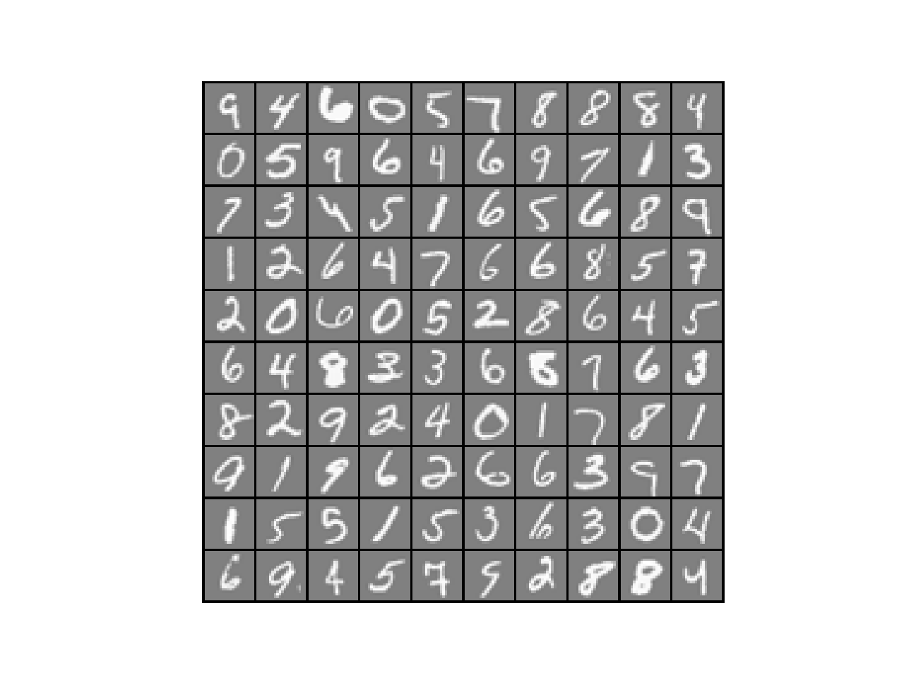
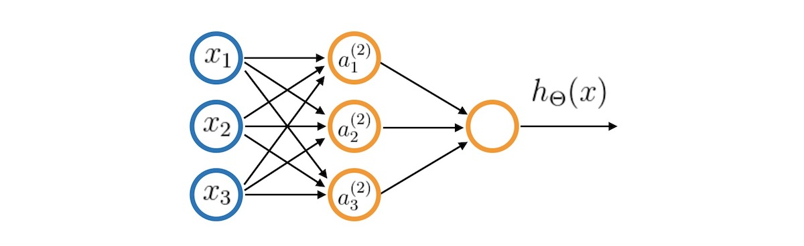
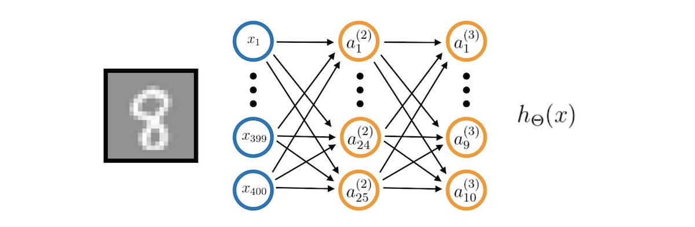
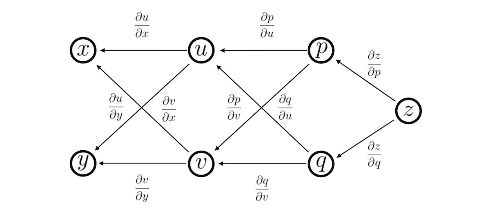
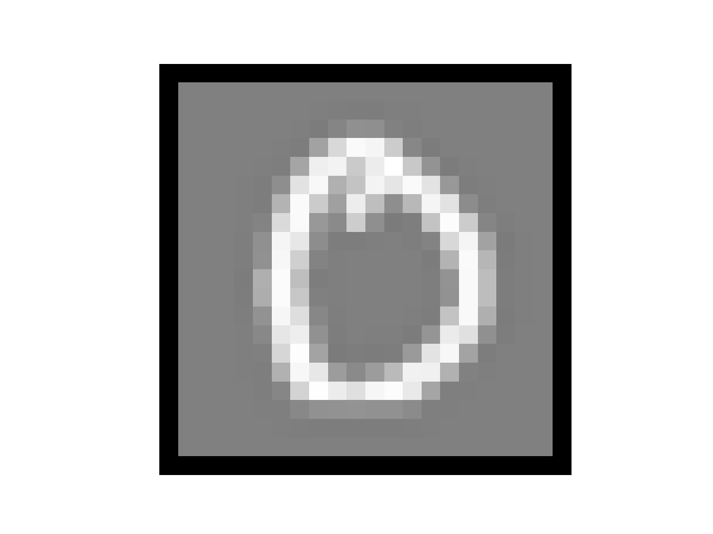
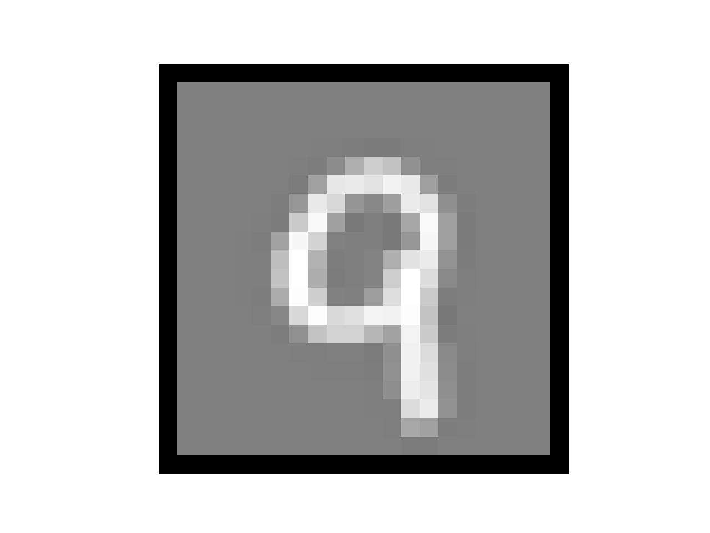
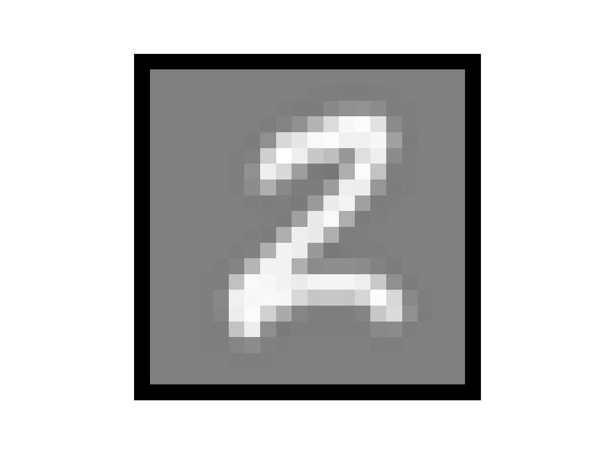
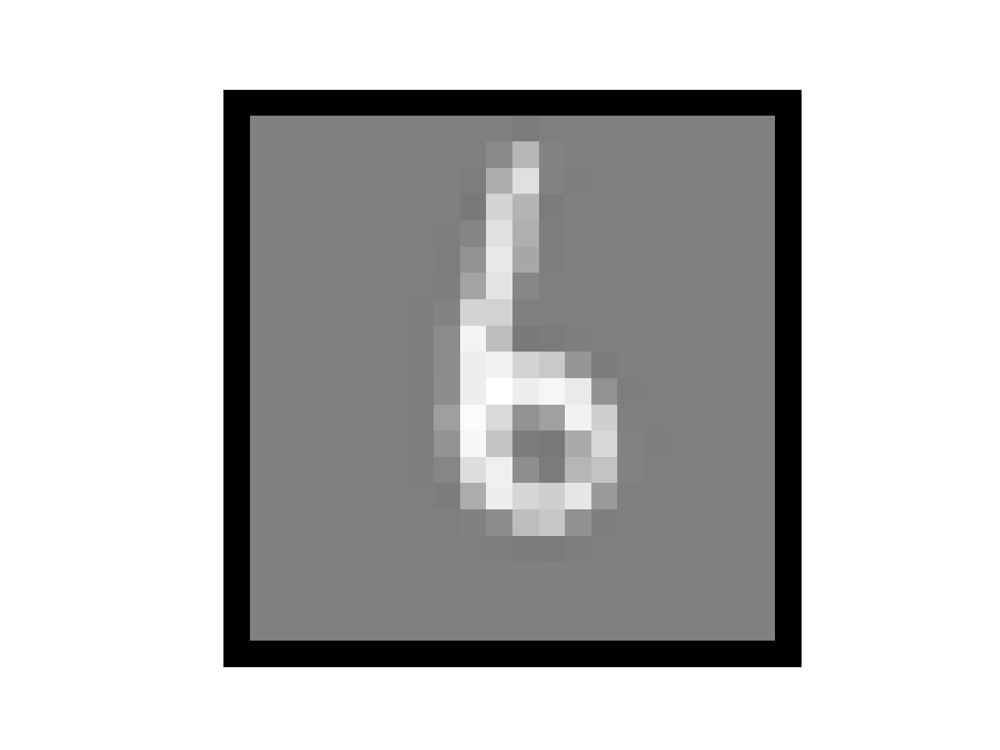

# 神经网络

【[返回主仓](https://github.com/99cloud/lab-algorithm)】

## Catalog

- [说明](#说明)
- [多分类问题](#多分类问题)
	- [神经网络介绍](#神经网络介绍)
	- [数学表示](#数学表示)
	- [表达能力](#表达能力)
	- [手写字符识别](#手写字符识别)
- [反向传播算法](#反向传播算法)
	- [损失函数](#损失函数)
	- [梯度计算](#梯度计算)
	- [链式法则](#链式法则)
	- [公式推导](#公式推导)
	- [反向传播](#反向传播)
- [示例](#示例)
- [小结](#小结)

# 说明

 ## 文档

此为监督学习中，神经网络的说明文档

**主要使用的包**

```python
import numpy as np
import matplotlib.pyplot as plt
import scipy.io as sio
from scipy.optimize import minimize
```

## 文件

### MultiClass

【[**File of MultiClass**](https://github.com/99cloud/lab-algorithm/tree/master/MachineLearning/Supervised/NeuralNetwork/MultiClass)】

| 文件               | 说明                                                      |
| ------------------ | --------------------------------------------------------- |
| Softmax.py         | 基于 Softmax 的多分类脚本                                 |
| number_data.mat    | 手写体数字特征数据集： X [5000, 400], y [5000, 1]         |
| MultiClass.py      | 多分类主函数，对于每一类进行逻辑回归判断，返回预测准确率  |
| displayData.py     | 手写体数字样例呈现代码                                    |
| sigmoid.py         | sigmoid 函数                                              |
| oneVsAll.py        | 凸优化函数模块，方法为共轭梯度算法                        |
| lrCostFunction.py  | 损失函数及梯度计算模块                                    |
| predictOneVsAll.py | 多分类函数预测结果                                        |
| weights.mat        | 已训练好的 Theta 数据                                     |
| MultiClass_nn.py   | 基于训练好的 Theta ，执行 NN 过程的主函数，返回预测准确率 |
| predict.py         | 训练好的 Theta 执行 NN 过程的预测结果                     |

### Neural_Network

【[**File of Neural_Network**](https://github.com/99cloud/lab-algorithm/tree/master/MachineLearning/Supervised/NeuralNetwork/Neural_Network)】

| 文件                        | 说明                                              |
| --------------------------- | ------------------------------------------------- |
| number_data.mat             | 手写体数字特征数据集： X [5000, 400], y [5000, 1] |
| weights.mat                 | 已训练好的 Theta 数据                             |
| Neural_Network.py           | 神经网络主函数                                    |
| displayData.py              | 手写体样例呈现代码                                |
| sigmoid.py                  | sigmoid 函数                                      |
| sigmoidGradient.py          | 凸优化函数模块，方法为共轭梯度算法                |
| computeNumericalGradient.py | 利用有限差分法进行梯度的估算                      |
| nnCostFunction.py           | 神经网络损失函数及梯度计算模块                    |
| randInitializeWeights.py    | 随机初始化权值                                    |
| debugInitializeWeights.py   | 利用三角函数和层的尺寸调整权值                    |
| checkNNGradients.py         | 建立一个小型的神经网络用于验证反向传播梯度        |
| predict.py                  | 训练好的 Theta 执行 NN 过程的预测结果             |

# 多分类问题

在 [**逻辑回归**](https://github.com/99cloud/lab-algorithm/tree/master/MachineLearning/Supervised/Logistic) 中，我们可以解决简单的 $\{0,1\}$ 分类问题，当我们需要解决特征量很大的非线性分类问题时（ 比如计算机视觉问题 ），我们原本假设高次特征的方法会使得特征数异常庞大，从而引出新的方法 **神经网络**

这次的新问题是手写字符识别，有一个手写字符的图片集合，每张图片都是一个 $\{0,1,2,\cdots,9\}$ 之间的手写数字，对于每张手写字符图片，我们要输出它是什么数字（ 下图是随机选取的 $100$ 张图片 ）


对于这个问题，我们的解决方法是训练 $10$ 个 $\{0,1\}$ 分类器，分别判断图片属于这个分类的概率（ **逻辑回归** 的输出 ），然后从这 $10$ 个结果中选取最大的作为结果，但为了更好地解决这类问题，我们需要引入新的方法

## 神经网络介绍

神经网络是一种很古老的算法，这个算法诞生的目的是为了模拟大脑的算法从而建造智能机器

这个想法产生的原因是神经科学的研究表明大脑并非对不同的信号采取不同的处理方式（ 不同的算法 ），而是使用同一种来应对不同的信号（ 视觉、听觉等 ），这极大地激发了研究人员对寻找这种算法的热情，虽然期间由于各种技术问题（ 没有有效的训练算法和硬件速度限制 ）消声觅迹了一段时间，但最终凭借 **反向传播**、**共享权值**、**GPU加速** 等技术重现光辉，并成为现代机器学习技术中最有效的方法之一

## 数学表示

我们把单个 **神经元** 抽象为一个 **逻辑单元** ，$x_0,\;x_1,\;x_2,\;x_3$ 为 **树突** 传入的信号（ $x_0$ 为偏置，图中没有画出 ），激活 **神经元** 后从 **轴突** 输出 $h_\theta (x)$


**逻辑单元** 可以使用数学符号表示为如下形式
$$
h_\theta=\frac{1}{1+e^{-\theta^\mathrm{T}x}} \qquad 
x=\left[
\begin{matrix}
x_0 \\ x_1 \\ x_2 \\ x_3
\end{matrix}
\right] \qquad
\theta=\left[
\begin{matrix}
\theta_0 \\ \theta_1 \\ \theta_2 \\ \theta_3
\end{matrix}
\right]
$$


单个 **神经元** 的能力非常有限，而 **神经网络** 强大的地方在于将这些 **神经元** 连接在一起共同工作（ 类似于大脑中神经元的工作方式 ）， **神经网络** 的表示如下



上图是含有一层 **隐含层** 的神经网络，输入单元 $x_0,\;x_1,\;x_2,\;x_3$ 将值传给 **隐含层**（ 每个输入单元传入的 **权值** 是不同的 ），然后 **隐含层** 将输出值再传给输出层的 **神经元** ，用数学语言表达就是
$$
\left[
\begin{matrix}
a_1^{(2)} \\ a_2^{(2)} \\a_3^{(2)}
\end{matrix}
\right]
=g\left(\left[
\begin{matrix}
z_1^{(2)} \\ z_2^{(2)} \\z_3^{(2)}
\end{matrix}
\right]\right)
=g\left(
\left[
\begin{matrix}
\Theta_{10}^{(1)} & \Theta_{11}^{(1)} & \Theta_{12}^{(1)} & \Theta_{13}^{(1)} \\
\Theta_{20}^{(1)} & \Theta_{21}^{(1)} & \Theta_{22}^{(1)} & \Theta_{23}^{(1)} \\
\Theta_{30}^{(1)} & \Theta_{31}^{(1)} & \Theta_{32}^{(1)} & \Theta_{33}^{(1)} \\
\end{matrix}
\right]
\left[\begin{matrix}
x_0 \\ x_1 \\ x_2 \\ x_3
\end{matrix}\right]
\right)
$$

$$
h_\Theta(x)=a_1^{(3)}=g(z_1^{(3)})
=g(\Theta_{10}^{(2)}a_0^{(2)}+\Theta_{11}^{(2)}a_1^{(2)}
+\Theta_{12}^{(2)}a_2^{(2)}+\Theta_{13}^{(2)}a_3^{(2)})
$$

式中

- $g(z)$ 为 **激活函数**，常用的是 **逻辑回归** 中提到的 **Sigmoid** 函数
- $z$ 为中间变量，上一层激活函数值的加权和
- $a_0^{(2)}=1$ 为偏置
- $h_\Theta(x)$ 由于输出层只有一个元素，为了美观没有写为矩阵形式

图中输出层只有一个 **逻辑单元**，但实际可以有多个

## 表达能力

**监督学习** 的目的就是为了使用算法获得问题的 **预测函数**，所以一个 **预测函数** 能够表达的函数越多，应用就能够更广泛，那么 **神经网络** 的表达能力如何呢？Andrew Ng 在课程中展示了如何使用 **逻辑单元** 来组成数字电路中的 **逻辑门**，而我们又知道 **逻辑门** 是计算机计算的基础，它们的组合可以表达一切可以计算的函数，所以从某种直觉上来说 **神经网络** 能够表达的东西是非常多的

## 手写字符识别

本周课程最后回到我们的 **多分类问题** 问题，我们构造一个 **神经网络** 来完成手写字符识别的任务。网络的输入为 $20\times20$ 的图片，所以输入层有 $400$ 个单元。我们需要归类 $\{0,1,2,\cdots,9\}$ 的 $10$ 个数字，所以输出层有 $10$ 个单元，第 $i$ 个单元表示图片为 $i\; mod\; 10$ 的概率（ 偏置不在图中绘出 ）



# 反向传播算法

## 损失函数

假设我们的多分类问题有 $K$ 个分类，神经网络共有 $L$ 层，第 $l$ 层的神经元个数为 $S_l$

那么神经网络的 **损失函数** 为
$$
J(\Theta)=-\frac1m\sum\limits_{i=1}^m\sum\limits_{k=1}^K
\left(
y_k^{(i)}log(h_\Theta(x^{(i)}))_k
+(1-y_k^{(i)})log(1-(h_\Theta(x^{(i)}))_k)
\right)
+\frac{\lambda}{2m}\sum\limits_{l=1}^{L-1}\sum\limits_{i=1}^{S_l}\sum\limits_{l=1}^{S_{l+1}}
(\Theta_{ji}^{(l)})^2
$$
其中的第二项为 **正则化** 项，是网络中所有权值的平方和

第一项与逻辑回归中的 **损失函数** 类似，但这里我们需要累加所有输出神经元的误差

这个看起来复杂很多的代价函数背后的思想还是一样的，我们希望通过代价函数来观察算法预测的结果与真实情况的误差有多大，唯一不同的是，对于每一行特征，我们都会给出 $K$ 个预测，基本上我们可以利用循环，对每一行特征都预测 $K$ 个不同结果，然后在利用循环在 $K$ 个预测中选择可能性最高的一个，将其与 $y$ 中的实际数据进行比较

正则化的那一项只是排除了每一层 $\theta_0$ 后，每一层的 $\theta$ 矩阵的和，最里层的循环 $j$ 循环所有的行（由$l+1$ 层的激活单元数 $s_{l+1}$ 决定），循环 $i$ 则循环所有的列，由 $s_l$ 层的激活单元数 $s_l$  所决定，即： $h_\theta(x)$ 与真实值之间的距离为每个样本-每个类输出的加和，对参数进行 **regularization** 的 **bias** 项处理所有参数的平方和

## 梯度计算

为了能够使用 **梯度下降** 算法来训练网络，我们需要计算代价函数的梯度

一种很直观的方法就是使用数值计算，对于某个 $\Theta_{ij} $ ，给它加上减去一个很小的量 $\epsilon$ 来计算梯度：
$$
\frac{\partial J(\theta)}{\partial\theta_j} \approx 
\frac{J(\theta_1,\cdots,\theta_j+\epsilon,\cdots,\theta_n)
-J(\theta_1,\cdots,\theta_j-\epsilon,\cdots,\theta_n)}{2\epsilon}
$$
但分析一下算法的复杂度就能知道，这样的方法十分缓慢，对于每一组数据，我们需要计算所有权值的梯度

**总的计算次数 = 训练数据个数 x 网络权值个数 x 前向传播计算次数** 

在通常情况下这样的复杂度是无法接受的，所以我们仅使用这个方法来验证 **反向传播** 算法计算的梯度是否正确

## 链式法则

为了能够理解之后对于 **反向传播** 公式的推导，我们首先要了解一个关于多元复合函数求导的 **链式法则**。对于多元函数 $z=f(u,v)$ ，其中 $u=h(x,y)$，$v=g(x,y)$，那么
$$
\frac{\partial z}{\partial x}=
 \frac{\partial z}{\partial u}\frac{\partial u}{\partial x}
 +\frac{\partial z}{\partial v}\frac{\partial v}{\partial x} \\
\frac{\partial z}{\partial y}=
 \frac{\partial z}{\partial u}\frac{\partial u}{\partial y}
 +\frac{\partial z}{\partial v}\frac{\partial v}{\partial y}
$$
**链式法则** 告诉我们有多个层次的多元复合函数，下一层次的导数可以由上一层次推得


即使再多加了一层，情况也是类似，这里 $p$ 是 $u,v$ 的函数，$q$ 是 $u,v$ 的函数，$z$ 是 $p,q$ 的函数

对于要计算的 $\frac{\partial z}{\partial x}$ 与 $\frac{\partial z}{\partial y}$，上式仍成立，原因是我们可以把 $z$ 看作 $u,v$ 的函数，这相当于我们把
$$
\frac{\partial z}{\partial x}=
 \frac{\partial z}{\partial p}\frac{\partial p}{\partial u}\frac{\partial u}{\partial x}
 +\frac{\partial z}{\partial p}\frac{\partial p}{\partial v}\frac{\partial v}{\partial x}
 +\frac{\partial z}{\partial q}\frac{\partial q}{\partial u}\frac{\partial u}{\partial x}
 +\frac{\partial z}{\partial q}\frac{\partial q}{\partial v}\frac{\partial v}{\partial x}
$$
简化为了只与上一层相关，利用上一层计算完成的结果 $\frac{\partial z}{\partial u}$  和 $\frac{\partial z}{\partial v}$  而不用从头算起
$$
\frac{\partial z}{\partial x}=
 \frac{\partial z}{\partial u}\frac{\partial u}{\partial x}
 +\frac{\partial z}{\partial v}\frac{\partial v}{\partial x}
$$
一般的，对于函数 $y$，如果它能看做 $z_1,z_2⋯,z_n$ 的函数，而 $z_i$ 为 $t$ 的函数，则
$$
\frac{\partial y}{\partial t} = \sum\limits_{i=1}^{n}
\frac{\partial y}{\partial z_i}\frac{\partial z_i}{\partial t}
$$
神经网络就是一个层次很多的多元函数，我们可以隐约从 **链式法则** 中感觉到反向传播的意味

## 公式推导

为了施展 **反向传播** 的魔法，我们首要要引入一个中间变量 $ \delta$ ，定义为
$$
\delta_j^l=\frac{\partial J}{\partial z_j^l}
$$
其中 $l$ 表示第 $l$ 层，$j$ 表示第 $l$ 层的第 $j$ 个神经元，$z$ 为中间变量（ 为了让式子看上去更清晰，**反向传播** 中的公式上标不使用括号 ），$δ$ 被称为第 $l$ 层第 $j$ 个神经元的误差，**反向传播** 就是先计算每一层每个神经元的误差，然后通过误差来得到梯度的

首先来看输出层的误差
$$
\delta_j^L=\frac{\partial J}{\partial z_j^L}
$$
对它使用 **链式法则** 得到
$$
\delta_j^l=\sum\limits_{k=1}^K
\frac{\partial J}{\partial a_k^L}\frac{\partial a_k^L}{\partial z_j^L}
$$
而只有当 $k==j$ 时，右边部分才不为 $0$ ，所以
$$
\delta_j^L=\frac{\partial J}{\partial a_j^L}\frac{a_j^L}{\partial z_j^L}
=\frac{\partial J}{a_j^L}g'(z_j^L)=a_j^L-y_j^L
\tag{1}
$$
对于其它层的误差
$$
\delta_j^l=\frac{\partial J}{\partial z_j^l}
$$
使用 **链式法则**
$$
\delta_j^l=\sum_{k=1}^{S_{l+1}}
 \frac{\partial J}{\partial z_k^{l+1}}\frac{\partial z_k^{l+1}}{\partial z_j^l}
 =\sum_{k=1}^{S_{l+1}}\delta_k^{l+1}\frac{\partial z_k^{l+1}}{\partial z_j^l}
$$
而其中
$$
z_k^{l+1}=\sum\limits_{p=1}^{S_l}\Theta_{kp}^lg(z_p^l)+b_k^l
$$
求偏导得
$$
\frac{\partial z_k^{l+1}}{\partial z_j^l}=\Theta_{kj}^lg'(z_j^l)
$$
所以
$$
\delta_j^l=\sum_{k=1}^{S_{l+1}}\Theta_{kj}^l\delta_k^{l+1}g'(z_j^l)
=\sum_{k=1}^{S_{l+1}}\Theta_{kj}^l\delta_k^{l+1}a_j^l(1-a_j^l)
\tag{2}
$$
最后同样使用 **链式法则** 来计算
$$
\frac{\partial J}{\partial \Theta_{ij}^l}=\sum\limits_{k=1}^{S_{l+1}}
\frac{\partial J}{\partial z_k^{l+1}}\frac{\partial z_k^{l+1}}{\partial\Theta_{ij}^l}
=\sum\limits_{k=1}^{S_l}\delta_k^{l+1}\frac{\partial z_k^{l+1}}{\partial\Theta_{ij}^l}
$$
由于
$$
z_k^{l+1}=\sum\limits_{p=1}^{S_l}\Theta_{kp}^lg(z_p^l)+b_k^l
$$
只有当 $k=i,\;p=j$ 时留下一项
$$
\frac{\partial J}{\Theta_{ij}^l}=g(z_j^l)\delta_i^{l+1}=a_j^l\delta_i^{l+1}
\tag{3}
$$

## 反向传播

有了 $(1)(2)(3)$ 式，就可以来完成 **反向传播** 算法了（ 注意：刚才所推导的式子都是针对一组训练数据而言的 ）

### 算法

- 对于所有的 $l,i,j$ 初始化 $\Delta_{ij}^l=0$

- 对于 $m$ 组训练数据， $k$ 从 $1$ 取到 $m$ 

  - 令 $a^1=x^{(k)}$
  - 前向传播，计算各层激活向量 $a^l$
  - 使用 $(1)$ 式，计算输出层误差 $\delta_L$
  - 使用 $(2)$ 式，计算其它层误差 $\delta^{L−1},\delta^{L−2},\cdots,\delta^2$
  - 使用 $(3)$ 式，累加 $\delta_{ij}^l$， $\delta_{ij}^l:=\delta_{ij}^l+a_j^l\delta_i^{l+1}$

- 计算梯度矩阵
  $$
  D_{ij}^l=
  \begin{cases}
  \frac1m\Delta_{ij}^l+\frac\lambda m\Theta_{ij}^l & if\;j\neq0 \\
  \frac1m\Delta_{ij}^l &if\;j=0
  \end{cases}
  $$

- 更新权值 $\Theta^l:=\Theta^l+\alpha D^l$

### 初始化权值

对于神经网络，不能像之前那样使用相同的 $0$ 值来初始化，这会导致每层的 **逻辑单元** 都相同

因此我们使用随机化的初始化方法，使得
$$
-\delta\leq\Theta_{ij}^l\leq\delta
$$

# 示例

数据集采用 $5000$ 张 $20\times20$ 的手写体数字图像（已经特征化）

并且我们导入一些事先训练好的神经网络参数

```python
Loading and Visualizing Data ...

Loading Saved Neural Network Parameters ...
```

对于神经网络，首先应该实现只返回神经网络前馈部分的 Cost ，过程在 nncostfunction.m 中完成，在实现了计算前馈的 Cost 之后，验证在固定的调试参数上是否正确

```python
Feedforward Using Neural Network ...

cost value: 0.287629
Cost at parameters (loaded from weights): 0.287629        
(this value should be about 0.287629)
```

当前馈部分的 Cost 正确之后，我们还需要增加正则化项

```python
Checking Cost Function (w/ Regularization) ... 

cost value: 0.383770
Cost at parameters (loaded from weights): 0.383770        
(this value should be about 0.383770)
```

Sigmoid 函数梯度计算

```python
Evaluating sigmoid gradient...

Sigmoid gradient evaluated at [1 -0.5 0 0.5 1]:
  
[0.19661193 0.23500371 0.25       0.23500371 0.19661193]
```

然后我们开始一个两层的神经网络去区分手写体数字

首先需要对初始权重的进行设置

当我们的 Cost 和主流的情况匹配时（差距小于 1e-9），就可以执行神经网络的反向传播算法，返回相应的偏导数

```python
Initializing Neural Network Parameters ...

Checking Backpropagation... 

cost value: 2.099385
cost value: 2.099384
...
cost value: 2.099409
[ 1.76654044e-02  4.83605809e-04  7.06767168e-04  2.80130052e-04
  9.70879576e-03  2.36708468e-04  2.83653862e-04  6.98092035e-05
 -7.18128123e-03 -2.28610917e-04 -4.01542820e-04 -2.05298106e-04
 -1.74827533e-02 -4.83497643e-04 -7.17048672e-04 -2.91348459e-04
 -1.16920643e-02 -2.93754241e-04 -3.73295381e-04 -1.09630470e-04
  1.09347722e-01  5.67965185e-02  5.25298306e-02  5.53542907e-02
  5.59290833e-02  5.23534682e-02  1.08133003e-01  5.67319602e-02
  5.14442931e-02  5.48296085e-02  5.56926532e-02  5.11795651e-02
  5.06270372e-01  2.63880175e-01  2.41215476e-01  2.57977109e-01
  2.58731922e-01  2.40983787e-01]
[ 1.76654043e-02  4.83605811e-04  7.06767165e-04  2.80130055e-04
  9.70879575e-03  2.36708468e-04  2.83653860e-04  6.98092051e-05
 -7.18128122e-03 -2.28610917e-04 -4.01542819e-04 -2.05298105e-04
 -1.74827533e-02 -4.83497640e-04 -7.17048672e-04 -2.91348459e-04
 -1.16920643e-02 -2.93754241e-04 -3.73295381e-04 -1.09630469e-04
  1.09347722e-01  5.67965185e-02  5.25298306e-02  5.53542907e-02
  5.59290833e-02  5.23534682e-02  1.08133003e-01  5.67319602e-02
  5.14442931e-02  5.48296085e-02  5.56926532e-02  5.11795651e-02
  5.06270372e-01  2.63880175e-01  2.41215476e-01  2.57977109e-01
  2.58731922e-01  2.40983787e-01]
The above two columns you get should be very similar.
             (Left-Your Numerical Gradient, Right-Analytical Gradient)

If your backpropagation implementation is correct, then 
           the relative difference will be small (less than 1e-9). 
  
Relative Difference: 1.76077e-11
```

当反向传播的 Cost 正确之后，我们还需要增加正则化项

```python
Checking Backpropagation (w/ Regularization) ... 

cost value: 2.145957
cost value: 2.145955
...
cost value: 2.145976
[ 0.0176654   0.05504145  0.00917397 -0.04512802  0.0097088  -0.01652822
  0.03970285  0.0594313  -0.00718128 -0.03286988 -0.06040096 -0.03239967
 -0.01748275  0.05895294  0.03830022 -0.01756555 -0.01169206 -0.04535299
  0.00861934  0.05466708  0.10934772  0.11135436  0.06099703  0.00994614
 -0.00160637  0.03558854  0.108133    0.11609346  0.0761714   0.02218834
 -0.00430676  0.01898519  0.50627037  0.32331662  0.28023275  0.24070291
  0.20104807  0.19592455]
[ 0.0176654   0.05504145  0.00917397 -0.04512802  0.0097088  -0.01652822
  0.03970285  0.0594313  -0.00718128 -0.03286988 -0.06040096 -0.03239967
 -0.01748275  0.05895294  0.03830022 -0.01756555 -0.01169206 -0.04535299
  0.00861934  0.05466708  0.10934772  0.11135436  0.06099703  0.00994614
 -0.00160637  0.03558854  0.108133    0.11609346  0.0761714   0.02218834
 -0.00430676  0.01898519  0.50627037  0.32331662  0.28023275  0.24070291
  0.20104807  0.19592455]
The above two columns you get should be very similar.
             (Left-Your Numerical Gradient, Right-Analytical Gradient)

If your backpropagation implementation is correct, then 
           the relative difference will be small (less than 1e-9). 
           
Relative Difference: 1.73727e-11

cost value: 0.576051

Cost at (fixed) debugging parameters (w/ lambda = 10): 0.576051           
(this value should be about 0.576051)
```

然后我们开始训练自己的神经网络，区别于 matlab 或者 octave 中的 'fmincg' 和 'fminunc' 方法，还是使用scipy.optimize 中的 minimize 包来获取局部最小值点，method 为 'CG'（共轭梯度算法），只要我们为这些高级优化器提供梯度计算，它们就能够有效地训练我们的 Cost 函数

```python
Training Neural Network... 

cost value: 6.950881
cost value: 6.950881
...
cost value: 0.326665
cost value: 0.326656
```

在训练神经网络之后，我们想用它来预测标签

使用神经网络来预测训练集的标签，并可以计算训练集的精度（示例的精度超过 $99\%$ ）

并可以展示样例图片和预测情况（这里举 $4$ 个例子）

```python
Training Set Accuracy: 99.380000

Displaying Example Image

Neural Network Prediction: 9 (digit 0)

Displaying Example Image
  
Neural Network Prediction: 8 (digit 9)

Displaying Example Image

Neural Network Prediction: 1 (digit 2)

Displaying Example Image

Neural Network Prediction: 5 (digit 6)
```

      

# 小结

## 网络结构

决定选择多少层以及决定每层分别有多少个单元

- 第一层的单元数即我们训练集的特征数量

- 最后一层的单元数是我们训练集的结果的类的数量

- 如果隐藏层数大于 $1$ ，确保每个隐藏层的单元个数相同，通常情况下隐藏层单元的个数越多越好
- 我们真正要决定的是隐藏层的层数和每个中间层的单元数

## 训练神经网络

1. 参数的随机初始化

2. 利用正向传播方法计算所有的 $h_\theta(x)$ 

3. 编写计算代价函数 $J$ 的代码

4. 利用反向传播方法计算所有偏导数

5. 利用数值检验方法检验这些偏导数

6. 使用优化算法来最小化代价函数


【[返回顶部](#神经网络)】

【[返回主仓](https://github.com/99cloud/lab-algorithm)】