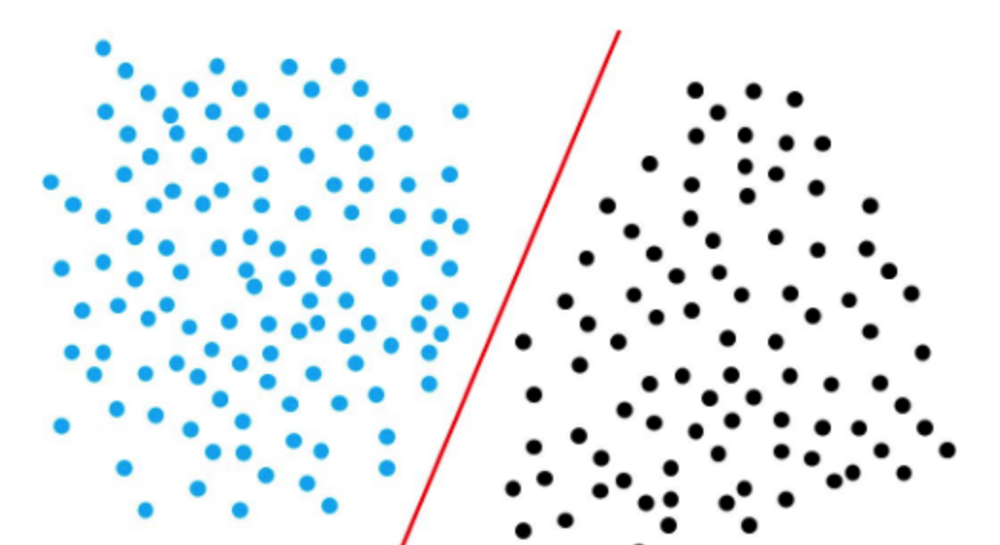
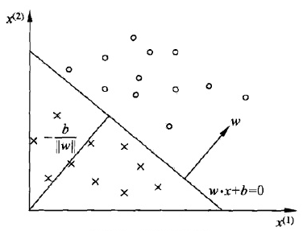
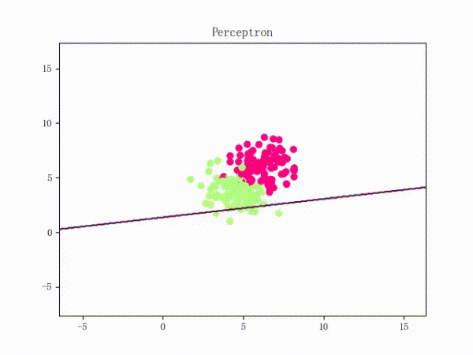

# 感知机

【[返回主仓](https://github.com/99cloud/lab-algorithm)】

## Catalog

- [说明](#说明)
- [感知机的原理](#感知机的原理)
- [感知机模型](#感知机模型)
- [感知机学习算法](#感知机学习算法)
	- [原始形式算法](#原始形式算法)
	- [对偶形式算法](#对偶形式算法)
	- [原始形式和对偶形式的选择](#原始形式和对偶形式的选择)
- [训练过程](#训练过程)
- [小结](#小结)

# 说明

## 文件

此为监督学习中，感知机的说明文档

| 文件               | 说明                                      |
| ------------------ | ----------------------------------------- |
| DM_Learner.py      | 感知机模型简单代码                        |
| perceptron.ipynb   | 感知机原始模型和对偶模型比较的jupyter文档 |
| perceptron_base.py | 感知机原始模型类                          |
| perceptron_dual.py | 感知机对偶模型类                          |
| utils_plot.py      | 绘制决策平面分离的代码                    |

## 前言

感知机是1957年，由Rosenblatt提出会，是**神经网络和支持向量机**的基础

# 感知机的原理

PLA全称是Perceptron Linear Algorithm，即线性感知机算法，属于一种最简单的感知机（Perceptron）模型

感知机是二分类的线性模型，其输入是实例的特征向量，输出的是事例的类别，分别是+1和-1，属于判别模型

假设训练数据集是线性可分的，感知机学习的目标是求得一个能够将训练数据集**正实例点和负实例点完全正确分开的分离超平面**。如果是非线性可分的数据，则最后无法获得超平面

## 点到线的距离

公式中的直线方程为$Ax+By+C=0$，点$P(x_0,y_0)$到直线的距离为
$$
d=\frac{A𝑥_0+B𝑦_0+C}{\sqrt{A^2+B^2}}
$$

## 样本到超平面距离

我们假设超平面是 $h=w\cdot x+b$ ，其中 $w=(w_0,w_1,...,w_m),x=(x_0,x_1,...,x_m)$，

样本 $x'$ 到超平面的距离为
$$
d=\frac{w⋅x'+b}{||w||}
$$

## 超平面（Hyperplanes）

超平面是在空间 $R^d$ 中的一个子空间 $R^{d−1}$ 

在$2$ 维空间中的超平面是一条线，在$3$ 维空间中的超平面是一个平面

# 感知机模型

感知机从输入空间到输出空间的模型如下：
$$
f(x)=sign(w\cdot x+b)
$$

$$
sign(x)=\begin{cases} −1,& x<0\\1,&x≥0\end{cases}
$$

我们首先定义对于样本 $(x_i,y_i)$ ，如果 $\frac{w\cdot xi+b}{||w||}>0$ 则记 $y_i=+1$ ，如果 $\frac{w\cdot xi+b}{||w||}<0$ 则记$y_i=−1$

这样取 $y$ 的值有一个好处，就是方便定义损失函数

因为正确分类的样本满足 $\frac{y_i(w\cdot xi+b)}{||w||}>0$ ，而错误分类的样本满足 $\frac{y_i(w\cdot xi+b)}{||w||}<0$

我们损失函数的优化目标，**就是期望使误分类的所有样本，到超平面的距离之和最小**

**所以损失函数定义如下：**
$$
L(w,b)=−\frac1{||w||}\cdot\sum \limits_{x_i\in M}y_i(w\cdot x_i+b)
$$
其中 $M$ 集合是误分类点的集合

不考虑 $\frac1{||w||}$ ，就得到感知机模型的损失函数：
$$
L(w,b)=−\sum \limits_{x_i\in M}y_i(w\cdot x_i+b)
$$

## 为什么可以不考虑 $\frac1{||w||}$

通过参考他人观点结合思考，觉得原因可以列为以下两点：

1. $\frac1{||w||}$ 不影响 $y_i(w\cdot x_i+b)$ 正负的判断，即不影响学习算法的中间过程，因为感知机学习算法是**误分类驱动**的，这里需要注意的是所谓的“误分类驱动”指的是我们只需要判断 $−yi(w\cdot xi+b)$ 的正负来判断分类的正确与否，而 $\frac 1{||w||}$ 并不影响正负值的判断，所以 $\frac1{||w||}$ 对感知机学习算法的中间过程可以不考虑
2. $\frac1{||w||}$ 不影响感知机学习算法的最终结果，因为感知机学习算法最终的终止条件是所有的输入都被正确分类，即不存在误分类的点，则此时损失函数为 $0$ ，对应于 $−\frac1{||w||}\cdot\sum \limits_{x_i\in M}y_i(w\cdot x_i+b)$ 即分子为 $0$ ，则可以看出 $\frac1{||w||}$ 对最终结果也无影响

综上所述，即使忽略 $\frac1{||w||}$ ，也不会对感知机学习算法的执行过程产生任何影响，反而还能简化运算，提高算法执行效率

# 感知机学习算法

感知机学习算法是对上述损失函数进行极小化，求得 $w$ 和 $b$

但是用普通的基于所有样本的梯度和的均值的批量梯度下降法（BGD）是行不通的，原因在于我们的损失函数里面有限定，**只有误分类的M集合里面的样本才能参与损失函数的优化**，所以我们不能用最普通的批量梯度下降,只能采用随机梯度下降（SGD）

目标函数如下：
$$
L(w,b)=arg\min \limits_{w,b}(-\sum \limits_{x_i\in M}y_i(w\cdot x_i+b))
$$

## 原始形式算法

**输入**：训练数据集 $T=(x_1,y_1),(x_2,y_2),...,(x_N,y_N)$，$y_i\in \{−1,+1\}$，学习率 $\eta(0<\eta<1)$

**输出**：$w,b$；感知机模型 $f(x)=sign(w\cdot x+b)$

1. 赋初值 $w_0,b_0$

2. 选取数据点 $(x_i,y_i)$

3. 判断该数据点是否为当前模型的误分类点，即判断若 $y_i(w\cdot x_i+b)\leq0$，则更新
   $$
   \begin{cases}
   w=w+\eta\cdot y_ix_i \\
b=b+\eta\cdot yi
   \end{cases}
   $$
   
4. 转到2，直到训练集中没有误分类点

## 对偶形式算法

由于 $w,b$ 的梯度更新公式
$$
\begin{cases}
w=w+\eta\cdot y_ix_i \\
b=b+\eta\cdot yi
\end{cases}
$$

我们的 $w,b$ 经过了 $n$ 次修改后的，参数可以变化为下公式，其中 $\alpha=ny$
$$
\begin{cases}
w=\sum \limits_{x_i\in M}\eta\cdot y_ix_i=\sum\limits_{i=1}^n\alpha_i\cdot y_ix_i \\
b=\sum \limits_{x_i\in M}\eta\cdot y_i=\sum\limits_{i=1}^n\alpha_i\cdot y_i
\end{cases}
$$

这样我们就得出了感知机的对偶算法

**输入**：训练数据集 $T=(x_1,y_1),(x_2,y_2),...,(x_N,y_N)$，$y_i\in \{−1,+1\}$，学习率 $\eta(0<\eta<1)$

**输出**：$\alpha,b$；感知机模型 $f(x)=sign(\sum\limits_{j=1}^n\alpha_j\cdot y_jx_j\cdot x + b)$

其中 $\alpha=(\alpha_1,\alpha_2,...,\alpha_n)^\mathrm{T}$

1. 赋初值 $\alpha_0,b_0$

2. 选取数据点 $(x_i,y_i)$

3. 判断该数据点是否为当前模型的误分类点，即判断若 $y_i(\sum\limits_{j=1}^n\alpha_j\cdot y_jx_j\cdot x + b)\leq0$，则更新
   $$
   \begin{cases}
   \alpha_i=\alpha_i+\eta \\
b=b+\eta\cdot y_i
   \end{cases}
   $$
   
4. 转到2，直到训练集中没有误分类点

为了减少计算量，我们可以预先计算式中的内积，得到 $Gram$ 矩阵
$$
G=[x_i,x_j]_{N×N}
$$

## 原始形式和对偶形式的选择

- 在向量维数（特征数）过高时，计算内积非常耗时，应选择对偶形式算法加速
- 在向量个数（样本数）过多时，每次计算累计和就没有必要，应选择原始算法

# 训练过程

我们大概从下图看下感知机的训练过程

线性可分的过程

线性不可分的过程

# 小结

感知机算法是一个简单易懂的算法，它是很多算法的鼻祖，比如**支持向量机算法，神经网络与深度学习**

因此虽然它现在已经不是一个在实践中广泛运用的算法，还是值得好好的去研究一下

感知机算法对偶形式为什么在实际运用中比原始形式快，也值得好好去体会

【[返回顶部](#感知机)】

【[返回主仓](https://github.com/99cloud/lab-algorithm)】