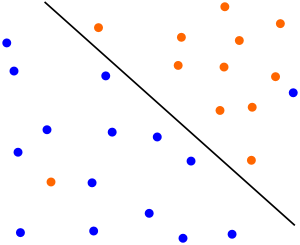
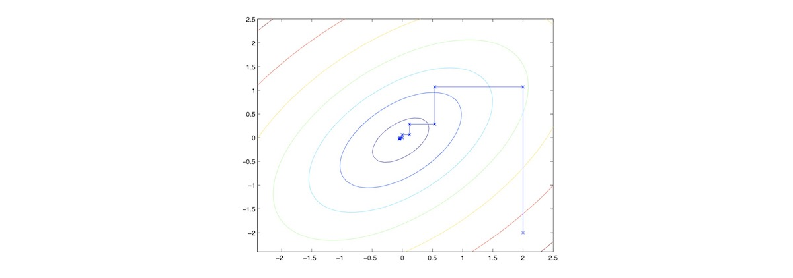

# 支持向量机

【[返回主仓](https://github.com/99cloud/lab-algorithm)】

## Catalog

- [说明](#说明)
- [拉格朗日对偶性](#拉格朗日对偶性)
	- [原始问题](#原始问题)
	- [拉格朗日对偶问题](#拉格朗日对偶问题)
	- [原始问题和对偶问题的关系](#原始问题和对偶问题的关系)
- [SVM思路](#SVM思路)
	- [最大间距分类器](#最大间距分类器)
	- [对偶问题](#对偶问题)
	- [核函数](#核函数)
		- [多项式回归](#多项式回归)
		- [核函数原理](#核函数原理)
		- [核函数的介绍](#核函数的介绍)
	- [正则化](#正则化)
		- [SVM异常点问题](#SVM异常点问题)
		- [线性分类SVM的软间隔最大化](#线性分类SVM的软间隔最大化)
		- [Hinge损失函数](#Hinge损失函数)
	- [SMO算法](#SMO算法)
- [数据点分类示例](#数据点分类示例)
	- [训练线性SVM模型](#训练线性SVM模型)
	- [利用高斯核函数训练非线性的SVM模型](#利用高斯核函数训练非线性的SVM模型)
	- [SVM对于有少量异常点的分类效果](#SVM对于有少量异常点的分类效果)
- [小结](#小结)

# 说明

 ## 文档

此为监督学习中，支持向量机的说明文档

**主要使用的包**

```python
import numpy as np
import pandas as pd
from sklearn.datasets import load_iris
from sklearn.model_selection import  train_test_split
from random import random
from sklearn.svm import SVC
```

## 文件

| 文件              | 说明                                       |
| ----------------- | ------------------------------------------ |
| svm.py            | 简单的 SVM 实现代码                        |
| svm.ipynb         | jupyter文档，简单的 SVM 示例               |
| data_generater.py | 随机从load_iris选取数据集的代码            |
| smo.pdf           | SMO 算法的详细说明                         |
| SVM               | 文件夹，SVM 实现代码，线性、非线性、正则化 |

### SVM文件

| 文件                       | 说明                                                    |
| -------------------------- | ------------------------------------------------------- |
| data1.mat                  | 线性可分的数据集： X: [51, 2]; y: [51, 1]               |
| data2.mat                  | 非线性的数据集： X: [863, 2]; y: [863, 1]               |
| data3.mat                  | 含有少量异常点的数据集： Xval: [200, 2]; yval: [200, 1] |
| svm.py                     | SVM 主函数，训练后返回对三个数据集的呈现及分类情况      |
| plotData.py                | 画图函数                                                |
| linearKernel.py            | 线性核函数代码                                          |
| gaussianKernel.py          | 高斯核函数代码                                          |
| svmTrain.py                | 基于 SMO 算法的 SVM 分类训练函数                        |
| svmProdict.py              | 基于训练模型，返回一个预测的向量                        |
| visualizeBoundary.py       | 在 SVM 训练后返回一个非画线的分类边界                   |
| visualizeBoundaryLinear.py | 在 SVM 训练后返回一个画线的分类边界                     |

# 拉格朗日对偶性

在约束最优化问题中，常常利用拉格朗日对偶性将原始问题转化为对偶问题，通过求解对偶问题获得原始问题的解，该方法应用在许多统计学方法中，如最大熵模型、支持向量机

对于 **拉格朗日对偶** 涉及的问题很多，推荐阅读 [**支持向量机：Duality**](http://blog.pluskid.org/?p=702)

## 原始问题

考虑一般的 **凸优化问题**
$$
\begin{aligned}\min\limits_\omega\quad & f(\omega)  \\s.t\quad & g_i(\omega) \leq 0,	& i=1,\cdots,k \\& h_i(\omega)=0，&i=1,\cdots,l \end{aligned} \tag{1}
$$
称此约束最优化问题为**原始最优化问题或原始问题**，设它的 **拉格朗日函数** 为
$$
\mathcal{L}(\omega,\alpha,\beta) = f(\omega)+ \sum\limits_{i=1}^k\alpha_ig_i(\omega) + \sum\limits_{i=1}^l\beta_ih_i(\omega)
$$
这里 $\alpha_i,\beta_i$ 是拉格朗日乘子，$\alpha_i \geq 0 $ ， 考虑 $\omega$ 的函数，这里下标 $\mathcal{P}$ 表示原始问题，考虑函数
$$
\theta_\mathcal{P}(\omega)=\max \limits_{\alpha,\beta:\;\alpha_i\geq0} 	\mathcal{L}(\omega,\alpha, \beta)
$$
在 $w$ 满足约束条件的时候 $\theta_\mathcal{P}(\omega)=f(\omega)$ ，在不满足时 $\theta_\mathcal{P}(\omega)=\infty$ 
$$
\min\limits_\omega \theta_\mathcal{P}(x)= \min\limits_\omega \max \limits_{\alpha,\beta:\;\alpha_i\geq0} 	\mathcal{L}(\omega,\alpha, \beta)
$$
此问题称为**广义拉格朗日函数的极小极大问题**，定义原始问题的最优值 $p^*$ 
$$
p^*= \min\limits_\omega \theta_\mathcal{P}(x)
$$

## 拉格朗日对偶问题

有意思的是对于这样的问题，总有一个与之对应问题（ **对偶问题** ），并且在特定条件下的解与原问题相同

要得到 **对偶问题**，我们只需要交换 $\min,\max$ 的顺序，考虑函数
$$
\theta_\mathcal{D}(\alpha,\beta) = \min\limits_\omega\mathcal{L}(\omega,\alpha,\beta)
$$
再考虑极大化上式
$$
\max \limits_{\alpha,\beta:\;\alpha_i\geq0} \theta_\mathcal{D}(\alpha,\beta)=
	\max \limits_{\alpha,\beta:\;\alpha_i\geq0} \min\limits_\omega
	\mathcal{L}(\omega,\alpha,\beta)
$$
该问题称为**广义拉格朗日函数的极大极小问题**

可将广义拉格朗日函数的极大极小问题表示为约束最优化问题
$$
\begin{aligned}
\max \limits_{\alpha,\beta:\;\alpha_i\geq0} & \theta_\mathcal{D}(\alpha,\beta)=
	\max \limits_{\alpha,\beta:\;\alpha_i\geq0} \min\limits_\omega
	\mathcal{L}(\omega,\alpha,\beta) \\
& s.t. \quad \alpha_i \geq 0, \quad i=1,2,\cdots,k
\end{aligned} \tag{2}
$$
称为原始问题的对偶问题，定义对偶问题的最优值，称为对偶问题的值
$$
d^*= \max \limits_{\alpha,\beta:\;\alpha_i\geq0} \theta_\mathcal{D}(\alpha,\beta)
$$

## 原始问题和对偶问题的关系

### 定理 1

若原始问题和对偶问题都有最优值，则
$$
d^*= \max \limits_{\alpha,\beta:\;\alpha_i\geq0} \theta_\mathcal{D}(\alpha,\beta)
\leq\min\limits_\omega \theta_\mathcal{P}(\omega)=p^*
$$

### 推论 1

设 $\omega^*$ 和 $\alpha^∗,\beta^∗$ 分别是原始问题(公式 $(1)$ )和对偶问题(公式 $(2)$ )的可行解，并且 $d^*=q^*$ ，则 $\omega^*$ 和 $\alpha^∗,\beta^∗$ 分别是原始问题和对偶问题的最优解

### 定理 2

考虑原始问题(公式 $(1)$ )和对偶问题(公式 $(2)$ )

设函数 $f(x)$ 和 $g_i(x)$ 是凸函数，$h_j(x)$ 是仿射函数；并且假设不等式约束 $g_i(x)$ 是严格可行的，即存在 $\omega$ ， 对所有 $i$ 有 $c_i(x)<0$， 则存在 $\omega^∗,\alpha^∗,\beta∗$ 使 $\omega∗$ 是原始问题的解， $\alpha^∗,\beta∗$  是对偶问题的解，并且
$$
d^∗=p^∗=\mathcal{L}(\omega^∗,\alpha^∗,\beta^∗)
$$

### 定理 3

最后再来看看 **对偶问题** 的解在什么情况下与 **原问题** 相同：如果函数 $f,g$ 都是 **凸函数**，$h$ 是 **仿射射函数**（ 线性的 ），并且存在 $\omega$ 使得 $g_i(\omega)<0$，则优化问题若有解 $\omega^∗,\alpha^∗,\beta^∗$  ， 则需要满足 **KKT** 条件，反之满足 **KKT** 条件的解也是优化问题的解（ **KKT** 条件如下 ）

> $$
> KKT\ Conditions \quad
> \begin{cases}
> \frac{\partial}{\partial\omega_i}\mathcal{L}(\omega^∗,\alpha^∗,\beta^∗)=0,	
> & i=1,\cdots,m \\
> \frac{\partial}{\partial\alpha_i}\mathcal{L}(\omega^∗,\alpha^∗,\beta^∗)=0, 	
> & i=1,\cdots,k \\
> \frac{\partial}{\partial\beta_i}\mathcal{L}(\omega^∗,\alpha^∗,\beta^∗)=0, 	
> & i=1,\cdots,l \\
> \alpha_i^*g_i(\omega^*) = 0, & i=1,\cdots,k \\
> g_i(\omega^*) \leq 0, & i=1,\cdots,k \\
> \alpha_i \geq 0, & i=1,\cdots,k \\
> h_i(\omega^*) = 0, & i=1,\cdots,l \\
> \end{cases}
> $$

# SVM思路

从 **最大间距分类器** 开始，通过 **拉格朗日对偶** 得到原问题的 **对偶** 问题，使得我们可以应用 **核技巧（ kernel trick ）**，用高效的方式解决高维问题

## 最大间距分类器

考虑 **逻辑回归** 的 **预测函数** 
$$
h_\theta(x)=g(\theta^\mathrm{T}x)
$$

- 当 $\theta^\mathrm{T}x\gg0$ 时，$h_\theta\to 1$ 

- 或当 $\theta^\mathrm{T}x \ll 0$ 时，$h_\theta\to 0$ 

因此我们能十分确信该样本的分类，直观的表达就是样本越是远离 **决策边界**，它的分类也就越清晰

所以自然想到如果在多个 **决策边界** 之间选择，我们会选择离所有样本都比较远的那个（ 考虑线性的情况 ）


为了得到这样的决策边界，我们首先来看看如何用数学方式表达这个问题

通过一些简单的 **计算几何** 知识可以计算出每个样本到 **决策边界** 的距离（ **geometric margin** ），$\gamma^{(i)}$

为了方便之后的推导，还需要定义一个 **functional margin**，$\hat\gamma^{(i)}$ 
$$
\hat\gamma^{(i)}=y^{(i)} \left( \omega^\mathrm{T}x^{(i)} + b \right) \\
\gamma^{(i)}=y^{(i)} \left( 
\left(\frac{\omega}{\Vert\omega\Vert} \right) ^ \mathrm{T} x^{(i)}
+ \frac{b}{\Vert\omega\Vert} \right)
$$
在接下来的 **SVM** 讨论中，我们约定 $y^{(i)}$ 的取值为 $\{1,-1\}$ （表示在决策边界的某一侧，这样使得距离的计算都是正值 ），当 $\omega^\mathrm{T}x + b \geq 0$ 时取 $1$ ，当 $\omega^\mathrm{T}x + b \leq 0$ 时取 $-1$  

同时还需要定义 $\hat\gamma$ 为所有 $\hat\gamma^{(i)}$ 中最小的值， $\gamma$ 为所有 $\gamma^{(i)}$ 中最小的值

于是要求离所有样本都比较远的决策边界问题就成为了在给定约束条件下求最值的问题
$$
\begin{align}
\max\limits_{\omega,\;b}\quad & \gamma \\
s.t.\quad &  y^{(i)}(\omega^\mathrm{T}x^{(i)}+b) \geq \gamma, \quad i=1,\cdots,m \\
& \Vert\omega\Vert = 1. 
\end{align}
$$
然而上面的问题还不是一个直接可解的 [**优化问题**](https://en.wikipedia.org/wiki/Optimization_problem)，需要对它进行转化（ 思路是把它转化为标准的 **凸优化问题** ），首先我们用 **functional margin** 来替换 **geometric margin**，原问题变为：
$$
\begin{align}
\max\limits_{\omega,\;b}\quad & \frac{\hat\gamma}{\Vert\omega\Vert} \\
s.t. \quad & y^{(i)}(\omega^\mathrm{T}x^{(i)}+b) \geq \hat\gamma, \quad i=1,\cdots,m \\
\end{align}
$$
这个问题的解和原先的相同，不同点是在这个问题里，我们可以对 $\omega,b$ 随意加倍而不用考虑 $\Vert\omega\Vert$ 的大小了

为了剔除 $\hat\gamma$ 项的干扰，我们适当地选取 $\omega,b$ 的倍数使得 $\hat\gamma=1$ ，再加上最大化 $\frac{1}{\Vert\omega\Vert}$ 相当于最小化 $\Vert\omega\Vert^2$ ，于是 **优化问题** 的最终形式可以化为：
$$
\begin{align}
\min\limits_{\omega,\;b}\quad & \frac12\Vert\omega\Vert^2 \\
s.t. \quad & y^{(i)}(\omega^\mathrm{T}x^{(i)}+b) \geq 1, \quad i=1,\cdots,m \\
\end{align}
$$
对于这样的问题，已经可以用已知的 **优化问题** 算法来解决

考虑前述的 **拉格朗日对偶**，对于 **SVM**，我们继续考察一个与之相对应的问题

## 对偶问题

通过 **拉格朗日对偶** 我们了解到之前的最大间距问题有一个与它对应的 **对偶** 问题

接下去我们就通过 **拉格朗日对偶** 来得到这个问题，对于之前的问题令
$$
g_i(\omega)=-y^{(i)}(\omega^\mathrm{T}x^\mathrm{(i)}+b)+1 \leq 0
$$
并设 **拉格朗日函数** 为：
$$
\mathcal{L}(\omega,b,\alpha) = \frac12\Vert\omega\Vert^2
- \sum\limits_{i=1}^m\alpha_i[y^{(i)}(\omega^\mathrm{T}x^\mathrm{(i)}+b) - 1]
\qquad s.t. \; \alpha \geq 0
$$
根据对偶问题的定义，我们先对于 $\omega,b$ 求 $\mathcal{L}(\omega,b,\alpha)$ 的最小值，也就是分别对 $\omega$ 和 $b$ 进行求导得到
$$
\begin{cases}
\frac{\partial}{\partial \omega}\mathcal{L}(\omega,b,\alpha) =
	\omega - \sum\limits_{i=1}^m\alpha_iy^{(i)}x^\mathrm{(i)} \\
\frac{\partial}{\partial b}\mathcal{L}(\omega,b,\alpha) =
	\sum\limits_{i=1}^m\alpha_iy^{(i)}
\end{cases}
$$
令偏导为 $0$ ，可得
$$
\begin{cases}
\omega = \sum\limits_{i=1}^m\alpha_iy^{(i)}x^\mathrm{(i)} \\
\sum\limits_{i=1}^m\alpha_iy^{(i)} = 0
\end{cases}
$$
将 $w$ 带入 $\mathcal{L}(\omega,b,\alpha)$ 得到
$$
\begin{align*}
\mathcal{L}(\omega,b,\alpha) 
= & +\frac12 \left[ \sum\limits_{i=1}^m\alpha_iy^{(i)}x^\mathrm{(i)} \right] ^\mathrm{T}
	\left[ \sum\limits_{i=1}^m\alpha_iy^{(i)}x^\mathrm{(i)} \right] \\
& -\sum\limits_{i=1}^m
	\alpha_i \left\{ y^{(i)} \left[ \left(
		\sum\limits_{i=1}^m\alpha_iy^{(i)}x^\mathrm{(i)} \right)
		^\mathrm{T}x^\mathrm{(i)} \right] \right\} 
	-b\sum\limits_{i=1}^m\alpha_iy^{(i)} + \sum\limits_{i=1}^m\alpha_i \\
\end{align*}
$$
由于
$$
\sum\limits_{i=1}^m\alpha_iy^{(i)} = 0
$$
所以 $\mathcal{L}(\omega,b,\alpha)$ 可化简为
$$
\mathcal{L}(\omega,b,\alpha) 
= \sum\limits_{i=1}^m\alpha_i 
 -\frac12\sum\limits_{i,j=1}^m y^{(i)} y^{(j)} \alpha_i\alpha_j
 \left[ x^\mathrm{(i)} \right] ^\mathrm{T} x^\mathrm{(j)}
$$
再加上 $\alpha \geq 0$ 与 $\sum\limits_{i=1}^m\alpha_iy^{(i)} = 0$ 的约束条件，我们得到了最终的 **对偶** 问题
$$
\begin{align*}
\max\limits_\alpha \quad & W(\alpha)=
	\sum\limits_{i=1}^m\alpha_i-\frac12\sum\limits_{i,j=1}^m y^{(i)} y^{(j)} \alpha_i\alpha_j
 	\color{red}{\left\langle x^{(i)},x^{(j)} \right\rangle } \\
s.t.\quad & \alpha_i\geq0, \qquad i=1,\cdots,m \\
& \sum\limits_{i=1}^m\alpha_iy^{(i)} = 0
\end{align*}
$$
红色正是最重要的部分（ 尖括号表示内积 ），它使得我们可以运用 **核函数** 的技巧来降低计算的复杂度，特别是需要将特征映射到很高维甚至是无限维的情况

## 核函数

### 多项式回归

在[线性回归](https://fdujiag.github.io/PyML/Supervise/LR)一节中我们有介绍线性回归解决非线性的一个方法就是**多项式回归**。它的原理是对于二维的不是线性的数据，我们将其映射到了五维以后，就变成了线性的数据，然后套用线性回归，达到了最终对非线性分类的目的


### 核函数原理

核函数的原理和多项式的原理如出一辙，也就是说对于在低维线性不可分的数据，在映射到了高维以后，就变成线性可分的了，也就是说，对于 SVM 线性不可分的低维特征数据，我们可以将其映射到高维，就能线性可分

假如是一个 $2$ 维特征的数据，我们可以将其映射到 $5$ 维来做特征的内积，如果原始空间是 $3$ 维，可以映射到到 $18$ 维空间，似乎还可以处理，但是如果我们的低维特征是 $100$ 个维度，$1000$ 个维度呢？那么我们要将其映射到超级高的维度来计算特征的内积，这时候映射成的高维维度是爆炸性增长的，这个计算量实在是太大了，而且如果遇到无穷维的情况，就根本无从计算了

假设每个样本有三个特征 $x_1,x_2,x_3$ ，通常需要把它们映射到更高维来拟合更复杂的函数，假设 **映射函数** 为
$$
\phi = \left[
\begin{matrix}
x_1x_1 \\ x_1x_2 \\ x_1x_3 \\
x_2x_1 \\ x_2x_2 \\ x_2x_3 \\
x_3x_1 \\ x_3x_2 \\ x_3x_3 \\
\end{matrix}
\right]
$$
在映射后两个不同样本间的内积为
$$
\begin{align}
\left\langle \phi(x),\phi(y) \right\rangle 
&= \sum\limits_{i,j=1}^3 (x_ix_j)(z_iz_j) \\
&= \sum\limits_{i=1}^3\sum\limits_{j=1}^3 x_ix_jz_iz_j \\
&= \left(\sum\limits_{i=1}^3 x_iz_i \right) \left( \sum\limits_{i=1}^3 x_jz_j \right) \\
&= \left( x^\mathrm{T}z \right)^2
\end{align}
$$
不难发觉映射后 $9$ 个特征之间的内积就等于原先 $3$ 个特征间的内积的平方

其实等式最后的 $(x^\mathrm{T}z)^2$ 就是 **核函数** 中的一种，对于有 $n$ 个特征的情况 **核函数** $K(x,z)=(x^\mathrm{T}z)^2$ 的计算值等于特征映射为 $n^2$ 个时的内积值，对于原本需要计算 $n^2$ 次的内积，通过 **核函数** 只需要计算 $n$ 次

更一般的，**核函数** 
$$
K(x,z)=(x^\mathrm{T}z+c)^d=\left\langle \phi(x),\phi(z) \right\rangle
$$
相当于把特征映射到 $\binom {n+d}{d}$ 维

至此，我们总结下线性不可分时核函数的引入过程

常用做法是把样例特征映射到高维空间中去，但是遇到线性不可分的样例，一律映射到高维空间，那么这个维度大小是会高到令人恐怖的，此时，核函数就体现出它的价值了，它虽然也是将特征进行从低维到高维的转换，但核函数在低维上进行计算，而将实质上的分类效果（利用了内积）表现在了高维上，这样避免了直接在高维空间中的复杂计算，真正解决了 SVM 线性不可分的问题

### 核函数的介绍

- **线性核函数**（Linear Kernel）其实就是我们前两篇的线性可分 SVM ，也就是说，线性可分SVM我们可以和线性不可分 SVM 归为一类，区别仅仅在于线性可分 SVM 用的是线性核函数
  $$
  K(x,z)=\langle x,z \rangle
  $$

- **多项式核函数**（Polynomial Kernel）是线性不可分 SVM 常用的核函数之一
  $$
  K(x,z)=(\gamma x\bullet z + r)^d
  $$

- **高斯核函数**（Gaussian Kernel），在 SVM 中也称为 **径向基核函数**（Radial Basis Function, RBF），计算结果相当于把特征映射到无限维，它是非线性分类SVM最主流的核函数，libsvm默认的核函数就是它
  $$
  K(x,z)=\exp \left(-\frac{\Vert x-z \Vert ^2}{2\sigma^2} \right)
  $$
  
- **Sigmoid核函数**（Sigmoid Kernel）也是线性不可分SVM常用的核函数之一
  $$
  K(x,z)=tanh(\gamma x \bullet z+r)
  $$
  

所以现在可以理解 **核函数** 的意义了，由于在 **对偶问题** 中只涉及特征内积的计算，而 **核函数** 在低维计算的值等于特征映射到高维后的内积值，因此我们能够获得相当高效的方法来求解我们的问题

## 正则化

我们对线性可分 SVM 的模型和损失函数优化做了总结，但是支持向量机会无法处理一些情况，比如在有 $\{0,1\}$两类，在 $0$ 类的中间出现了几个 $1$ 类的异常点，这样的话要之前最原始的 SVM 绝对分离两个类基本是不可能的了，这里对支持向量机做一个推广，允许超平面能够错分一些点，来达到能分离异常点

### SVM异常点问题

有时候本来数据的确是可分的，也就是说可以用线性分类 SVM 的学习方法来求解，但是却因为混入了异常点，导致不能线性可分，比如下图，本来数据是可以按下面的实线来做超平面分离的，可以由于一个橙色和一个蓝色的异常点导致我们没法按照原始线性支持向量机中的方法来分类



另外一种情况没有这么糟糕到不可分，但是会严重影响我们模型的泛化预测效果，比如下图，本来如果我们不考虑异常点，SVM 的超平面应该是下图中的红色线所示，但是由于有一个蓝色的异常点，导致我们学习到的超平面是下图中的粗虚线所示，这样会严重影响我们的分类模型预测效果


### 线性分类SVM的软间隔最大化

为了解决数据集线性不可分的情况，我们在 SVM 对训练集里面的每个样本 $(x_i,y_i)$ 引入了一个松弛变量 $\xi_i  \geq 0$ ，使得间距可以比 $1$ 小，但相应的我们要在优化目标中加入一定的代价
$$
\begin{align}
\min\limits_{\omega,\;b}\quad 
& \frac12\Vert\omega\Vert^2 + C\sum\limits_{i=1}^m\xi_i \\
s.t. \quad & y^{(i)}(\omega^\mathrm{T}x^{(i)}+b) \geq 1-\xi_i, & i=1,\cdots,m \\
& \xi_i\geq0, & i=1,\cdots,m
\end{align}
$$
这里，$C>0$ 为惩罚参数，可以理解为我们一般回归和分类问题正则化时候的参数， $C$ **越大，对误分类的惩罚越大，$C$ 越小，对误分类的惩罚越小** ，也就是说，我们希望 $\frac12\Vert\omega\Vert^2$ 尽量小，误分类的点尽可能的少，$C$ 是协调两者关系的正则化惩罚系数，在实际应用中，需要调参来选择

下面就来看看怎么对线性分类SVM的软间隔最大化来进行学习优化

我们将软间隔最大化的约束问题用拉格朗日函数转化为无约束问题公式如下
$$
\mathcal{L}(\omega,b,\xi,\alpha,\mu) = \frac12\Vert\omega\Vert^2
+ C\sum\limits_{i=1}^m\xi_i 
- \sum\limits_{i=1}^m\alpha_i[y^{(i)}(\omega^\mathrm{T}x^\mathrm{(i)}+b) - 1]
- \sum\limits_{i=1}^m \mu_i\xi_i
$$
我们现在要优化的目标函数是
$$
\min\limits_{\omega,b,\xi}\max\limits_{\alpha_i\geq 0,\mu_i\geq 0}
\mathcal{L}(\omega,b,\xi,\alpha,\mu)
$$
这个优化目标也满足 **KKT** 条件，我们可以通过 **拉格朗日对偶** 将优化问题转化为等价的对偶问题来求解，如下
$$
\max\limits_{\alpha_i\geq 0,\mu_i\geq 0} \min\limits_{\omega,b,\xi}
\mathcal{L}(\omega,b,\xi,\alpha,\mu)
$$
最后求出的结果很干净，和之前的结果也非常像，也就是 **SMO** 算法所要解决的问题，如下
$$
\begin{align*}
\max\limits_\alpha \quad & W(\alpha)=
	\sum\limits_{i=1}^m\alpha_i-\frac12\sum\limits_{i,j=1}^m y^{(i)} y^{(j)} \alpha_i\alpha_j
 	\color{red}{\left\langle x^{(i)},x^{(j)} \right\rangle } \\
s.t.\quad & 0 \leq \alpha_i \leq C, \qquad i=1,\cdots,m \\
& \sum\limits_{i=1}^m\alpha_iy^{(i)} = 0
\end{align*}
$$

这就是软间隔最大化时的线性可分 SVM 的优化目标形式，我们仅仅是多了一个约束条件 $0 \leq \alpha_i \leq C$ ，依然可以通过 SMO 算法来求上式极小化时对应的 $\alpha$ 向量就可以求出 $\omega$ 和 $b$ 了

由对偶规划求得最优解 $\alpha^*=(\alpha_1^*,\alpha_2^*,\dots,\alpha_N^*)$ ，然后我们可以由 **KKT** 条件得到原始规划的最优解
$$
w^*=\sum_{i=1}^{N}\alpha_i^* y_i x_i
$$
选择 $\alpha^*$ 一个分量满足条件 $0<\alpha_j^*<C$ ，计算
$$
b^*=y_j-\sum_{i=1}^N \alpha_i^* y_i(x_i\cdot x_j)
$$
从而我们就得到了原始规划的最优解

这里需要注意的是，软间隔 SVM 的支持向量和硬间隔 SVM 的支持向量略有差别，硬间隔 SVM 的支持向量是位于边界上的向量，而软间隔 SVM 的支持向量或在间隔边界上，或在间隔边界与分离超平面之间，或在分离超平面误分一侧，具体说来

1. 若 $\alpha_i^*<C$ ，则 $\xi_i=0$ ，支持向量落在边界上
2. 若 $\alpha_i^*=C$ ，且 $0<\xi_i<1$ ，则分类正确，支持向量在间隔边界与分离超平面之间
3. 若 $\alpha_i^*=C$ ，且 $\xi_i=1$ ，则支持向量在分离超平面上
4. 若 $\alpha_i^*=C$ ，且 $\xi_i>1$ ，则支持向量在分离超平面误分一侧

### Hinge损失函数

我们从另一个角度来解读软间隔的损失函数，表达式如下
$$
\min\limits_{\omega,b} [1-y_i(\omega\bullet x+b)]_+ + \lambda\Vert \omega \Vert_2^2
$$
其中
$$
\mathcal{L}(y(\omega \bullet x+b))=[1−y_i(\omega \bullet x+b)]_+
$$
称为合页损失函数 (hinge loss function) ，下标 $+$ 表示为
$$
[z]_+ = 
\begin{cases}
z & z>0 \\ 0 & z \leq 0
\end{cases}
$$
也就是说：如果点被正确分类，且函数间隔大于 $1$ ，损失是 $0$ ，否则损失是 $1−y_i(\omega \bullet x+b)$ ，如下图中的绿线


在图中还可以看出其他各种模型损失和函数间隔的关系

- 对于 $0-1$ 损失函数，如果正确分类，损失是 $0$ ，误分类损失 $1$ ，如图中黑线，可见 $0-1$ 损失函数是不可导的
- 对于感知机模型，感知机的损失函数是 $[−y_i(\omega \bullet x+b)]_+$ ，这样当样本被正确分类时，损失是 $0$ ，误分类时，损失是 $−y_i(\omega \bullet x+b)$ ，如图中紫线
- 对于逻辑回归之类和最大熵模型对应的对数损失，损失函数是 $\log[1+\exp(y_i(\omega \bullet x+b))]$ ，如图中红线

## SMO算法

这里介绍一下 **SMO** 的主要想法，算法的具体细节可以参考论文，对于没有约束条件的优化问题 
$$
\max\limits_\alpha W(\alpha_1,\alpha_2,...,\alpha_m)
$$
我们可以依次选取 $\alpha_i$ 并固定其它变量来取得函数的最值，不断这样重复直到函数的值收敛（ 如下图 ）



对于 **SVM** 中的 **对偶** 问题，思路差不多，每次选取两个变量 $\alpha_i,\alpha_j$，固定其它的变量

由于要满足一定的约束条件，$\alpha_i$ 可以由 $\alpha_j$ 表示 
$$
\alpha_j=(\zeta - \alpha_jy^{(j)})y^{(i)}
$$
从而优化目标可以化为一个关于 $\alpha_j$ 的二次多项式 $a\alpha_j^2+b\alpha_j+c$ 求得最值，当然这里还需要考虑 $\alpha_j$ 的约束范围，对结果进行剪裁，最后不断重复这个过程直到优化目标收敛

**具体算法**

输入：精度 $\epsilon$ ，训练数据集 $T=\{(x_1,y_1),(x_2,y_2),\cdots,(x_n,y_n) \}$ ，其中
$$
x_i \in \mathcal{X}=\mathbf{R}^2 ，y_i \in \mathcal{Y} = \{-1, 1\},\quad i=1,2,\cdots,N
$$
输出：近似解 $\hat\alpha$

1. 取初值 $\alpha^{(0)}=0$ ，令 $k=0$ 

2. 选取优化变量 $\alpha_1^{(k)}, \alpha_2^{(k)}$ ，解析求解两个变量的最优化问题
   $$
   \begin{align}
   \min\limits_{\alpha_1,\alpha_2} \quad W =\ & \frac12 K_{11}\alpha_1^2
   + \frac12 K_{22}\alpha_2^2 + y_1y_2K_{12}\alpha_1\alpha_2 - \\
   & (\alpha_1+\alpha_2) + y_1\alpha_1\sum\limits_{i=3}^Ny_i\alpha_iK_{i1}
   + y_2\alpha_2\sum\limits_{i=3}^Ny_i\alpha_iK_{i2} \\
   s.t. \quad  \alpha_1y_1 & + \alpha_2y_2 
   = -\sum\limits_{i=3}^N y_i\alpha_i = \zeta \\
   0 \leq &\;\alpha \leq C , \quad i=1,2
   \end{align}
   $$
   求得最优解 $\alpha_1^{(k+1)}, \alpha_2^{(k+1)}$ ，更新 $\alpha$ 为 $\alpha^{(k+1)}$ 

3. 若在精度 $\epsilon$ 范围内满足停机条件
   $$
   \sum\limits_{i=1}^N \alpha_i y_i=0,\quad 0\leq \alpha_i\leq C, \quad i=1,2,\cdots,N \\
   y_i\bullet g(x_i) \begin{cases}
   \geq 1, & \{x_i|\alpha_i = 0\} \\
   = 1, & \{x_i|0 < \alpha_i < C\} \\
   \leq 1, & \{x_i|\alpha_i = C\} 
   \end{cases}
   $$
   其中
   $$
   g(x_i)=\sum\limits_{j=1}^N \alpha_j y_j K(x_j,x_i) +b
   $$
   则转第 4. 步；否则令 $k=k+1$ ，转第 2. 步

4. 取 $\hat\alpha=\alpha^{(k+1)}$ 

# 数据点分类示例

## 训练线性SVM模型

```python
Training Linear SVM ...

Training ......................................................................
................................................ Done! 

{'X': array([[3.5772  , 2.856   ],
       [3.3814  , 3.4291  ],
       [3.1048  , 3.0709  ],
       [1.9182  , 4.0534  ],
       [2.6555  , 3.5008  ],
       [3.0357  , 3.3165  ],
       [1.5841  , 3.3575  ],
       [2.0103  , 3.2039  ],
       [2.3099  , 2.9584  ],
       [2.8283  , 2.6309  ],
       [1.3191  , 3.5109  ],
       [2.4482  , 2.6411  ],
       [2.7938  , 1.9656  ],
       [2.5403  , 2.8867  ],
       [0.086405, 4.1045  ]]), 'y': array([[ 1],
       [ 1],
       [ 1],
       [ 1],
       [ 1],
       [ 1],
       [-1],
       [-1],
       [-1],
       [-1],
       [-1],
       [-1],
       [-1],
       [-1],
       [ 1]]), 'kernelFunction': <function linearKernel at 0x10f40dcb0>, 'b': array([-10.38276639]), 'alphas': array([[1.00000000e+00],
       [3.62123526e-17],
       [1.00000000e+00],
       [6.01117180e-01],
       [1.00000000e+00],
       [9.25525691e-01],
       [1.00000000e+00],
       [1.00000000e+00],
       [1.00000000e+00],
       [1.00000000e+00],
       [5.26642871e-01],
       [6.93889390e-18],
       [2.77555756e-17],
       [1.00000000e+00],
       [1.00000000e+00]]), 'w': array([[1.4189917 ],
       [2.15188388]])}
```

分类效果


## 利用高斯核函数训练非线性的SVM模型

```python
Evaluating the Gaussian Kernel ...

Gaussian Kernel between x1 = [1; 2; 1], x2 = [0; 4; -1], sigma = 0.5 :
	%lf
(this value should be about 0.324652)
 0.32465246735834974

Loading and Visualizing Data ...

Training SVM with RBF Kernel (this may take 1 to 2 minutes) ...

Training ......................................................................
...............................................................................
...............................................................................
............................................................... Done! 
```

分类效果


## SVM对于有少量异常点的分类效果

 

# 小结

在真实的环境中，非线性问题比线性问题要多的多，如果 SVM 只能处理线性问题，那大大局限了它的使用范围，核函数就是这么一把利器，能够把 SVM 在线性回归里面的整套逻辑无缝的运用到非线性问题上，并且更好的是计算量并没有太多的提升，值得一提的是核函数并不是 SVM 模型发明出来的，它是一套数学的简化计算的方法原理，只要符合它的使用条件，都可以运用核函数的方式简化运算


【[返回顶部](#支持向量机)】

【[返回主仓](https://github.com/99cloud/lab-algorithm)】