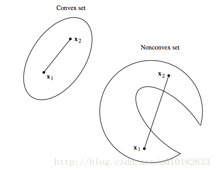
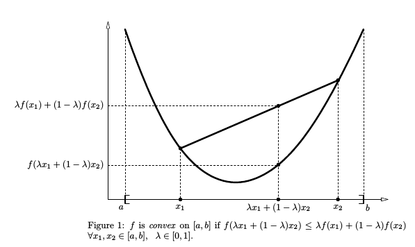
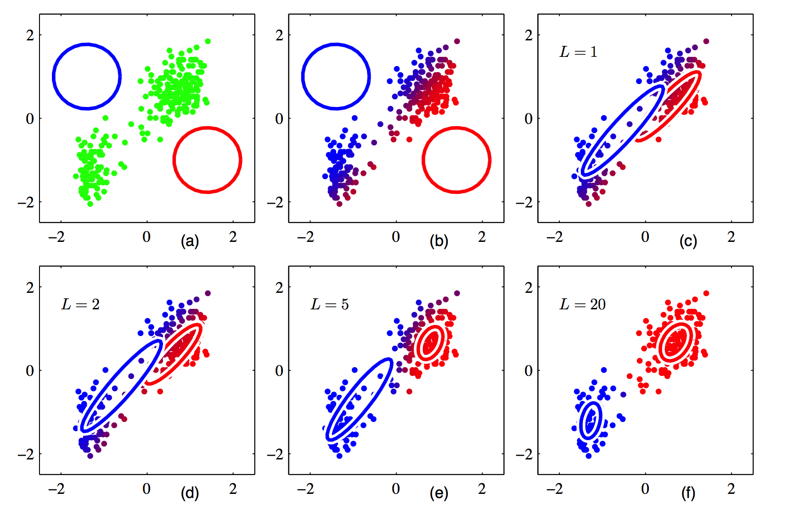
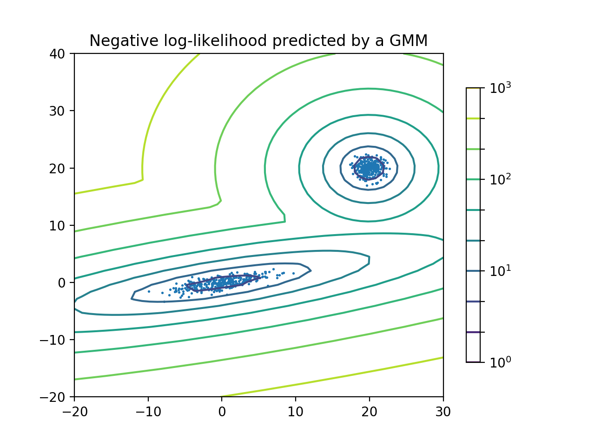
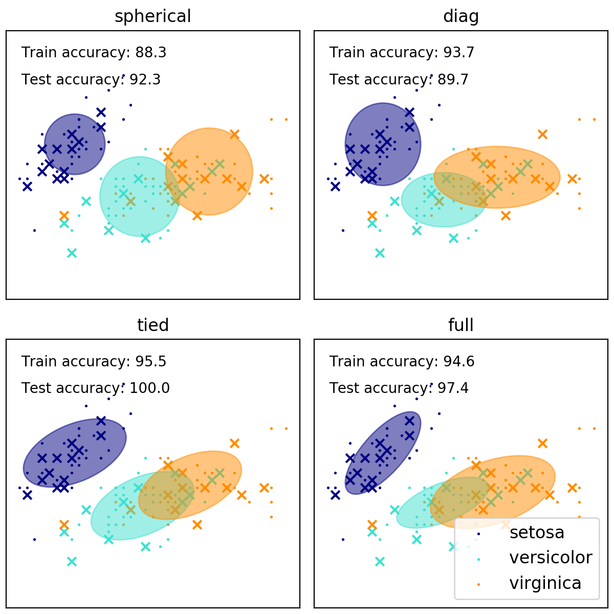

# EM

【[返回主仓](https://github.com/99cloud/lab-algorithm)】

## Catalog

- [说明](#说明)
- [EM算法介绍](#EM算法介绍)
	- [数学基础](#数学基础)
		- [凸函数](#凸函数)
		- [Jensen不等式](#Jensen不等式)
		- [极大似然估计](#极大似然估计)
	- [EM算法详解](#EM算法详解)
		- [EM算法原理](#EM算法原理)
		- [EM算法公式](#EM算法公式)
		- [EM算法流程](#EM算法流程)
- [GMM介绍](#GMM介绍)
	- [GMM原理解析](#GMM原理解析)
	  - [引入隐变量](#引入隐变量)
	  - [确定E步极大似然函数](#确定E步极大似然函数)
	  - [M步更新参数](#M步更新参数)
	- [GMM算法流程](#GMM算法流程)
	- [sklearn中的GMM](#sklearn中的GMM)
- [小结](#小结)

# 说明

 ## 文档

此为非监督学习中，EM 的说明文档

**主要使用的包**

```python
import numpy as np
import matplotlib as mpl
import matplotlib.pyplot as plt
from matplotlib.colors import LogNorm
from scipy.special import logsumexp

from sklearn import mixture
from sklearn import datasets
from sklearn.mixture import GaussianMixture
from sklearn.model_selection import StratifiedKFold
```

## 文件

| 文件                    | 说明                                            |
| ----------------------- | ----------------------------------------------- |
| amix1-est.dat           | 一个 2 维数组，300 条记录                       |
| main.py                 | gmm 主函数                                      |
| gmm.py                  | gmm 实现函数                                    |
| misc_utils.py           | 一些数学工具的实现代码 比如正态，累乘，log 等   |
| plot_gmm_pdf.py         | 两个高斯分布混合的密度估计 官方示例代码         |
| plot_gmm_covariances.py | 高斯混合模型的几种协方差类型的演示 官方示例代码 |

# EM算法介绍

## 数学基础

### 凸函数

通常在实际中，最小化的函数有几个极值，所以最优化算法得出的极值不确实是否为全局的极值，对于一些特殊的函数，凸函数与凹函数，任何局部极值也是全局极致，因此如果目标函数是凸的或凹的，那么优化算法就能保证是全局的。

**定义1** 集合 $R_c\subset E^n$ 是凸集，如果对每对点 $\mathbf{x_1},\mathbf{x_2}\in R_c$ ，每个实数 $\alpha,0<\alpha<1$，点 $\mathbf{x}\in R_c$ ，有
$$
\mathbf{x}=\alpha\mathbf{x_1}+(1-\alpha)\mathbf{x_2}
$$


**定义2** 我们称定义在凸集 $R_c$ 上的函数 $f(x)$ 为凸的，如果对每对 $\mathbf{x_1},\mathbf{x_2}\in R_c$ 与每个实数 $\alpha,0<\alpha<1$，则满足不等式
$$
f[\alpha\mathbf{x_1}+(1−\alpha)\mathbf{x_2}] \leq 
\alpha f(\mathbf{x_1})+(1−\alpha)f(\mathbf{x_2})
$$
如果 $\mathbf{x_1}\neq \mathbf{x_2}$，则 $f(x)$ 是严格凸的
$$
f[\alpha\mathbf{x_1}+(1−\alpha)\mathbf{x_2}] <
\alpha f(\mathbf{x_1})+(1−\alpha)f(\mathbf{x_2})
$$


### Jensen不等式

**定义1** 若 $f(x)$ 为区间 $X$ 上的凸函数，则 $\forall n\in\mathbb{N},n\geq1$ ， 若
$$
\forall i\in\mathbb{N},1\leq i\leq n,x_i\in X, \qquad
\lambda\in\mathbb{R},\sum\limits_{i=1}^n \lambda_i=1
$$
则
$$
f(\sum\limits_{i=1}^n \lambda_i x_i) \leq \sum\limits_{i=1}^n \lambda_i f(x_i)
$$
**推论1** 若 $f(x)$ 为区间 $R$ 上的凸函数，$g(x):R\rightarrow R$ 为一任意函数，$X$ 为一取值范围有限的离散变量，$E[f(g(X))]$ 与$E[g(X)]$ 都存在，则
$$
E[f(g(X))] \geq f(E[g(X)]) \tag{1}
$$

### 极大似然估计

极大似然估计方法（Maximum Likelihood Estimate，MLE）也称为最大概似估计或最大似然估计

一般说来，事件 $A$ 发生的概率与某一未知参数 $\theta$ 有关，$\theta$ 的取值不同，则事件 $A$ 发生的概率 $P(A|\theta)$ 也不同，当我们在一次试验中事件 $A$ 发生了，则认为此时的 $\theta$ 值应是 $\theta$ 的一切可能取值中使 $P(A|\theta)$ 达到最大的那一个，极大似然估计法就是要选取这样的 $\theta$ 值作为参数 $\theta$ 的估计值，使所选取的样本在被选的总体中出现的可能性为最大

**直观的例子**
设甲箱中有 99 个白球，1 个黑球；乙箱中有 1 个白球．99个黑球，现随机取出一箱，再从抽取的一箱中随机取出一球，结果是黑球，这一黑球从乙箱抽取的概率比从甲箱抽取的概率大得多，这时我们自然更多地相信这个黑球是取自乙箱的

## EM算法详解

概率模型有时既含有观测变量 (observable variable)，又含有隐变量或潜在变量（latent variable），如果仅有观测变量，那么给定数据就能用极大似然估计或贝叶斯估计来估计 model 参数；但是当模型含有隐变量时，需要一种含有隐变量的概率模型参数估计的极大似然方法估计—— EM 算法

### EM算法原理

EM算法称为期望极大值算法（expectation maximizition algorithm，EM），是一种启发式的迭代算法

EM算法的思路是使用启发式的迭代方法，既然我们无法直接求出模型分布参数，那么我们可以先猜想隐含数据（EM算法的E步），接着基于 **观察数据和猜测的隐含数据** 一起来极大化对数似然，求解我们的模型参数（EM算法的M步)

可以通过 K-Means 算法来简单理解 EM 算法的过程

**E步：**

在初始化 K 个中心点后，我们对所有的样本归到 K 个类别

**M步：**

在所有的样本归类后，重新求 K 个类别的中心点，相当于更新了均值

### EM算法公式

对于 $m$ 个样本观察数据 $x=(x^{(1)},x^{(2)},...x^{(m)})$ 中，找出样本的模型参数 $\theta$ ，极大化模型分布的对数似然函数如下，假设数据中有隐含变量 $z=(z^{(1)},z^{(2)},...z^{(m)})$
$$
L(\theta)=\sum\limits_{i=1}^m \log P(x^{(i)} \vert \theta)
$$
加入隐含变量公式变为如下，注意到下式中 $Q_i(z^{(i)})$ 是一个分布，因此 $\sum\limits_{z^{(i)}}Q_i(z^{(i)})\log P(x^{(i)},z^{(i)}\vert \theta)$ 可以理解为 $ \log P(x^{(i)},z^{(i)}\vert \theta)$ 基于条件概率分布的期望
$$
Q_i(z^{(i)})=P(z^{(i)}|x^{(i)},\theta)
$$

$$
L(θ)=\sum\limits_{i=1}^m \log
\sum\limits_{z^{(i)}}Q_i(z^{(i)}) P(x^{(i)},z^{(i)}\vert \theta) 
\qquad s.t.\sum\limits_{z^{(i)}}Q_i(z^{(i)})=1 \tag{2}
$$

根据 Jensen 不等式 $(1)$， $(2)$ 式变为 $(3)$
$$
\begin{align}
L(θ) &= \sum\limits_{i=1}^m \log
\sum\limits_{z^{(i)}}Q_i(z^{(i)}) P(x^{(i)},z^{(i)}\vert \theta)  \\
&\geq \sum\limits_{i=1}^m 
\sum\limits_{z^{(i)}}Q_i(z^{(i)})\log P(x^{(i)},z^{(i)}\vert \theta)
\qquad s.t.\sum\limits_{z^{(i)}}Q_i(z^{(i)})=1 \tag{3}
\end{align}
$$

### EM算法流程

**输入** 观察数据 $x=(x^{(1)},x^{(2)},...x^{(m)})$，联合分布 $p(x,z \vert \theta)$， 条件分布 $p(z\vert x,\theta)$， EM 算法退出的阈值 $\gamma$

1. 随机初始化模型参数 $\theta$ 的初值 $\theta_0$

2. **E 步** 计算联合分布的条件概率期望
	$$
	Q_i(z^{(i)})=P(z^{(i)}|x^{(i)},\theta^j) \tag{4}
	$$

	$$
	L(\theta,\theta^j) = \sum\limits_{i=1}^m 
	\sum\limits_{z^{(i)}}Q_i(z^{(i)})\log P(x^{(i)},z^{(i)}\vert \theta)
	$$

3. **M 步** 极大化 $L(\theta,\theta_j)$，得到 $\theta^{(j+1)}$ 
	$$
	\theta^{(j+1)}=\arg\max_\theta L(\theta,\theta_j)
	$$

4. 重复 2.3. 两步，直到极大似然估计 $L(\theta,\theta_j)$ 的变化小于 $\gamma$ 

# GMM介绍

GMM (Gaussian Mixture Model) 混合高斯模型在机器学习、计算机视觉等领域有着广泛的应用。其典型的应用有概率密度估计、背景建模、聚类等

高斯混合模型指的是多个高斯分布函数的线性组合，理论上 GMM 可以拟合出任意类型的分布，通常用于解决同一集合下的数据包含多个不同的分布的情况



## GMM原理解析

我们用高斯分布来一步一步的完成 EM 算法，设有随机变量 $X$，则混合高斯模型可以用下式表示
$$
\begin{align}
p(x\vert \pi,\mu,\Sigma) &=\sum\limits_{k=1}^K \pi_k \mathcal{N(x\vert\mu_k,\Sigma_k)} \\
\sum\limits_{k=1}^K \pi_k &=1, \qquad 0<\pi_k<1
\end{align}
$$
其中 $\mathcal{N}(x\vert \mu_k,\sigma_k)$ 称为混合模型中的第 $k$ 个分量（component），可以看到 $\pi_k$ 相当于每个分量 $\mathcal{N}(x\vert \mu_k,\sigma_k)$ 的权重

### 引入隐变量

我们引入一个隐变量 $z_{ik}$，$z_{ik}$ 的含义是样本 $x_i$ 来自第 $k$ 个模型的数据分布
$$
z_{ik}=
\begin{cases}
1, & if\ data\ item\ i\ comes\ from\ component\ k \\
0, & otherwises
\end{cases}
$$
则有
$$
P(x,z \vert \mu_k,\Sigma_k)=
\prod\limits_{k=1}^K\prod\limits_{i=1}^N 
[\pi_k \mathcal{N}(x\vert \mu_k,\Sigma_k)]^{z_{ik}}
=\prod\limits_{k=1}^K \pi_k^{n_k} \prod\limits_{i=1}^N 
[\mathcal{N} (x\vert \mu_k,\Sigma_k)]^{z_{ik}}   \tag{5}
$$
其中
$$
n_k=\sum\limits_{i=1}^N z_{ik},\quad \sum\limits_{k=1}^Kn_k=N
$$
再对 $(5)$ 进一步化简得到
$$
P(x,z \vert \mu_k,\Sigma_k)=
\prod\limits_{k=1}^K \pi_k^{n_k} \prod\limits_{i=1}^N 
[\frac{1}{\sqrt{2\pi}\Sigma_k}\exp(-\frac{(x_i-\mu_k)^2}{2\Sigma_k})]^{z_{ik}}
$$
取对数 $\log$ 后
$$
\log P(x,z \vert \mu_k,\Sigma_k)=
\sum\limits_{k=1}^K n_k\log\pi_k + \sum\limits_{i=1}^N z_{ik}
[\log(\frac{1}{\sqrt{2\pi}})-\log\Sigma_k-\frac{(x_i-\mu_k)^2}{2\Sigma_k}]
$$

### 确定E步极大似然函数

计算最大似然估计 $L(\theta,\theta^{(j)})$ ，$j$ 是第 $j$ 次 EM 的过程，下式子中的 EQ 是 $(4)$ 中 $Q$ 函数的期望值
$$
L(\theta,\theta^{(j)})=EQ[logP(x,z\vert\mu_k,\Sigma_k)]
$$

$$
L(\theta,\theta^{(j)})=E_Q\left[
\sum\limits_{k=1}^K n_k\log\pi_k + \sum\limits_{i=1}^N z_{ik}
[\frac D2\log(2\pi)-\log\Sigma_k-\frac{(x_i-\mu_k)^2}{2\Sigma_k}]
\right]
$$

$$
L(\theta,\theta^{(j)})=\sum\limits_{k=1}^K \left[
\sum\limits_{i=1}^N (E_Q(z_{ik})) \log\pi_k + \sum\limits_{i=1}^N E_Q(z_{ik})
[\frac D2\log(2\pi)-\log\Sigma_k-\frac{(x_i-\mu_k)^2}{2\Sigma_k}]
\right]
$$

我们记 $\gamma_{ik}=E_Q(z_{ik})$，$n_k=\sum\limits_{i=1}^N \gamma_{ik}$ 可以算出
$$
L(\theta,\theta^{(j)})=\sum\limits_{k=1}^K n_k 
\left[\log\pi_k + [\frac D2\log(2\pi)-\log\Sigma_k-\frac{(x_i-\mu_k)^2}{2\Sigma_k}]
\right]
$$
因为 $\frac D2 \log(2π)$ 是常数，忽略不计
$$
L(\theta,\theta^{(j)})=\sum\limits_{k=1}^K n_k 
\left[\log\pi_k -\log\Sigma_k-\frac{(x_i-\mu_k)^2}{2\Sigma_k}
\right]
$$

$$
\gamma_{ik}=\frac{\pi_k\mathcal{N}(x\vert\mu_k,\Sigma_k)}
{\sum\limits_{k=1}^K \pi_k\mathcal{N}(x\vert\mu_k,\Sigma_k)}
$$

### M步更新参数

M 步的过程是最化大 $L(\theta,\theta^j)$，求出 $\theta^{(j+1)}$ 
$$
\theta^{j+1}=\arg\max_\theta L(\theta,\theta^j)
$$
因为有
$$
n_k=\sum\limits_{i=1}^N \gamma_{ik}
$$
通过 $L(\theta,\theta^j)$ 对 $\mu_k$，$\Sigma_k$ 求偏倒等于 $0$ 得到
$$
\begin{align}
\mu_k &= \frac1{n_k}\sum_{i=1}^N \gamma_{ik}x_i \\
\Sigma_k &=\frac1{n_k}\sum_{i=1}^N \gamma_{ik} (x_i - \mu_k)^2 \\
\pi_k &=\frac{n_k}{N}
\end{align}
$$

## GMM算法流程

**输入** 观测数据 $x_1,x_2,\cdots,x_N$ 

- 对输入数据进行归一化处理

	```python
	#数据预处理
	def scale_data(self):
	    for d in range(self.D):
	        max_ = self.X[:, d].max()
	        min_ = self.X[:, d].min()
	        self.X[:, d] = (self.X[:, d] - min_) / (max_ - min_)
	    self.xj_mean = np.mean(self.X, axis=0)
	    self.xj_s = np.sqrt(np.var(self.X, axis=0))
	```

**输出** GMM 的参数

1. 初始化参数

2. **E步** 根据当前模型，计算模型 $k$ 对 $x_i$ 的影响
	$$
	\gamma_{ik}=\frac{\pi_k\mathcal{N}(x\vert\mu_k,\Sigma_k)}
	{\sum\limits_{k=1}^K \pi_k\mathcal{N}(x\vert\mu_k,\Sigma_k)}
	$$

	```python
	#E步，估计gamma
	def e_step(self, data):
	    gamma_log_prob = np.mat(np.zeros((self.N, self.K)))
	    for k in range(self.K):
	        gamma_log_prob[:, k] = log_weight_prob(data, self.alpha[k], self.mu[k], self.cov[k])
	    log_prob_norm = logsumexp(gamma_log_prob, axis=1)
	    log_gamma = gamma_log_prob - log_prob_norm[:, np.newaxis]
	    return log_prob_norm, np.exp(log_gamma)
	```

3. **M步**：计算 $\mu_{k+1},\Sigma_{k+1}^2,\pi_{k+1}$ 
	$$
	\begin{align}
	n_k &=\sum\limits_{i=1}^N \gamma_{ik} \\
	\mu_k &= \frac1{n_k}\sum_{i=1}^N \gamma_{ik}x_i \\
	\Sigma_k &=\frac1{n_k}\sum_{i=1}^N \gamma_{ik} (x_i - \mu_k)^2 \\
	\pi_k &=\frac{n_k}{N}
	\end{align}
	$$

	```python
	#M步，最大化loglikelihood
	def m_step(self):
	    newmu = np.zeros([self.K, self.D])
	    newcov = []
	    newalpha = np.zeros(self.K)
	    for k in range(self.K):
	        Nk = np.sum(self.gamma[:, k])
	        newmu[k, :] = np.dot(self.gamma[:, k].T, self.X) / Nk
	        cov_k = self.compute_cov(k, Nk)
	        newcov.append(cov_k)
	        newalpha[k] = Nk / self.N
	    newcov = np.array(newcov)
	    return newmu, newcov, newalpha
	```

4. 重复 2.3. 两步直到收敛

最后加上 log likelihood 的计算方法，基本的计算方法按照公式定义
$$
L(θ)=\sum\limits_{i=1}^m \log
\sum\limits_{z^{(i)}}Q_i(z^{(i)}) P(x^{(i)},z^{(i)}\vert \theta) 
\qquad s.t.\sum\limits_{z^{(i)}}Q_i(z^{(i)})=1
$$

```python
def loglikelihood(self):
    P = np.zeros([self.N, self.K])
    for k in range(self.K):
        P[:,k] = prob(self.X, self.mu[k], self.cov[k])

    return np.sum(np.log(P.dot(self.alpha)))
```

## sklearn中的GMM

**二分量高斯混合模型** 数据点，以及模型的等概率线



高斯混合模型是一个假设所有的数据点都是生成于有限个带有未知参数的高斯分布所混合的概率模型，我们可以将这种混合模型看作是 k-means 聚类算法的一种扩展使用，它包含了数据的协方差结构以及隐高斯模型的中心信息

对应不同的估算策略，Scikit-learn 实现了不同的类来估算高斯混合模型

[`GaussianMixture`](https://scikit-learn.org/stable/modules/generated/sklearn.mixture.GaussianMixture.html#sklearn.mixture.GaussianMixture) 对象实现了用来拟合高斯混合模型的 EM 算法，它还可以为多变量模型绘制置信椭圆体，同时计算 BIC（Bayesian Information Criterion，贝叶斯信息准则）来评估数据中聚类的数量，而其中的[`GaussianMixture.fit`](https://scikit-learn.org/stable/modules/generated/sklearn.mixture.GaussianMixture.html#sklearn.mixture.GaussianMixture.fit) 方法可以从训练数据中拟合出一个高斯混合模型

如果给定测试数据，通过使用 [`GaussianMixture.predict`](https://scikit-learn.org/stable/modules/generated/sklearn.mixture.GaussianMixture.html#sklearn.mixture.GaussianMixture.predict) 方法，可以为每个样本分配最适合的高斯分布模型

[`GaussianMixture`](https://scikit-learn.org/stable/modules/generated/sklearn.mixture.GaussianMixture.html#sklearn.mixture.GaussianMixture) 方法中自带了不同的选项来约束不同估类的协方差：spherical，diagonal，tied 或 full 协方差



# 小结

如果从算法思想的角度来思考 EM 算法，我们可以发现算法里已知的是观察数据，未知的是隐含数据和模型参数，在 E 步，我们所做的事情是固定模型参数的值，优化隐含数据的分布，而在 M 步，我们所做的事情是固定隐含数据分布，优化模型参数的值

EM 算法有很多实现方式，其中比较流行的一种实现方式是高斯混合模型（Gaussian Mixed Model）

**高斯混合优缺点**

- **优点**
	- **速度** 是混合模型学习算法中最快的算法
	- **无偏差性** 这个算法仅仅只是最大化可能性，并不会使均值偏向于 $0$ ，或是使聚类大小偏向于可能适用或者可能不适用的特殊结构

-  **缺点**
	-  **奇异性** 当每个混合模型没有足够多的点时，会很难去估算对应的协方差矩阵，同时该算法会发散并且去寻找具有无穷大似然函数值的解，除非人为地正则化相应的协方差
	-  **分量的数量** 这个算法总是会使用它所能用的全部分量，所以在缺失外部线索的情况下，需要留存数据或者信息理论标准来决定用多少个分量


【[返回顶部](#EM)】

【[返回主仓](https://github.com/99cloud/lab-algorithm)】