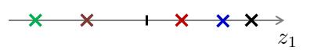

# PCA

【[返回主仓](https://github.com/99cloud/lab-algorithm)】

## Catalog

- [说明](#说明)
- [主成分分析介绍](#主成分分析介绍)
	- [数据降维](#数据降维)
	- [主成分分析（PCA）](#主成分分析（PCA）)
	- [PCA算法思路与要点](#PCA算法思路与要点)
		- [PCA算法思路](#PCA算法思路)
		- [PCA算法要点](#PCA算法要点)
	- [PCA算法过程](#PCA算法过程)
	- [PCA在Sklearn中的示例](#PCA在Sklearn中的示例)
	  - [准确的PCA和概率解释](#准确的PCA和概率解释)
	  - [增量PCA](#增量PCA)
	  - [核PCA](#核PCA)
- [小结](#小结)

# 说明

 ## 文档

此为非监督学习中，PCA 的说明文档

**主要使用的包**

```python
import numpy as np
import matplotlib.pyplot as plt
from scipy import linalg

from sklearn.datasets import load_iris
from sklearn.datasets import make_circles
from sklearn.decomposition import PCA, IncrementalPCA, FactorAnalysis, KernelPCA
from sklearn.discriminant_analysis import LinearDiscriminantAnalysis
from sklearn.covariance import ShrunkCovariance, LedoitWolf
from sklearn.model_selection import cross_val_score
from sklearn.model_selection import GridSearchCV
```

## 文件

| 文件                              | 说明                                                         |
| --------------------------------- | ------------------------------------------------------------ |
| testSet.txt                       | 一个 2 维数组，1000 条记录                                   |
| secom.data                        | 半导体制造数据，[1567,  590]                                 |
| PCA.ipynb                         | jupyter 文档，PCA 展示，降维后各主成分方差的占比             |
| PCA.py                            | PCA 主要算法的代码                                           |
| plot_pca_vs_lda.py                | PCA 与 LDA（线性判别分析） 算法的比较 官方示例代码           |
| plot_pca_vs_fa_model_selection.py | PCA 与 FA（因子分析） 在同/异方差下 选择模型的比较 官方示例代码 |
| plot_incremental_pca.py           | 增量 PCA 与 PCA 在 IRIS 数据集上的差异 官方示例代码          |
| plot_kernel_pca.py                | 核 PCA                                                       |

# 主成分分析介绍

## 数据降维

在实际生产生活中，我们所获得的数据集在特征上往往具有很高的维度，对高维度的数据进行处理时消耗的时间很大，并且过多的特征变量也会妨碍查找规律的建立，**如何在最大程度上保留数据集的信息量的前提下进行数据维度的降低**，是我们需要解决的问题

对数据进行降维有以下**优点**

- 使得数据集更易使用
- 降低很多算法的计算开销
- 去除噪声
- 使得结果易懂

降维技术作为数据预处理的一部分，即可使用在监督学习中也能够使用在非监督学习中，而降维技术主要有以下几种：**主成分分析(Principal Component Analysis，PCA)**、**因子分析(Factor Analysis)**，以及**独立成分分析(Independent Component Analysis, ICA)** ，其中 **主成分分析PCA** 应用最为广泛

## 主成分分析（PCA）

我们利用一个例子来理解 PCA 如何进行降维的

参考下图，对于样本数据 $D={x(1),x(2),\cdots,x(m)} $，其中 $x^{(i)}=[x_1^{(i)},x_2^{(i)}]^\mathrm{T}$ 


我们需要将上图的样本数据由 **二维** 降至 **一维** ，如下图


一般来说，这些样本点在坐标图中任意一条向量上都可以投影成一维的，但如何选择 **最佳投影向量**，需要 **在最大程度上保留数据集的信息量的前提下进行数据维度的降低**，因此我们需要有 **优化目标** 来对图中的向量进行选择

而 PCA 的 **优化目标** 就是

- 对于 $2$ 维降到 $1$ 维，找到一个投影方向，使得 **投影误差和最小**
- 对于 $n$ 维降到 $k$ 维，找到 $k$ 个向量定义的 $k$ 维投影平面，使得 **投影误差和最小** 

其中，**投影误差** 即为，每一个样本点到投影向量或者投影平面的距离，而 **投影误差和**  即为所有样本点到投影向量或投影平面的距离的和

下面两幅图展示了两种不同投影向量


我们能够和清楚地看到，对于第一种向量的 **投影误差和** 一定比第二种的 **投影误差和** 要小

对应以上两幅图的投影结果



假设对于原样本中，位于第一象限的三个样本点属于类别 "A" ，位于第三象限的两个样本点属于类别 "B"，经过投影后，我们可以看出，对于第一种降维，在降维后仍旧保持了位于原点右侧的三个样本属于类别 "A"，位于原点左侧的两个样本属于类别 "B"，而对于第二种投影，明显可以看出，已经不能够分辨出样本的类别了，换句话说，第二种投影方式丢失了一些信息

因此，"投影误差和最小" 便成为我们所需要优化的目标

**寻找到方差最大的方向即可**，方差最大与投影误差最小这两个优化目标其实本质上是一样的，具体可参考周志华著《机器学习》一书，书中证明了**最大可分性（误差最大）**与**最近重构性（投影和最小）**两种优化等价

## PCA算法思路与要点

### PCA算法思路

**PCA** 的 **算法思路** 主要是：数据从原来的坐标系转换到新的坐标系，由数据本身决定，转换坐标系时，以方差最大的方向作为坐标轴方向，因为数据的最大方差给出了数据的最重要的信息，第一个新坐标轴选择的是原始数据中方差最大的方向，第二个新坐标轴选择的是与第一个新坐标轴正交且方差次大的方向，重复该过程，重复次数为原始数据的特征维数

通过这种方式获得的新的坐标系，我们发现，大部分方差都包含在前面几个坐标轴中，后面的坐标轴所含的方差几乎为 $0$，于是，我们可以忽略余下的坐标轴，只保留前面的几个含有绝大部分方差的坐标轴，事实上，这样也就相当于只保留包含绝大部分方差的维度特征，而忽略包含方差几乎为 $0$ 的特征维度，也就实现了对数据特征的降维处理

###PCA算法要点 

根据以上 PCA 算法思路的描述，我们大概可以看出，对于 PCA 算法，其要点主要是**如何找到方差最大的方向**

这里将提到有关线性代数里的一些内容

- 协方差矩阵

	- 特征 $X_i$ 与特征 $X_j$ 的 **协方差（Covariance）**
		$$
		Cov(X_i,X_j)=\frac{\sum\limits_{k=1}^{n}\left( X_i^{(k)} - \overline{X_i} \right)
		\left( X_j^{(k)} - \overline{X_j} \right)}{n-1}
		$$
		

		其中 $X_i^{(k)}$，$X_i^{(k)}$ 表示特征 $X_i$ ，$X_j$ 的第 $k$ 个样本中的取值，而 $\overline{X_i}$ ， $\overline{X_j}$ 则是表示两个特征的样本均值

		可以看出，**当 $X_i=X_j$ 时，协方差即为方差**

	- 对于一个只有两个特征的样本来说，其 **协方差矩阵** 为
		$$
		C=\left[
		\begin{matrix}
		Cov(X_1,X_1) & Cov(X_1,X_2) \\
		Cov(X_2,X_1) & Cov(X_2,X_2)
		\end{matrix}
		\right]
		$$
		当特征数为 $n$ 时，协方差矩阵为 $n\times n$ 维的矩阵，且对角线为各特征的方差值

- 特征向量与特征值

	对于矩阵 $A$ ，若满足 $A\zeta=\lambda\zeta$ ，则称 $\zeta$ 是矩阵 $A$ 的 **特征向量** ，而 $\lambda$ 则是矩阵 $A$ 的 **特征值**，将特征值按照**从大到小** 的顺序进行排序，选择前 $k$ 个特征值所对应的 **特征向量** 即为所求投影向量

	对于特征值与特征向量的求解，主要是：特征值分解（当 $A$ 为方阵时），奇异值 SVD 分解（当 $A$ 不为方阵时）

## PCA算法过程

**输入** 训练样本集 $D=x(1),x(2),\cdots,x(m)$，低维空间维数 $d′$

**过程**

- 对所有样本进行中心化（去均值操作） $x_j^{(i)}←x_j^{(i)}−\frac1m\sum\limits_{i=1}^mx_j^{(i)}$
- 计算样本的协方差矩阵 $XX^\mathrm{T}$ 
- 对协方差矩阵 $XX^\mathrm{T}$ 做特征值分解 
- 取最大的 $d′$ 个特征值所对应的特征向量 $w_1,w_2,\cdots,w_{d′}$
- 将原样本矩阵与投影矩阵相乘： $X\cdot W$ 即为降维后数据集 $X′$，其中 $X$ 为 $m\times n$ 维， $W=[w_1,w_2,\cdots,w_{d′}]$ 为 $n\times d′$ 维

**输出** 降维后的数据集 $X'$

## PCA在Sklearn中的示例

### 准确的PCA和概率解释

在 scikit-learn 中， [`PCA`](https://scikit-learn.org/stable/modules/generated/sklearn.decomposition.PCA.html#sklearn.decomposition.PCA) 被实现为一个变换器对象， 通过 `fit` 方法可以拟合出 $n$ 个成分， 并且可以将新的数据投影（project 亦可理解为分解）到这些成分中

在应用 SVD（奇异值分解)）之前，PCA 是在为每个特征聚集而不是缩放输入数据，可选参数 `whiten=True` 使得可以将数据投影到奇异（singular）空间上，同时将每个成分缩放到单位方差，如果下游模型对信号的各向同性作出强假设，这通常是有用的，例如，使用 RBF 内核的 SVM 算法和 K-Means 聚类算法

以下是 iris 数据集的一个示例，该数据集包含 $4$ 个特征，通过 PCA 降维后投影到方差最大的二维空间上


```python
explained variance ratio (first two components): [0.92461872 0.05306648]
```

[`PCA`](https://scikit-learn.org/stable/modules/generated/sklearn.decomposition.PCA.html#sklearn.decomposition.PCA) 对象还提供了 PCA 算法的概率解释，其可以基于可解释的方差量给出数据的可能性，PCA 对象实现了在交叉验证（cross-validation）中使用 score 方法


### 增量PCA

[`PCA`](https://scikit-learn.org/stable/modules/generated/sklearn.decomposition.PCA.html#sklearn.decomposition.PCA) 对象非常有用，但针对大型数据集的应用，仍然具有一定的限制，最大的限制是 [`PCA`](https://scikit-learn.org/stable/modules/generated/sklearn.decomposition.PCA.html#sklearn.decomposition.PCA) 仅支持批处理，这意味着所有要处理的数据必须放在主内存， [`IncrementalPCA`](https://scikit-learn.org/stable/modules/generated/sklearn.decomposition.IncrementalPCA.html#sklearn.decomposition.IncrementalPCA) 对象使用不同的处理形式，即允许部分计算以小型批处理方式处理数据的方法进行，而得到和 [`PCA`](https://scikit-learn.org/stable/modules/generated/sklearn.decomposition.PCA.html#sklearn.decomposition.PCA) 算法差不多的结果， [`IncrementalPCA`](https://scikit-learn.org/stable/modules/generated/sklearn.decomposition.IncrementalPCA.html#sklearn.decomposition.IncrementalPCA) 可以通过以下方式实现核外（out-of-core）主成分分析

- 基于从本地硬盘或网络数据库中连续获取的数据块之上，使用 `partial_fit` 方法
- 在 memory mapped file (通过 `numpy.memmap` 创建)上使用 fit 方法

[`IncrementalPCA`](https://scikit-learn.org/stable/modules/generated/sklearn.decomposition.IncrementalPCA.html#sklearn.decomposition.IncrementalPCA) 类为了增量式的更新 explained*variance_ratio* ，仅需要存储估计出的分量和噪声方差，这就是为什么内存使用量依赖于每个批次的样本数量，而不是数据集中需要处理的样本总量

在应用SVD之前，[`IncrementalPCA`](https://scikit-learn.org/stable/modules/generated/sklearn.decomposition.IncrementalPCA.html#sklearn.decomposition.IncrementalPCA)就像[`PCA`](https://scikit-learn.org/stable/modules/generated/sklearn.decomposition.PCA.html#sklearn.decomposition.PCA)一样，为每个特征聚集而不是缩放输入数据


### 核PCA

[`KernelPCA`](https://scikit-learn.org/stable/modules/generated/sklearn.decomposition.KernelPCA.html#sklearn.decomposition.KernelPCA) 是 PCA 的扩展，通过使用核方法实现非线性降维（dimensionality reduction），它具有许多应用，包括去噪，压缩和结构化预测（ structured prediction ）（kernel dependency estimation（内核依赖估计））， [`KernelPCA`](https://scikit-learn.org/stable/modules/generated/sklearn.decomposition.KernelPCA.html#sklearn.decomposition.KernelPCA) 支持 `transform` 和 `inverse_transform` 


# 小结

- **优点**

	使得数据更易使用，并且可以去除数据中的噪声，使得其他机器学习任务更加精确，该算法往往作为预处理步骤，在数据应用到其他算法之前清洗数据

- **缺点**

	数据维度降低并不代表特征的减少，因为降维仍旧保留了较大的信息量，对结果过拟合问题并没有帮助，不能将降维算法当做解决过拟合问题方法，如果原始数据特征维度并不是很大，也并不需要进行降维


【[返回顶部](#PCA)】

【[返回主仓](https://github.com/99cloud/lab-algorithm)】