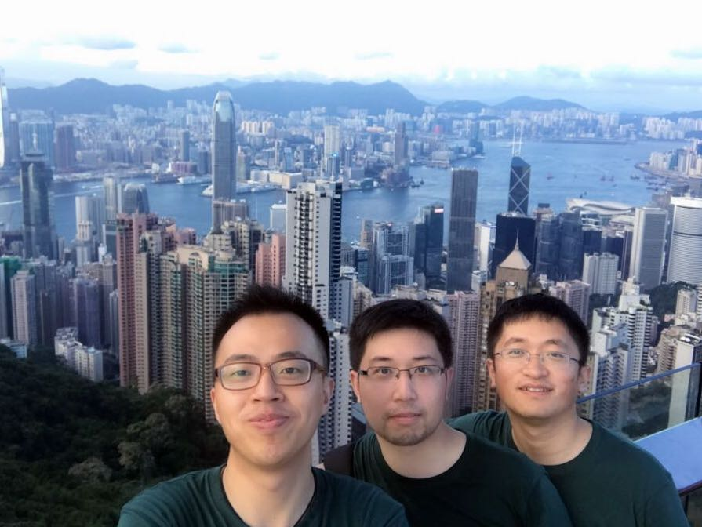
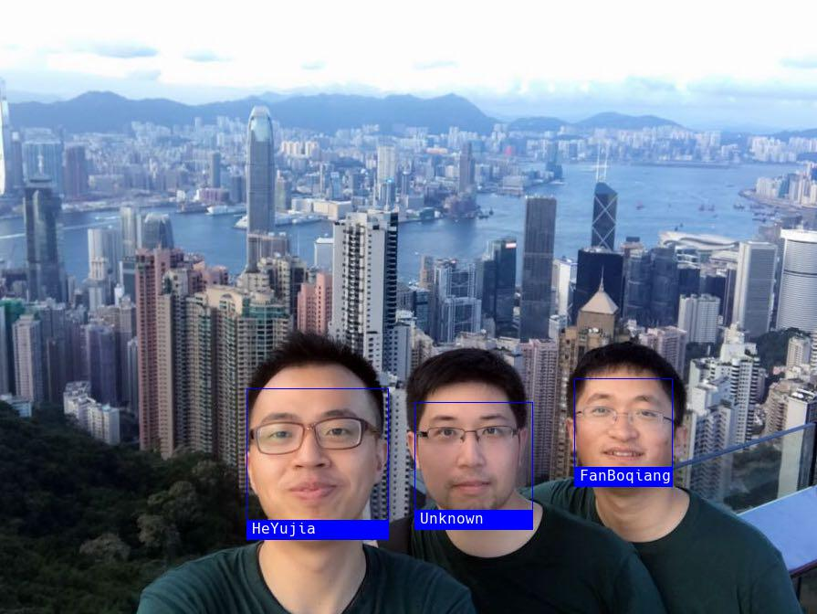
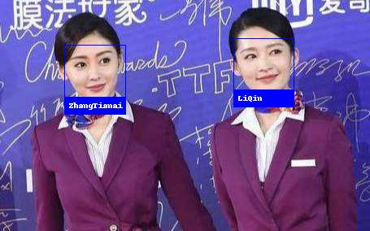
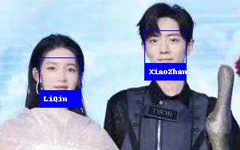
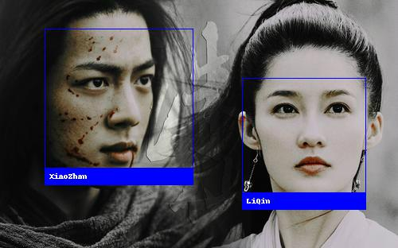

# Face Recognition

##  Catalog
- [Introduction](#introduction)
- [Installation](#installation)
    - [Requirements](#requirements)
    - [Installation Options (Eg. on Mac)](#installation-options-eg-on-mac)
- [Usage](#usage)
    - [Face Locations](#face-locations)
        - [Nomal Face Recognition](#nomal-face-recognition)
        - [Face Recognition Using CNN](#face-recognition-using-cnn)
    - [Face landmarks](#face-landmarks)
    - [Recognize and Identify](#recognize-and-identify)
        - [Face Identify](#face-identify)
        - [Identify with Name](#identify-with-name)
        - [Compare by Numeric Face Distance](#compare-by-numeric-face-distance)
        - [Recognize Faces with Machine Learning](#recognize-faces-with-machine-learning)
            - [Train with KNN](#train-with-knn)
            - [Test](#test)
            - [Output](#output)
            - [With SVM](#with-svm)
            - [Eg on Kaggle](#eg-on-kaggle)
        - [Face Recognition from Webcam](#face-recognition-from-webcam)

##  Introduction

谷歌开源项目 [face_recognition](https://github.com/ageitgey/face_recognition) 是一个强大、简单、易上手的人脸识别开源项目，并且配备了完整的开发文档和应用案例

本项目的人脸识别是基于业内领先的 C++ 开源库 [dlib](http://dlib.net/) 中的深度学习模型，用 [Labeled Faces in the Wild](http://vis-www.cs.umass.edu/lfw/) 人脸数据集进行测试，有高达 99.38% 的准确率，但对小孩和亚洲人脸的识别准确率尚待提升，而本说明会增加一些亚洲人脸的示例，来测试实际效果

> [Labeled Faces in the Wild](http://vis-www.cs.umass.edu/lfw/) 是美国麻省大学安姆斯特分校（University of Massachusetts Amherst) 制作的人脸数据集，该数据集包含了从网络收集的13,000多张面部图像

仅仅需要简易的 `face_recognition` 命令行工具，就可以用来处理整个文件夹里的图片

##  Installation

###  Requirements

- Python 3.3+ or Python 2.7
- macOS or Linux
- Windows not officially supported, but might work

###  Installation Options (Eg. on Mac)

首先，安装 **dlib** 和相关 Python 依赖

- Pre-reqs

	- Install XCode from the Mac App Store (or install the XCode command line utils)
	- Have [homebrew](https://brew.sh/) installed

- These instructions assume you don't have an nVidia GPU and don't have Cuda and cuDNN installed and don't want GPU acceleration (since none of the current Mac models support this)

- Clone the code from github

	```shell
	git clone https://github.com/davisking/dlib.git
	```

- Build the main dlib library (optional if you just want to use Python)

	```shell
	cd dlib
	mkdir build; cd build; cmake ..; cmake --build .
	```

- Build and install the Python extensions

	```shell
	cd ..
	python3 setup.py install
	```

- At this point, you should be able to run `python3` and type `import dlib` successfully

接着，通过 **pypi** 来安装

```python
pip3 install face_recognition
```

当然，最优的安装思路是修改 pip 镜像源为清华镜像，然后使用 `pip install face_recognition` ，这样可以自动安装各种依赖，包括dlib，只是在安装 dlib 的时候可能会出问题，因为 dlib 需要编译，出现的问题一般是 `gcc` 或者 `g++` 版本的问题，所以在 `pip install face_recognition` 之前，可以通过在命令行键入

```shell
export CC=/usr/local/bin/gcc		      # 根据实际位置而定, 比如也有可能是 CC=/usr/bin/gcc		      
export CXX=/usr/local/bin/g++  
```

来指定你 gcc 和 g++ 对应的位置，（这两句话会临时修改当前终端的环境变量对应你自己 gcc 或者 g++ 所在目录）

##  Usage

在 Python 中，你可以导入 `face_recognition` 模块，用几行代码就可以轻松操作各种人脸识别功能

**Package Docs**: [https://face-recognition.readthedocs.io](https://face-recognition.readthedocs.io/en/latest/face_recognition.html)

###  Face Locations

可以从图片中识别面部所在区域，返回 [(top, right, bottom, left), ...] 等信息

####  Nomal Face Recognition

```python
import face_recognition

image = face_recognition.load_image_file("picture_name.jpg")
face_locations = face_recognition.face_locations(image)

# face_locations is now an array listing the co-ordinates of each face!
```

**Input**


**Output**

```python
I found 3 face(s) in this photograph.
A face is located at pixel location Top: 116, Left: 76, Bottom: 206, Right: 165
A face is located at pixel location Top: 196, Left: 295, Bottom: 271, Right: 370
A face is located at pixel location Top: 186, Left: 494, Bottom: 275, Right: 583
```

|                  1st face                   |                  2nd face                   |                  3rd face                   |
| :-----------------------------------------: | :-----------------------------------------: | :-----------------------------------------: |
|  |  |  |

该示例中，我们发现识别出的 3 张人脸较为精确，但实际上原图有 4 张人脸，右上角处的略有遮挡的人脸并未被识别出来，而在 [Aliyun API](https://github.com/FDUJiaG/lab-algorithm/tree/master/Aliyun) 中，该示例的四张人脸均可以被识别出

【[**示例**](https://github.com/99cloud/lab-algorithm/blob/master/On-Premise_AI/FaceRecognition/examples/find_faces_in_picture.py)】

####  Face Recognition Using CNN

于是我们需要使用深度学习模型达到更加精准的人脸定位（执行时间会有所增加）

注意：这种方法需要 GPU 加速（通过英伟达显卡的 CUDA 库驱动），你在编译安装 `dlib` 的时候也需要开启 CUDA 支持

```python
import face_recognition

image = face_recognition.load_image_file("picture_name.jpg")
face_locations = face_recognition.face_locations(image, model="cnn")

# face_locations is now an array listing the co-ordinates of each face!
```

**Input**


**Output**

```python
I found 4 face(s) in this photograph.
A face is located at pixel location Top: 188, Left: 500, Bottom: 267, Right: 579
A face is located at pixel location Top: 180, Left: 292, Bottom: 259, Right: 371
A face is located at pixel location Top: 108, Left: 84, Bottom: 187, Right: 163
A face is located at pixel location Top: 92, Left: 412, Bottom: 171, Right: 491
```

|                    1st face                     |                    2nd face                     |                    3rd face                     |                    4th face                     |
| :---------------------------------------------: | :---------------------------------------------: | :---------------------------------------------: | :---------------------------------------------: |
|  |  |  |  |

当使用 CNN 模型后，我们发现 input 中所有的人脸都被准确无误地识别出来了，返回的顺序会和常规方法略有不同，并且对于同一张脸，返回的大小和区域也会有所差异

【[**示例**](https://github.com/99cloud/lab-algorithm/blob/master/On-Premise_AI/FaceRecognition/examples/find_faces_in_picture_cnn.py)】

###  Face landmarks

可以从图片中识别面部的关键点，包括：

- 下巴轮廓
- 左、右眉毛
- 鼻梁、鼻尖
- 左、右眼睛
- 上、下嘴唇

|                    Input                     |                         Output                          |
| :------------------------------------------: | :-----------------------------------------------------: |
|  |  |

部分面部关键点信息如下

```python
I found 2 face(s) in this photograph.
The chin in this face has the following points: [(496, 238), ...]
The left_eyebrow in this face has the following points: [(503, 226), ...]
The right_eyebrow in this face has the following points: [(550, 219), ...]
The nose_bridge in this face has the following points: [(544, 229), ...]
The nose_tip in this face has the following points: [(535, 269), ...]
The left_eye in this face has the following points: [(514, 233), ...]
The right_eye in this face has the following points: [(563, 230), ...]
The top_lip in this face has the following points: [(528, 288), ...]
The bottom_lip in this face has the following points: [(575, 286), ...]
...
```

【[**示例**](https://github.com/99cloud/lab-algorithm/blob/master/On-Premise_AI/FaceRecognition/examples/find_facial_features_in_picture.py)】

###  Recognize and Identify

####  Face Identify

```python
import face_recognition

picture_of_me = face_recognition.load_image_file("me.jpg")
my_face_encoding = face_recognition.face_encodings(picture_of_me)[0]

# my_face_encoding now contains a universal 'encoding' of my facial features that can be compared to any other picture of a face!

unknown_picture = face_recognition.load_image_file("unknown.jpg")
unknown_face_encoding = face_recognition.face_encodings(unknown_picture)[0]

# Now we can see the two face encodings are of the same person with `compare_faces`!

results = face_recognition.compare_faces([my_face_encoding], unknown_face_encoding)

if results[0] == True:
    print("It's a picture of me!")
else:
    print("It's not a picture of me!")
```

在找到面部所在区域后，还需要进行人脸的比对，需要用到 `compare_faces` 函数，并且可以将未知的人脸编码和已知人脸编码的 list 进行比对，并在通过与 tolerance 的比较后，返回是否是已知人脸中之一或者在已知人脸中是否出现

在以下这个例子中，在  [Aliyun API](https://github.com/FDUJiaG/lab-algorithm/tree/master/Aliyun) 中 1e-3 的置信度下，依旧会认为两位女明星来自同一张面孔

**Input**

|                 LiQin                  |                 SunYi                  |                 Unknown                  |
| :------------------------------------: | :------------------------------------: | :--------------------------------------: |
|  |  |  |

**Output**

```
Is the unknown face a picture of LiQin? True
Is the unknown face a picture of SunYi? False
Is the unknown face a new person that we've never seen before? False
```

 通过对 tolerance 的设置，还是可以正确的将 Unknown 的人脸图片进行正确的识别

【[**示例**](https://github.com/99cloud/lab-algorithm/blob/master/On-Premise_AI/FaceRecognition/examples/recognize_faces_in_pictures.py)】

####  Identify with Name

我们在识别出人脸后，还可以为人脸打上 name 标签

前面的 encoding 内容类似，再匹配时，我们选择一个较小的 tolerance ，依次将测试图片中的人脸与人脸库中的 encodings 进行比对，如果通过，则标记为已知人脸库中特征距离最近的人脸名称，否则依旧为 Unknown

```python
import face_recognition
from PIL import Image, ImageDraw, ImageFont
import numpy as np

# Loop through each face found in the unknown image
for (top, right, bottom, left), face_encoding in zip(face_locations, face_encodings):
    # See if the face is a match for the known face(s)
    matches = face_recognition.compare_faces(known_face_encodings, face_encoding, tolerance=0.45)

    name = "Unknown"

    # Or instead, use the known face with the smallest distance to the new face
    face_distances = face_recognition.face_distance(known_face_encodings, face_encoding)
    best_match_index = np.argmin(face_distances)
    if matches[best_match_index]:
        name = known_face_names[best_match_index]

    # Draw a box around the face using the Pillow module
    draw.rectangle(((left, top), (right, bottom)), outline=(0, 0, 255))

    # Draw a label with a name below the face
    text_width, text_height = draw.textsize(name)
    draw.rectangle(((left, bottom - text_height), (right, bottom + 10)), fill=(0, 0, 255), outline=(0, 0, 255))
    Font1 = ImageFont.truetype('Hack-Regular.ttf', size=16)
    draw.text((left + 6, bottom - text_height), name, fill=(255, 255, 255, 255), font=Font1)
```

**Input**

|           1st Person [Heyujia]           |           2nd Person [FanBoqiang]           |                   Test Pic                   |
| :--------------------------------------: | :-----------------------------------------: | :------------------------------------------: |
|  |  |  |

**Output**



【[**示例**](https://github.com/99cloud/lab-algorithm/blob/master/On-Premise_AI/FaceRecognition/examples/identify_and_draw_boxes_on_faces.py)】

####  Compare by Numeric Face Distance

我们可以根据 face_distance 的具体数值，来观测不同 tolerance 下的情况

```python
face_distances = face_recognition.face_distance(known_encodings, image_to_test_encoding)
```

**Input**

|                 LiQin                  |                 SunYi                  |                 Test_Pic                 |
| :------------------------------------: | :------------------------------------: | :--------------------------------------: |
|  |  |  |

**Output**

```python
The test image has a distance of 0.44 from known image #0
- With a normal cutoff of 0.45, would the test image match the known image? True
- With a little loose cutoff of 0.5, would the test image match the known image? True

The test image has a distance of 0.49 from known image #1
- With a normal cutoff of 0.45, would the test image match the known image? False
- With a little loose cutoff of 0.5, would the test image match the known image? True
```

可以看出，当 cutoff 稍稍调宽松一些，Test 的图片就会被已知图片库的两张人脸都匹配上，原因是

- 受限于图片库中的两张面孔较为相似，距离差异不明显
- 对开源项目对亚洲面孔的训练度不够，亚洲面孔的距离区分度远远弱于欧美面孔

【[**示例**](https://github.com/99cloud/lab-algorithm/blob/master/On-Premise_AI/FaceRecognition/examples/face_distance.py)】

####  Recognize Faces with Machine Learning

在 `face_recognize.face_locations` 和 `face_recognize.face_encodings` 后，我们可以避开 `face_recognition.compare_faces` 的方法，而是使用机器学习的方法进行，人脸的分类操作

##### Train with KNN

以下这个例子可以在人脸位置检测后，用机器学习中的 k-nearest-neighbors 方法，去完成预测一张未标记的人脸来自于一个已知人脸集合中的具体哪一张

|                    1st Person [LiQin]                     |                    2nd Person [XiaoZhan]                     |                   3rd Person [ZhangTianai]                   |
| :-------------------------------------------------------: | :----------------------------------------------------------: | :----------------------------------------------------------: |
|  |  |  |
|  |  |  |

```python
Training KNN classifier...
Training complete!
```

##### Test

|                       Input                       |                           Output                           |
| :-----------------------------------------------: | :--------------------------------------------------------: |
|  |  |
|  |  |
|  |  |
|  |  |

##### Output

```python
Looking for faces in Test4.jpg
- Found XiaoZhan at (56, 36)    # 返回左上角像素坐标
- Found LiQin at (304, 98)
Looking for faces in Test1.jpg
- Found ZhangTianai at (79, 55)
- Found LiQin at (287, 47)
Looking for faces in Test3.jpg
- Found LiQin at (49, 72)
- Found XiaoZhan at (181, 38)
Looking for faces in Test2.jpg
- Found ZhangTianai at (215, 76)
- Found LiQin at (712, 96)
```

【[**示例**](https://github.com/99cloud/lab-algorithm/blob/master/On-Premise_AI/FaceRecognition/examples/face_recognition_knn.py)】

##### With SVM

当然如果我们使用机器学习中的 SVM 方法，也可以得到相同的效果

```python
Number of faces detected:  2
Found:
ZhangTianai at (79, 55)
LiQin at (287, 47)
```

【[**示例**](https://github.com/99cloud/lab-algorithm/blob/master/On-Premise_AI/FaceRecognition/examples/face_recognition_svm.py)】

##### Eg on Kaggle

在 Kaggle 中也有对 olivetti-dataset 进行机器学习分类的示例，该示例使用机器学习中的 **PCA** 方法先对图像对应的像素特征进行 **降维** ，而后选取 90 个主成分，并利用各种监督学习的方法进行人脸的分类，并给出一些评价指标，其分类准确率约为 95%， 详见 [ipynb](https://github.com/99cloud/lab-algorithm/blob/master/On-Premise_AI/FaceRecognition/olivetti/Face_Recognition_on_Olivetti.ipynb) 示例

#### Face Recognition from Webcam

此外，不仅对禁止的图片，face_Recognition 还支持对动态的视频或者是实时摄像头获取的画面进行实时的人脸识别，当然也是需要基于一个已知的人脸信息库，比如以下这个例子


【[**示例**](https://github.com/99cloud/lab-algorithm/blob/master/On-Premise_AI/FaceRecognition/examples/facerec_webcam_test.py)】


【[**Return to Repositories**](https://github.com/99cloud/lab-algorithm)】