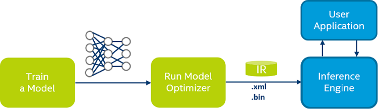

# OPENVINO<sup>TM</sup> TOOLKIT

##  Catalog
- [Catalog](#catalog)
- [Introduction](#introduction)
    - [Let Computer Vision Apps Faster](#let-computer-vision-apps-faster)
    - [Who Needs This Product](#who-needs-this-product)
    - [Usage Scenarios](#usage-scenarios)
- [Installation](#installation)
    - [Requirements](#requirements)
    - [Install the OpenVINO toolkit core components (Eg. on Mac)](#install-the-openvino-toolkit-core-components-eg-on-mac)
    - [Set the Environment Variables](#set-the-environment-variables)
    - [Configure the Model Optimizer](#configure-the-model-optimizer)
        - [Model Optimizer Configuration Steps](#model-optimizer-configuration-steps)
    - [Run the Verification Scripts to Verify Installation and Compile Samples](#run-the-verification-scripts-to-verify-installation-and-compile-samples)
        - [Run the Image Classification Verification Script](#run-the-image-classification-verification-script)
        - [Run the Inference Pipeline Verification Script](#run-the-inference-pipeline-verification-script)
- [Usage (Eg. on Mac)](#usage-eg-on-mac)
    - [Tensorflow Model Configuration](#tensorflow-model-configuration)
    - [Build Samples](#build-samples)
    - [Tensorflow Model Transfer](#tensorflow-model-transfer)
    - [Transfer Parameter Usage](#transfer-parameter-usage)
        - [Mean and Scale Values](#mean-and-scale-values)
        - [Input Shapes](#input-shapes)
        - [IsTraining](#istraining)
        - [Parameters on Tensorflow Model](#parameters-on-tensorflow-model)
- [Samples (Eg. on Mac)](#samples-eg-on-mac)
    - [Image Classification Python* Sample](#image-classification-python-sample)
        - [Download Alexnet Model](#download-alexnet-model)
        - [Transfer the Alexnet Model to XML](#transfer-the-alexnet-model-to-xml)
        - [Running Image Classification Sample](#running-image-classification-sample)
    - [Object Detection](#object-detection)
        - [YOLO* V3 Model](#yolo-v3-model)
        - [SSD Model](#ssd-model)
    - [Face Recognition](#face-recognition)
        - [Multi Camera Multi Person Demo](#multi-camera-multi-person-demo)
        - [Interactive Face Recognition Demo](#interactive-face-recognition-demo)

##  Introduction

### Let Computer Vision Apps Faster

Develop applications and solutions that emulate human vision with the Intel® Distribution of OpenVINO™ toolkit. Based on convolutional neural networks (CNN), the toolkit extends workloads across Intel® hardware (including accelerators) and maximizes performance.

- Enables deep learning inference at the edge
- Supports heterogeneous execution across computer vision accelerators—CPU, GPU, Intel® Movidius™ Neural Compute Stick, and FPGA—using a common API
- Speeds up time to market via a library of functions and preoptimized kernels
- Includes optimized calls for OpenCV and OpenVX*

### Who Needs This Product

- Work on computer vision, neural network inference, and deep learning deployment capabilities
- Want to accelerate their solutions across multiple platforms, including CPU, GPU, VPU, and FPGA

### Usage Scenarios

- vehicle detection and license plate recognition

- People Counter Reference Implementation
- Interactive Face Recognition

##  Installation

Download Link: https://software.intel.com/en-us/openvino-toolkit/choose-download

###  Requirements

- Processors
	- 6th to 10th generation Intel® Core™ and Intel® Xeon® processors
- Compatible Operating Systems
	- Ubuntu* 18.04.3 LTS (64 bit)
	- Windows® 10 (64 bit)
	- CentOS* 7.4 (64 bit)
	- macOS* 10.13, 10.14 (64 bit)

- Software Requirements (Eg. on Mac)
	- [OpenCV 4.0](https://opencv.org/releases.html) or higher
	- [LLVM 10.0](https://llvm.org/) or higher
	- [CMake* 3.0](https://cmake.org/download/) or higher
	- [Python* 3.5](https://www.python.org/downloads/) or higher
	- Apple Xcode* Command Line Tools
	- (Optional) Apple Xcode* IDE (not required for OpenVINO, but useful for development)
	- (Optional) Homebrew* (required for installation of a library for Intel® Neural Compute Stick 2)

### Install the OpenVINO toolkit core components (Eg. on Mac)

1. Go to the directory in which you downloaded the Intel® Distribution of OpenVINO™ toolkit. This document assumes this is your `Downloads` directory. By default, the disk image file is saved as `m_openvino_toolkit_p_.dmg`. Lastest Version: `m_openvino_toolkit_p_2019.3.334.dmg`

2. Double-click the `m_openvino_toolkit_p_.dmg` file to mount. The disk image is mounted to `/Volumes/m_openvino_toolkit_p_` and automatically opened in a separate window.

3. Run the installation wizard application `m_openvino_toolkit_p_.app`

4. On the **User Selection** screen, choose a user account for the installation:

	- Root
	- Administrator
	- Current user

	The default installation directory path depends on the privileges you choose for the installation.

5. Click **Next** and follow the instructions on your screen.

6. If you are missing external dependencies, you will see a warning screen. Take note of any dependencies you are missing. After installing the Intel® Distribution of OpenVINO™ toolkit core components, you will need to install the missing dependencies. For example, the screen example below indicates you are missing two dependencies: 

7. Click **Next**.

8. The **Installation summary** screen shows you the default component set to install: 

	- If you used **root** or **administrator** privileges to run the installer, it installs the OpenVINO toolkit to `/opt/intel/openvino_/`

		For simplicity, a symbolic link to the latest installation is also created: `/opt/intel/openvino/`

	- If you used **regular user** privileges to run the installer, it installs the OpenVINO toolkit to `/home//intel/openvino_/`

		For simplicity, a symbolic link to the latest installation is also created: `/home//intel/openvino/`

9. If needed, click **Customize** to change the installation directory or the components you want to install:

	Click **Next** to save the installation options and show the Installation summary screen.

10.  On the **Installation summary** screen, press **Install** to begin the installation.

11. When the first part of installation is complete, the final screen informs you that the core components have been installed and additional steps still required:

12. Click **Finish** to close the installation wizard. A new browser window opens to the next section of the Installation Guide to set the environment variables. If the installation did not indicate you must install dependencies, you can move ahead to **Set the Environment Variables**. If you received a message that you were missing external software dependencies, listed under **Software Requirements** at the top of this guide, you need to install them now before continuing on to the next section.

### Set the Environment Variables

You need to update several environment variables before you can compile and run OpenVINO™ applications. Open the macOS Terminal* or a command-line interface shell you prefer and run the following script to temporarily set your environment variables

```bash
source /opt/intel/openvino/bin/setupvars.sh
```

**Optional**: The OpenVINO environment variables are removed when you close the shell. You can permanently set the environment variables as follows:

1. Open the `.bash_profile` file in the current user home directory:

	```bash
	vi ~/.bash_profile
	```

2. Press the **i** key to switch to the insert mode.

3. Add this line to the end of the file:

	```bash
	source /opt/intel/openvino/bin/setupvars.sh
	```

1. Save and close the file: press the **Esc** key, type `:wq` and press the **Enter** key.
2. To verify your change, open a new terminal. You will see `[setupvars.sh] OpenVINO environment initialized`.

The environment variables are set. Continue to the next section to configure the Model Optimizer.

### Configure the Model Optimizer

The Model Optimizer is a Python*-based command line tool for importing trained models from popular deep learning frameworks such as Caffe*, TensorFlow*, Apache MXNet*, ONNX* and Kaldi*.

The Model Optimizer is a key component of the OpenVINO toolkit. You cannot perform inference on your trained model without running the model through the Model Optimizer. When you run a pre-trained model through the Model Optimizer, your output is an Intermediate Representation (IR) of the network. The IR is a pair of files that describe the whole model:

- `.xml`: Describes the network topology
- `.bin`: Contains the weights and biases binary data

The Inference Engine reads, loads, and infers the IR files, using a common API on the CPU hardware.

For more information about the Model Optimizer, see the [Model Optimizer Developer Guide](https://docs.openvinotoolkit.org/latest/_docs_MO_DG_Deep_Learning_Model_Optimizer_DevGuide.html).

#### Model Optimizer Configuration Steps

You can choose to either configure the Model Optimizer for all supported frameworks at once, **OR** for one framework at a time. Choose the option that best suits your needs. If you see error messages, verify that you installed all dependencies listed under **Software Requirements** at the top of this guide.

> **NOTE**: If you installed OpenVINO to a non-default installation directory, replace `/opt/intel/` with the directory where you installed the software.

**Option 1: Configure the Model Optimizer for all supported frameworks at the same time:**

1. Go to the Model Optimizer prerequisites directory:

	```bash
	cd /opt/intel/openvino/deployment_tools/model_optimizer/install_prerequisites
	```

2. Run the script to configure the Model Optimizer for Caffe, TensorFlow, MXNet, Kaldi*, and ONNX:

	```bash
	sudo ./install_prerequisites.sh
	```

**Option 2: Configure the Model Optimizer for each framework separately:**

Configure individual frameworks separately **ONLY** if you did not select **Option 1** above.

1. Go to the Model Optimizer prerequisites directory:

	cd /opt/intel/openvino/deployment_tools/model_optimizer/install_prerequisites

2. Run the script for your model framework. You can run more than one script:

	- For **Caffe**:

		```bash
		sudo ./install_prerequisites_caffe.sh
		```

	- For **TensorFlow**:

		```bash
		sudo ./install_prerequisites_tf.sh
		```

The Model Optimizer is configured for one or more frameworks.

You are ready to verify the installation by [running the verification scripts](https://docs.openvinotoolkit.org/latest/_docs_install_guides_installing_openvino_macos.html#Run-Demos).

### Run the Verification Scripts to Verify Installation and Compile Samples

To verify the installation and compile two Inference Engine samples, run the verification applications provided with the product on the CPU:

#### Run the Image Classification Verification Script

1. Go to the **Inference Engine demo** directory:

	```bash
	cd /opt/intel/openvino/deployment_tools/demo
	```

2. Run the **Image Classification verification script**:

	```bash
	./demo_squeezenet_download_convert_run.sh
	```

The Image Classification verification script downloads a public SqueezeNet Caffe* model and runs the Model Optimizer to convert the model to `.bin` and `.xml` Intermediate Representation (IR) files. The Inference Engine requires this model conversion so it can use the IR as input and achieve optimum performance on Intel hardware.

This verification script creates the directory `/home//inference_engine_samples/`, builds the [Image Classification Sample](https://docs.openvinotoolkit.org/latest/_inference_engine_samples_classification_sample_async_README.html) application and runs with the model IR and `car.png` image located in the `demo` directory. When the verification script completes, you will have the label and confidence for the top-10 categories:


For a brief description of the Intermediate Representation `.bin` and `.xml` files, see [Configuring the Model Optimizer](#configure-the-model-optimizer).

This script is complete. Continue to the next section to run the Inference Pipeline verification script.

#### Run the Inference Pipeline Verification Script

1. While still in `/opt/intel/openvino/deployment_tools/demo/` , run the Inference Pipeline verification script:

	```bash
	./demo_security_barrier_camera.sh
	```

	This verification script downloads three pre-trained model IRs, builds the [Security Barrier Camera Demo](https://docs.openvinotoolkit.org/latest/_demos_security_barrier_camera_demo_README.html) application and runs it with the downloaded models and the `car_1.bmp` image from the `demo` 

	directory to show an inference pipeline. The verification script uses vehicle recognition in which vehicle attributes build on each other to narrow in on a specific attribute.

First, an object is identified as a vehicle. This identification is used as input to the next model, which identifies specific vehicle attributes, including the license plate. Finally, the attributes identified as the license plate are used as input to the third model, which recognizes specific characters in the license plate.

When the verification script completes, you will see an image that displays the resulting frame with detections rendered as bounding boxes, and text:

| Input                     | Display                        |
| ------------------------- | ------------------------------ |
|  |  |

Close the image viewer screen to end the demo.

**Congratulations**, you have completed the Intel® Distribution of OpenVINO™ 2019 R1.1 installation for macOS. To learn more about what you can do with the Intel® Distribution of OpenVINO™ toolkit, see the additional resources provided below.

##  Usage (Eg. on Mac)

### Tensorflow Model Configuration

OpenVINO的深度学习部署工具套件主要包括两部分，一个是模型优化器，另外一个是推理引擎。模型优化器是由Python编写的，推理引擎是一套C++函数库以及C++的类



工作原理是对训练产生的网络模型进行优化，优化结果转换成中间表示文件，得到IR文件（xml文件和bin文件）

xml 文件中包含优化以后的网络拓扑结构，bin 文件优化之后的模型参数和模型变量

对于 TensorFlow 框架，对应的模型为 pb 文件

### Build Samples

Build Sample 环境

```bash
cd /opt/intel/openvino/deployment_tools/inference_engine/samples/
sudo build_samples.sh
```

配置模型优化器

```bash
cd /opt/intel/openvino/deployment_tools/model_optimizer/install_prerequisites
sudo ./install_prerequisites.sh
```

### Tensorflow Model Transfer

先来关注一下可以转的层：[Supported TensorFlow Layers](https://docs.openvinotoolkit.org/latest/_docs_MO_DG_prepare_model_convert_model_Convert_Model_From_TensorFlow.html#tensorflow-supported-layers)

比如 RandomUniform 就是 Not supported 的

其实转的过程很简单，就两小步：

1. 进入 `model_optimizer` 文件夹

	```bash
	cd /opt/intel/deployment_tools/model_optimizer
	```

2. 使用 `mo_tf.py` 脚本将 pb 文件转为 IR 文件

	```bash
	python mo_tf.py --input_model <INPUT_MODEL>.pb --output_dir <OUTPUT PATH>
	```

但是对于大部分模型来说，直接运行 `mo_tf.py` 得到的应该都是各种各样的 ERROR 

### Transfer Parameter Usage

`mo_tf.py` 文件除了 `--input_model` 和 `--output_dir` 这个两个参数以外，还有众多参数


#### Mean and Scale Values

一般来说在训练时我们都会使用归一化的输入，比如从 **0\~255 归一化到 0\~1**，还有在使用 Image Net 等公开数据集的时候，会进行一个 **去均值** 的操作，这些都属于简单的数据预处理，乍一看好像和网络没啥关系，但其实影响很大，重点在于预处理部分的代码有没有被写进 TensorFlow 的拓扑结构里。

如果预处理部分被写进拓扑结构里了，这种主要就是在训练网络时直接读取的原始数据，然后用 tf 里的函数进行预处理的情况，这种情况下得到的模型，在 pb 文件里会有预处理相关的node，这些 node 也会直接转化到 xml 文件中（前提是 OpenVINO 支持）

另一种情况是拓扑结构里没有预处理部分，举例就是用 numpy 对原始数据进行了处理，然后作为 tf 网络的输入，输入到网络中，由于拓扑结构中没有预处理部分，虽然pb转IR的时候也可以成功，但之后推理的结果肯定是错的，这个时候就需要用到相关参数 `--scale` ，  `--scale_values` ， `--mean_values` ， 当 mean value 和 scale value 被同时指定时，数据先减去 mean value ，再除以 scale value

```bash
python mo_tf.py \
--input_model <model_name>.pb --scale_values [59,59,59] --mean_values [177,177,177]
```

至于怎么看拓扑结构里有没有预处理部分，restore pb 文件打印出所有 node 是一种办法，再直观一点，使用 [Netron](https://github.com/lutzroeder/Netron)，把 pb 文件导进去可以直接可视化网络

这一个参数其实并不影响模型转化的成功与否，但如果不注意的话，问题百出

接下来的参数会直接影响转化的成败

#### Input Shapes

在 TensorFlow 中， 输入的 placeholderr 的 shape 可以被设成 None 或者 -1 ，这种设置在对输入任意尺寸图片和调整 batch size 时非常方便。但遗憾的是OpenVINO不接受这么随意的输入

如果在 pb 文件中，输入没有明确的尺寸的话，需要加入 `--input_shape` 参数指定 shape ，比如 `[1，128，128，3]` ，对于 batch size 不定的情况，再调用 `mo_tf.py` 后面加上 `-b` ，这两个参数不能同时使用

```bash
python mo_tf.py --input_model <model_name>.pb --input_shape [1,128,128, 3]
```

```bash
python mo_tf.py --input_model <model_name>.pb -b 1
```

#### Is_Training

神经网络的输入除了输入数据，一般还会有一个区分 train 和 valid（test）状态的 is_training ，用来控制 batch norm 和 dropout 的状态，这里也有两种情况

1. train 和 valid 是两份代码，这种情况下，is_training 在各自的代码里是 True 和 False 的定值，并不会再程序运行中切换，此时的 pb 文件应该固定的是 valid 代码中的 graph，在 pb 转 IR 的过程中也无需多加参数
2. 在 train 的过程中同时进行 valid，此时 is_training 是一个 placeholder，会在 train 时传入 True ，在 valid 时传入False，在 pb 文件中也会存在这个 node，此时就需要使用参数 `--freeze_placeholder_with_value` ，将 is_training（ node 的名字以自己网络中的为准）的值定为 False

```bash
python mo_tf.py \
--input_model <model_name>.pb --freeze_placeholder_with_value "is_training->False"
```

#### Parameters on Tensorflow Model 

`--tensorflow_use_custom_operations_config`

这个参数主要是使用 TensorFlow Object Detection API 中的模型时会用到，需要传入相应的 json 配置文件，比如在转 SSD、Faster RCNN、YOLO 等模型发生错误时，使用这个参数导入配置文件后都成功了

`--disable_nhwc_to_nchw`

这个参数主要是转换输入维度的，NHWC 和 NCHW，默认会从 NHWC 转为 NCHW

## Samples (Eg. on Mac)

### Image Classification Python* Sample

运行图像分类示例应用程序，该应用程序使用图像分类网络（例如 AlexNet ）执行推理

启动后，示例应用程序将读取命令行参数，并将网络和图像加载到 Inference Engine 插件，推断完成后，应用程序将创建输出图像并将数据输出到标准输出流

#### Download Alexnet Model

首先可以将 alexnet 模型下载到制定的文件夹，OpenVINO 自带的下载工具使用方法如下

```bash
cd /opt/intel/openvino/deployment_tools/open_model_zoo/tools/downloader/
python3 downloader.py -h
```

`downloader.py` 主要参数显示如下

```bash
usage: downloader.py [-h] [-c CONFIG.YML] [--name PAT[,PAT...]]
                     [--list FILE.LST] [--all] [--print_all]
                     [--precisions PREC[,PREC...]] [-o DIR] [--cache_dir DIR]
                     [--num_attempts N] [--progress_format {text,json}]
```

我们可以执行如下操作来获取 alexnet 模型

```bash
cd /opt/intel/openvino/deployment_tools/open_model_zoo/tools/downloader/
python3 downloader.py \
--name alexnet -o <OUTPUT PATH>/<OUTPUT DIR>
```

会得到一个 alexnet.caffemodel 文件和一个 alexnet.prototxt 文件

#### Transfer the Alexnet Model to XML

alexnet 是 caffe 框架下的网路，我们需要用到 caffe 的转换代码

```bash
cd /opt/intel/openvino/deployment_tools/model_optimizer
python3 mo_caffe.py -h
```

主要参数显示如下

```bash
usage: mo_caffe.py [-h] [--input_model INPUT_MODEL] [--model_name MODEL_NAME]
                   [--output_dir OUTPUT_DIR] [--input_shape INPUT_SHAPE]
                   [--scale SCALE] [--reverse_input_channels]
                   [--log_level {CRITICAL,ERROR,WARN,WARNING,INFO,DEBUG,NOTSET}]
                   [--input INPUT] [--output OUTPUT]
                   [--mean_values MEAN_VALUES] [--scale_values SCALE_VALUES]
                   [--data_type {FP16,FP32,half,float}] [--disable_fusing]
                   [--disable_resnet_optimization]
                   [--finegrain_fusing FINEGRAIN_FUSING] [--disable_gfusing]
                   [--enable_concat_optimization] [--move_to_preprocess]
                   [--extensions EXTENSIONS] [--batch BATCH] [--version]
                   [--silent]
                   [--freeze_placeholder_with_value FREEZE_PLACEHOLDER_WITH_VALUE]
                   [--generate_deprecated_IR_V2] [--keep_shape_ops] [--steps]
                   [--input_proto INPUT_PROTO]
                   [--caffe_parser_path CAFFE_PARSER_PATH] [-k K]
                   [--mean_file MEAN_FILE]
                   [--mean_file_offsets MEAN_FILE_OFFSETS]
                   [--disable_omitting_optional]
                   [--enable_flattening_nested_params]
```

我们可以执行如下操作来将 alexnet 模型转换为 alexnet.xml 的形式

```bash
cd /opt/intel/openvino/deployment_tools/model_optimizer/
python3 mo_caffe.py \
--input_model <INPUT MODEL PATH>/alexnet/alexnet.caffemodel \
--input_proto <INPUT PROTO PATH>/alexnet/alexnet.prototxt \
--input_shape (1,3,227,227),[1,6,1,1] \
--output_dir <OUTPUT PATH>/alexnet
```

转换成功提示如下

```bash
Model Optimizer version: 	2019.3.0-375-g332562022

[ SUCCESS ] Generated IR model.
[ SUCCESS ] XML file: <OUTPUT PATH>/alexnet/alexnet.xml
[ SUCCESS ] BIN file: <OUTPUT PATH>/alexnet/alexnet.bin
[ SUCCESS ] Total execution time: 28.99 seconds. 
```

#### Running Image Classification Sample

运行带有 `-h` 选项的应用程序会产生使用情况消息

```bash
cd /opt/intel/openvino/deployment_tools/inference_engine/samples/python_samples/classification_samplel
python3 classification_sample.py -h
```

该命令产生以下用法消息

```bash
usage: classification_sample.py [-h] -m MODEL -i INPUT [INPUT ...]
                                [-l CPU_EXTENSION] [-d DEVICE]
                                [--labels LABELS] [-nt NUMBER_TOP]

Options:
  -h, --help            Show this help message and exit.
  -m MODEL, --model MODEL
                        Required. Path to an .xml file with a trained model.
  -i INPUT [INPUT ...], --input INPUT [INPUT ...]
                        Required. Path to a folder with images or path to an
                        image files
  -l CPU_EXTENSION, --cpu_extension CPU_EXTENSION
                        Optional. Required for CPU custom layers. MKLDNN
                        (CPU)-targeted custom layers. Absolute path to a
                        shared library with the kernels implementations.
  -d DEVICE, --device DEVICE
                        Optional. Specify the target device to infer on; CPU,
                        GPU, FPGA, HDDL, MYRIAD or HETERO: is acceptable. The
                        sample will look for a suitable plugin for device
                        specified. Default value is CPU
  --labels LABELS       Optional. Path to a labels mapping file
  -nt NUMBER_TOP, --number_top NUMBER_TOP
                        Optional. Number of top results
```

例如，要在 CPU 上执行 AlexNet 模型的推理（已转换为推理引擎格式），请使用以下命令

```bash
cd /opt/intel/openvino/deployment_tools/inference_engine/samples/python_samples/classification_samplel
python3 classification_sample.py \
-i <path_to_image>/<image_name>.jpg \
-m <path_to_model>/alexnet/alexnet.xml \
--labels <path_to_label>/squeezenet1.1.labels
```

在 squeezenet1.1.labels 中有 1000 个类，我们来看一下识别效果

| Input 1                          | Input 2                         |
| -------------------------------- | ------------------------------- |
|  |  |

**Output 1**

```bash
[ INFO ] Top 10 results: 
Image <path_to_image>/<image_name>.jpg 

classid probability
------- -----------
king of beasts, Panthera leo 0.9992079
chow chow 0.0001856
macaque  0.0001427
mastiff  0.0001366
collie   0.0000868
hound, Afghan0.0000505
camel, dromedary, Camelus dromedarius0.0000419
Newfoundland dog0.0000213
 coat    0.0000202
  ox     0.0000123
```

**Output 2**

```bash
classid probability
------- -----------
pug-dog  0.8826568
mastiff  0.0514272
muzzle   0.0224353
 boxer   0.0074206
 Dane    0.0061223
bulldog  0.0036575
burrito  0.0030568
 watch   0.0019292
loggerhead turtle, Caretta caretta0.0009914
terrapin  0.0009757
```

两张输入图片分别被识别为 **非洲狮** 和 **哈巴狗** ，可以说效果还是不错的

### Object Detection

#### YOLO* V3 Model

使用 YOLO * V3 模型进行对象检测

- 通过 OpenCV* 提供视频输入支持
- 可视化生成的边界框和文本标签（来自 `.labels` 文件）或类编号（如果未提供文件）
- OpenCV 提供了结果边界框，标签和其他信息

运行带有 `-h` 选项的应用程序会产生使用情况消息

```bash
cd /opt/intel/openvino/deployment_tools/open_model_zoo/demos/python_demos/object_detection_demo_yolov3_async
python3 object_detection_demo_yolov3_async.py -h
```

该命令产生以下用法消息

```bash
usage: object_detection_demo_yolov3_async.py [-h] -m MODEL -i INPUT
                                             [-l CPU_EXTENSION] [-d DEVICE]
                                             [--labels LABELS]
                                             [-t PROB_THRESHOLD]
                                             [-iout IOU_THRESHOLD]
                                             [-ni NUMBER_ITER] [-pc] [-r]

Options:
  -h, --help            Show this help message and exit.
  -m MODEL, --model MODEL
                        Required. Path to an .xml file with a trained model.
  -i INPUT, --input INPUT
                        Required. Path to a image/video file. (Specify 'cam'
                        to work with camera)
  -l CPU_EXTENSION, --cpu_extension CPU_EXTENSION
                        Optional. Required for CPU custom layers. Absolute
                        path to a shared library with the kernels
                        implementations.
  -d DEVICE, --device DEVICE
                        Optional. Specify the target device to infer on; CPU,
                        GPU, FPGA, HDDL or MYRIAD is acceptable. The sample
                        will look for a suitable plugin for device specified.
                        Default value is CPU
  --labels LABELS       Optional. Labels mapping file
  -t PROB_THRESHOLD, --prob_threshold PROB_THRESHOLD
                        Optional. Probability threshold for detections
                        filtering
  -iout IOU_THRESHOLD, --iou_threshold IOU_THRESHOLD
                        Optional. Intersection over union threshold for
                        overlapping detections filtering
  -ni NUMBER_ITER, --number_iter NUMBER_ITER
                        Optional. Number of inference iterations
  -pc, --perf_counts    Optional. Report performance counters
  -r, --raw_output_message
                        Optional. Output inference results raw values showing
```

例如，要在 CPU 上执行 AlexNet 模型的推理（已转换为推理引擎格式），请使用以下命令

```bash
cd /opt/intel/openvino/deployment_tools/open_model_zoo/demos/python_demos/object_detection_demo_yolov3_async
python3  object_detection_demo_yolov3_async.py \
-i <path_to_Video>/<Video_name> \
-m <path_to_Video>/YoloV3/FP32/frozen_yolo_v3.xml \
--labels <path_to_label>/frozen_yolo_v3.labels \
--cpu_extension /opt/intel/openvino/deployment_tools/inference_engine/lib/intel64/libcpu_extension.dylib
```

对于视频的目标检测，YOLO 模型在 CPU 条件下运行较慢，几乎是 **每秒两帧** 的速度进行目标检测，故而运行时间较长，这里不再详细展示

#### SSD Model

该演示展示了使用 SSD 进行对象检测

具体来说，此演示保留两个并行的推断请求，并且在处理当前的请求时，将捕获下一个的输入帧，这基本上是隐藏拍摄的等待时间，使整体帧率是由 `MAXIMUM(detection time, input capturing time)` 确定，而不是 `SUM(detection time, input capturing time)`

性能警告，并行运行的任务应尽量避免过度使用共享计算资源，例如，如果推理是在 FPGA 上执行的，并且 CPU 本质上处于空闲状态，那么在 CPU 上并行处理是有意义的。但是，如果推断是在 GPU 上执行的，则由于设备已经很忙，因此几乎不可能在同一 GPU 上并行进行（结果视频）编码

使用 SSD 模型进行对象检测

- 通过 OpenCV* 提供视频输入支持
- 可视化生成的边界框和文本标签（来自 `.labels` 文件）或类编号（如果未提供文件）
- OpenCV 提供了结果边界框，标签和其他信息

运行带有 `-h` 选项的应用程序会产生使用情况消息

```bash
cd /opt/intel/openvino/deployment_tools/open_model_zoo/demos/python_demos/object_detection_demo_ssd_async
python3 object_detection_demo_ssd_async.py -h
```

该命令产生以下用法消息

```bash
usage: object_detection_demo_ssd_async.py [-h] -m MODEL -i INPUT
                                          [-l CPU_EXTENSION] [-d DEVICE]
                                          [--labels LABELS]
                                          [-pt PROB_THRESHOLD]

Options:
  -h, --help            Show this help message and exit.
  -m MODEL, --model MODEL
                        Required. Path to an .xml file with a trained model.
  -i INPUT, --input INPUT
                        Required. Path to video file or image. 'cam' for
                        capturing video stream from camera
  -l CPU_EXTENSION, --cpu_extension CPU_EXTENSION
                        Optional. Required for CPU custom layers. Absolute
                        path to a shared library with the kernels
                        implementations.
  -d DEVICE, --device DEVICE
                        Optional. Specify the target device to infer on; CPU,
                        GPU, FPGA, HDDL or MYRIAD is acceptable. The demo will
                        look for a suitable plugin for device specified.
                        Default value is CPU
  --labels LABELS       Optional. Path to labels mapping file
  -pt PROB_THRESHOLD, --prob_threshold PROB_THRESHOLD
                        Optional. Probability threshold for detections
                        filtering
```

可以使用以下命令在具有预先训练的对象检测模型的 CPU 上进行推断

```bash
cd /opt/intel/openvino/deployment_tools/open_model_zoo/demos/python_demos/object_detection_demo_ssd_async
python3  object_detection_demo_ssd_async.py \
-i <path_to_Video>/<Video_name> \
-m <path_to_Video>/YoloV3/FP32/frozen_inference_graph.xml \
--labels <path_to_label>/ssd_v2/ssd_v2.names \
--cpu_extension /opt/intel/openvino/deployment_tools/inference_engine/lib/intel64/libcpu_extension.dylib
```

Demo 在不采用 GPU 的情况下 对于 15 秒的原始视频，大约产生 45 秒的目标检测视频（测试时因为其他运行程序较多，并且还开了录制屏幕，否则目标检测的时间还会稍短一些）

<video src="video/object_detect_ssd.mov" width=200 ></video>

SSD 是目前目标检测流行算法中公认最快的之一，ssd_v2.names 中包含有常见的 80 种 Label，比如 Demo 中可以对 person 和 horse 进行较好的识别

### Face Recognition

#### Multi Camera Multi Person Demo

需要用到两个 OpenVINO 自带的模型

- Person detection model
- Person re-identification model

OpenVINO 不仅可以完成对视频的人脸计数，也可以完成多摄像头下对人脸的计数，但效果来说，应该是OpenVINO 中对 Threshold 设置较小的原因，同样的人脸，因为妆容的差异及部分遮挡的因素，经常被判别为是不同的人脸

下面运行带有 `-h` 选项的应用程序来产生使用情况消息

```bash
cd /opt/intel/openvino/deployment_tools/open_model_zoo/demos/python_demos/multi_camera_multi_person_tracking
python multi_camera_multi_person_tracking.py -h
```

该命令产生以下用法消息

```bash
usage: multi_camera_multi_person_tracking.py [-h] -i I [I ...] -m M_DETECTOR
                                             [--t_detector T_DETECTOR]
                                             --m_reid M_REID
                                             [--output_video OUTPUT_VIDEO]
                                             [--config CONFIG]
                                             [--history_file HISTORY_FILE]
                                             [-d DEVICE] [-l CPU_EXTENSION]

Multi camera multi person tracking live demo script

optional arguments:
  -h, --help            show this help message and exit
  -i I [I ...]          Input sources (indexes of cameras or paths to video
                        files)
  -m M_DETECTOR, --m_detector M_DETECTOR
                        Path to the person detection model
  --t_detector T_DETECTOR
                        Threshold for the person detection model
  --m_reid M_REID       Path to the person reidentification model
  --output_video OUTPUT_VIDEO
  --config CONFIG
  --history_file HISTORY_FILE
  -d DEVICE, --device DEVICE
  -l CPU_EXTENSION, --cpu_extension CPU_EXTENSION
                        MKLDNN (CPU)-targeted custom layers.Absolute path to a
                        shared library with the kernels impl.
```

可以使用以下命令在 CPU 上进行人脸计数

```bash
# web-cameras
cd /opt/intel/openvino/deployment_tools/open_model_zoo/demos/python_demos/multi_camera_multi_person_tracking
python multi_camera_multi_person_tracking.py \
    -i 0 \
    -m <path_to_model>/face-detection-retail-0005.xml \
    --m_reid <path_to_model>/face-reidentification-retail-0095.xml \
    --config config.py \
    --cpu_extension /opt/intel/openvino/deployment_tools/inference_engine/lib/intel64/libcpu_extension.dylib
```

但目前来说，效果并不好

#### Interactive Face Recognition Demo

此示例演示了一种创建用于视频处理的交互式应用程序的方法，它显示了用于构建模型 pipeline 的基本体系结构，该模型 pipeline 支持在不同设备上放置模型以及使用 Python 中的 OpenVINO 库同时并行或顺序执行

特别地，该演示使用 3 个模型构建了一个 pipeline ，该 pipeline 能够检测视频上的面部，其关键点（又称 landmark ），并使用提供的面部数据库（图库）识别人员

可以使用以下预训练的模型

* `face-detection-retail-0004` , to detect faces and predict their bounding boxes;
* `landmarks-regression-retail-0009`, to predict face keypoints;
* `face-reidentification-retail-0095`, to recognize persons.

它逐帧读取指定的输入视频流（无论是相机设备还是视频文件），并对每个帧进行独立分析

为了进行预测，应用程序使用 OpenVINO 库在指定的设备上部署3个模型，并以异步方式运行它们

面部检测模型处理输入帧以预测面部边界框，然后，通过相应的模型预测面部关键点，帧处理的最后一步是由人脸识别模型完成的，该模型使用找到的关键点来对齐人脸和人脸库，以将视频帧中的人脸与库中的人脸进行匹配，然后，将处理结果可视化并显示在屏幕上或写入输出文件

为了识别人脸，应用程序使用人脸数据库或图库

图库是一个包含人物图像的文件夹，图库中的每张图像都可以是任意大小，并且应包含一个或多个质量良好的正面人脸。允许有同一个人的多张图像，但是在这种情况下，命名格式应特定 `-{id}-{num_of_instance}.jpg`

例如，可能有图像 `Paul-0.jpg`，`Paul-1.jpg` 等，并且它们都将被视为同一个人的图像，如果每人只有一张图像，则可以使用 `{id} .jpg` 格式（例如 `Paul.jpg`）

应用程序可以在图库建立期间使用面部检测器，该检测器由 `--run_detector` 标志控制，这样一来，图库图像就可以包含多个人脸图像，并且不会被严格裁剪，在这种模式下，将询问用户是否要将特定图像添加到图像库中（这会导致将图像自动转储到磁盘上的同一文件夹中），如果是，则用户应在打开的窗口中指定图像的名称，然后按Enter，如果不是，请按 Escape 键。用户可以通过在打开的窗口中设置相同的名称来添加同一个人的多个图像，但是，由于人脸检测器可能会发生故障并导致较差的结果，因此需要反复确认图库中的人脸，即后续用法中涉及的 `--run_detector` 选项

图像文件名在可视化期间会用作人脸的名称，使用以下名称约定：`person_N_name.png` 或 `person_N_name.jpg` 

下面运行带有 `-h` 选项的应用程序来产生使用情况消息

```bash
cd /opt/intel/openvino/deployment_tools/open_model_zoo/demos/python_demos/face_recognition_demo
python face_recognition_demo.py -h
```

该命令产生以下用法消息

```bash
usage: face_recognition_demo.py [-h] [-i PATH] [-o PATH] [--no_show] [-tl]
                                [-cw CROP_WIDTH] [-ch CROP_HEIGHT] -fg PATH
                                [--run_detector] -m_fd PATH -m_lm PATH -m_reid
                                PATH [-d_fd {CPU,GPU,FPGA,MYRIAD,HETERO,HDDL}]
                                [-d_lm {CPU,GPU,FPGA,MYRIAD,HETERO,HDDL}]
                                [-d_reid {CPU,GPU,FPGA,MYRIAD,HETERO,HDDL}]
                                [-l PATH] [-c PATH] [-v] [-pc] [-t_fd [0..1]]
                                [-t_id [0..1]] [-exp_r_fd NUMBER]
                                [--allow_grow]

optional arguments:
  -h, --help            show this help message and exit

General:
  -i PATH, --input PATH
                        (optional) Path to the input video ('0' for the
                        camera, default)
  -o PATH, --output PATH
                        (optional) Path to save the output video to
  --no_show             (optional) Do not display output
  -tl, --timelapse      (optional) Auto-pause after each frame
  -cw CROP_WIDTH, --crop_width CROP_WIDTH
                        (optional) Crop the input stream to this width
                        (default: no crop). Both -cw and -ch parameters should
                        be specified to use crop.
  -ch CROP_HEIGHT, --crop_height CROP_HEIGHT
                        (optional) Crop the input stream to this height
                        (default: no crop). Both -cw and -ch parameters should
                        be specified to use crop.

Faces database:
  -fg PATH              Path to the face images directory
  --run_detector        (optional) Use Face Detection model to find faces on
                        the face images, otherwise use full images.

Models:
  -m_fd PATH            Path to the Face Detection model XML file
  -m_lm PATH            Path to the Facial Landmarks Regression model XML file
  -m_reid PATH          Path to the Face Reidentification model XML file

Inference options:
  -d_fd {CPU,GPU,FPGA,MYRIAD,HETERO,HDDL}
                        (optional) Target device for the Face Detection model
                        (default: CPU)
  -d_lm {CPU,GPU,FPGA,MYRIAD,HETERO,HDDL}
                        (optional) Target device for the Facial Landmarks
                        Regression model (default: CPU)
  -d_reid {CPU,GPU,FPGA,MYRIAD,HETERO,HDDL}
                        (optional) Target device for the Face Reidentification
                        model (default: CPU)
  -l PATH, --cpu_lib PATH
                        (optional) For MKLDNN (CPU)-targeted custom layers, if
                        any. Path to a shared library with custom layers
                        implementations
  -c PATH, --gpu_lib PATH
                        (optional) For clDNN (GPU)-targeted custom layers, if
                        any. Path to the XML file with descriptions of the
                        kernels
  -v, --verbose         (optional) Be more verbose
  -pc, --perf_stats     (optional) Output detailed per-layer performance stats
  -t_fd [0..1]          (optional) Probability threshold for face
                        detections(default: 0.6)
  -t_id [0..1]          (optional) Cosine distance threshold between two
                        vectors for face identification (default: 0.3)
  -exp_r_fd NUMBER      (optional) Scaling ratio for bboxes passed to face
                        recognition (default: 1.15)
  --allow_grow          (optional) Allow to grow faces gallery and to dump on
                        disk. Available only if --no_show option is off.
```

可以使用以下命令在 CPU 上进行视频人脸识别

```bash
# Set up the environment
source /opt/intel/openvino/bin/setupvars.sh

cd /opt/intel/openvino/deployment_tools/open_model_zoo/demos/python_demos/face_recognition_demo

python ./face_recognition_demo.py \
-i <path_to_input_Video>/<input_Video_name> \
-o <path_to_output_Video>/<output_Video_name> \
-m_fd <path_to_model>/face-detection-retail-0005.xml \
-m_lm <path_to_model>/landmarks-regression-retail-0009.xml \
-m_reid <path_to_model>/face-reidentification-retail-0095.xml \
-l /opt/intel/openvino/deployment_tools/inference_engine/lib/intel64/libcpu_extension.dylib \
--verbose \
-fg <path_to_known_gallery> \
-t_id 0.4
```

值得一提的是，OpenVINO 下对视频的人脸识别速度还是远远快于 Google 开源库 Face Recognition 的，这里的人脸识别的算法几乎是实时的，Demo 可以对视频中的人脸进行较好的区分，事实上针对具体的问题，可能还是需要调整不同的 `-t_fd` 和 `-t_id` 的数值

<video src="video/Output_BP.mov" width=400></video>


【[**Return to Repositories**](https://github.com/99cloud/lab-algorithm)】